## Azure

### Platform installation from GitHub on Azure Web apps

You can <a class="crosslink" href="https://virtocommerce.com/ecommerce-hosting" target="_blank">deploy</a> the latest version of VirtoCommerce Platform to Azure with just a few clicks.

* Open the code repository <a href="https://github.com/VirtoCommerce/vc-community" rel="nofollow">https://github.com/VirtoCommerce/vc-community</a>
* Scroll to the end of the page and click the **Deploy to Azure** button


You will see the first page of the deployment wizard:

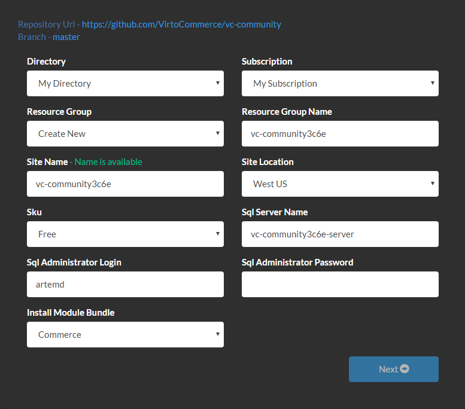
  
* **Directory** and **Subscription** options define which Azure subscription will be used.
* **Resource group** option allows you to create a new Azure resource group or select an existing one from the list. The new SQL server and the new website will be added to this group.
* **Resource Group Name** is the name of the new resource group.
* **Site Name** is the part of the new website URL: http://**site-name**.azurewebsites.net. By default, the site name is generated by adding 4 random characters to the Git repository name.
* **Sql Server Name** is the name of the new SQL server.
* **Sql Administrator Login** is the login for the new SQL server administrator.
* **Sql Administrator Password** is the password for the new SQL server administrator. Password must be at least 8 characters long and contain characters from three of the following four categories:     
* Latin uppercase letters (A through Z)
* Latin lowercase letters (a through z)
* Base 10 digits (0 through 9)
* Non-alphanumeric characters such as: exclamation point (!), dollar sign ($), number sign (#), or percent (%).
* **Install Module Bundle** option defines which modules to install automatically after deployment.
* If you select **Commerce** then all modules required for creating an eCommerce application will be installed.
* If you select **None** then no modules will be installed automatically and you will get the clean platform.
* Enter the password for SQL Server administrator and click **Next** button.
* On the second page of the deployment wizard click **Deploy** button.

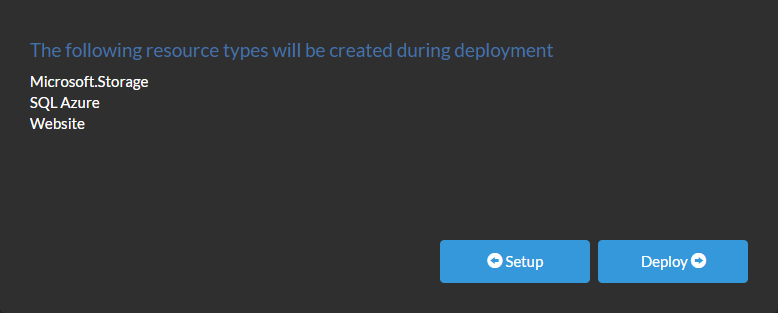

The deployment process will take about 3 minutes.

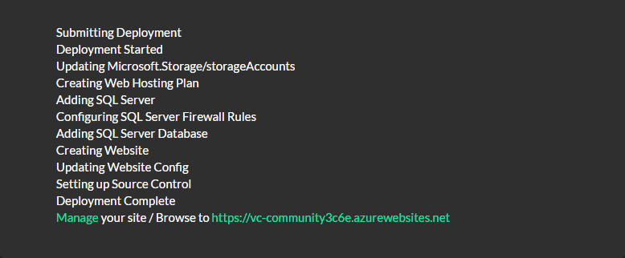
  
* You can now browse to the VirtoCommerce Platform, the login is: **admin**, and password is **store**.
* If you selected to install the Commerce bundle, it will be installed automatically after you have signed in:

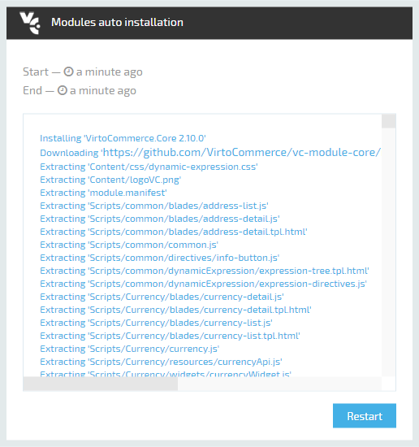
  
* Click **Restart** button to activate installed modules.

#### Troubleshooting

Sometimes the deployment process fails while **Running deployment command**:

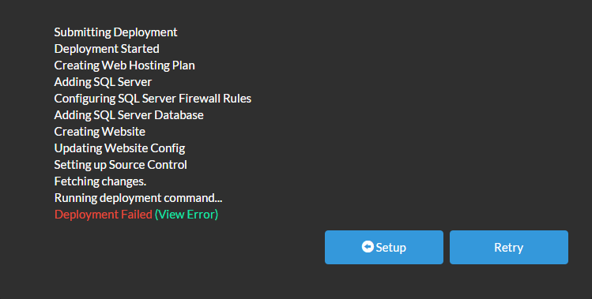

Clicking the green (View Error) link will not explain anything, you should go to Azure Portal and check the deployment log.

Open Web Apps and select your recenly created web app.Click on **Active Deployment** widget.In the **Deployments** list click on the failed deployment.In the **Deployment Details** click **View Log**.The most frequent error is related to downloading packages from NuGet. This is a temporary issue and in most cases clicking **Redeploy** in Deployment Details blade leads to successful deployment.

#### Updating to the latest version

Open Web App settings.Open **Deployment source**.Click **Sync** button in the toolbar.

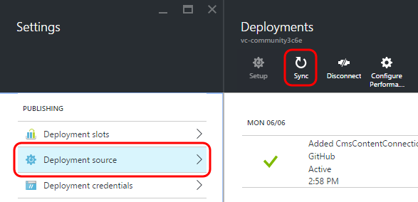

This operation will download the latest source code from GitHub repository, compile it, copy the result to the wwwroot directory and restart the web site.

### Storefront installation from GitHub on Azure Web apps

Before starting <a class="crosslink" href="https://virtocommerce.com/ecommerce-website" target="_blank">storefront installation</a> you should have running VC platform application.

* Open the code repository <a href="https://github.com/VirtoCommerce/vc-storefront" rel="nofollow">https://github.com/VirtoCommerce/vc-storefront</a>
* Scroll to the end of the page and click the **Deploy to Azure** button


  
You will see the first page of the deployment wizard:
  
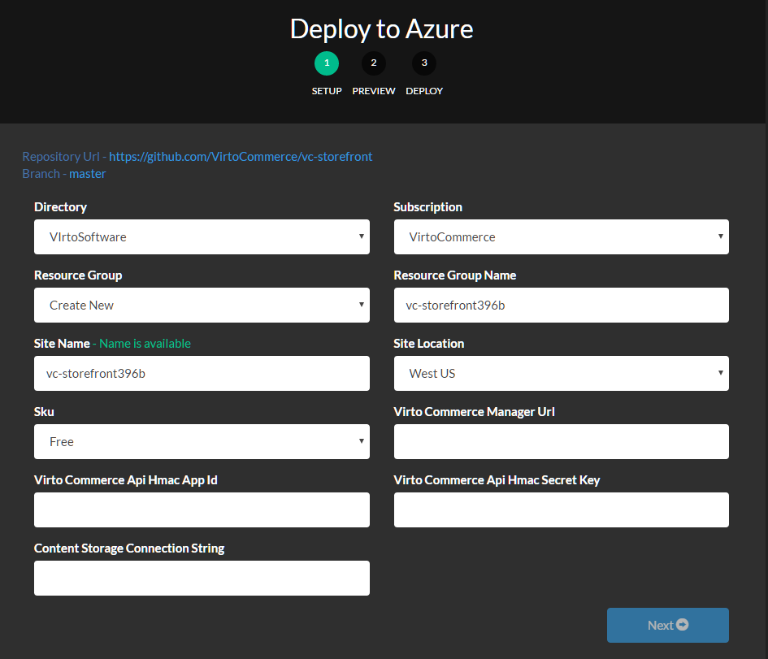
  
* **Directory** and **Subscription** options define which Azure subscription will be used.
* **Resource group** option allows you to create a new Azure resource group or select an existing one from the list. The new website will be added to this group.
* **Resource Group Name** is the name of the new resource group.
* **Site Name** is the part of the new website URL: http://**site-name**.azurewebsites.net. By default, the site name is generated by adding 4 random characters to the Git repository name.
* **Virto Commerce Manager Url** is the public url where Virto Commerce platform installed. Will be used for API calls.
* **Virto Commerce Api Hmac App Id** is the API client application identifier will used for API calls authentication. (default value: **27e0d789f12641049bd0e939185b4fd2**) you can read more about this parameters here [Working with platform API](https://virtocommerce.com/docs/vc2devguide/development-scenarios/working-with-platform-api)
* **Virto Commerce Api Hmac App Secret Key** is the Hmac secret key will used for API calls authentication (default value: **34f0a3c12c9dbb59b63b5fece955b7b2b9a3b20f84370cba1524dd5c53503a2e2cb733536ecf7ea1e77319a47084a3a2c9d94d36069a432ecc73b72aeba6ea78**)
* **Content Storage Connection string** is the connection string with have syntax provider=AzureBlobStorage;DefaultEndpointsProtocol=http;AccountName=XXXX;AccountKey=YYYY and should pointed to CMS content blob  storage . You can get it value from your VC 2.11 platform application settings.

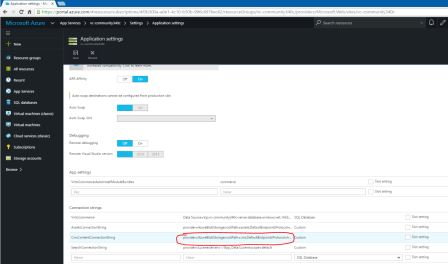

On the second page of the deployment wizard click **Deploy** button. And wait until deploy process will finished. And click to resulting link in final screen.

## Local installation

### Platform local installation

Deploy and configure Virto Commerce Platform from source code and setup development environment:

#### Software requirements

* Microsoft .NET Framework 4.6.1
* Internet Information Services 7 or later
* Microsoft SQL Server 2008 or later (*Express or Full*)
* Visual Studio 2015 or later (*optional*)
* Git

#### Downloading source code

Fork your own copy of VirtoCommerce Platform to your account on GitHub:
1. Open <a href="https://github.com/VirtoCommerce/vc-platform" rel="nofollow">Virto Commerce Platform in GitHub</a> and click **Fork** in the upper right corner.
2. If you are a member of an organization on GitHub, select the target for the fork.
3. Clone the forked repository to local machine:
```
git clone https://github.com/<<your GitHub user name>>/vc-platform.git C:\vc-platform
```
4. Switch to the cloned directory:
```
cd C:\vc-platform
```
5. Add a reference to the original repository:
```
git remote add upstream https://github.com/VirtoCommerce/vc-platform.git
```
In result you should get the **C:\vc-platform** folder which contains full platform source code.
To retrieve changes from original Virto Commerce Platform repository, merge **upstream/master** branch.

Restore NuGet packages in one of the following ways:
* Open **VirtoCommerce.Platform.sln** solution in Visual Studio. In Solution Explorer window right-click on solution and select **Manage NuGet Packages for Solution**. In the opened window click the **Restore** button.

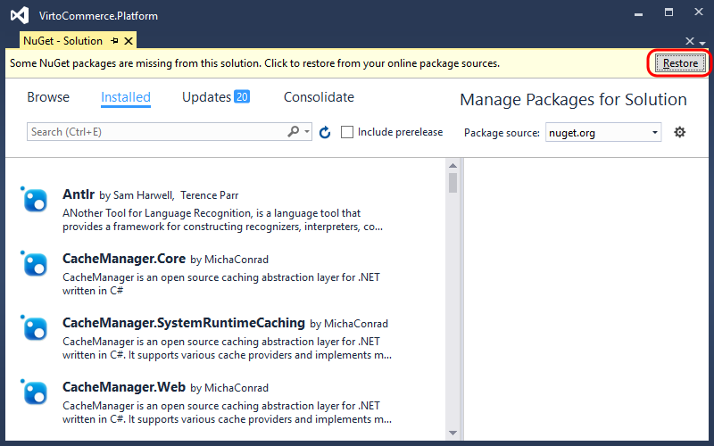
* Run this command:
```
nuget restore C:\vc-platform\VirtoCommerce.Platform.Web\VirtoCommerce.Platform.sln
```
Build the solution.

#### Configure SQL Server

SQL Server Authentication mode must be enabled.
  
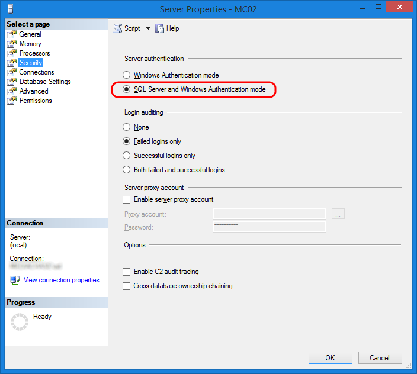 

Create the new login named **virto** with password **virto**. The password policy enforcement should be switched off for a simple password like this.

```
USE master; CREATE LOGIN virto WITH PASSWORD = 'virto', CHECK_POLICY = OFF
```

Give the **CREATE ANY DATABASE** permission to user virto. This will allow you to create a database automatically when Commerce Manager starts. For new databases created with this permission the user will have the **db_owner** role while access will be denied for any other database.

```
USE master; GRANT CREATE ANY DATABASE TO virto
```

Open the **C:\vc-platform\VirtoCommerce.Platform.Web\web.config** file and make sure the **VirtoCommerce** connection string has correct parameters for your configuration, particularly **Data Source** (SQL Server address), **Initial Catalog** (database name), **User ID** (user name) and **Password**.

#### Configure IIS

Open **IIS Manager** and add new application to **Default Web Site** with alias **admin** and physical path to **C:\vc-platform\VirtoCommerce.Platform.Web**. Select application pool which uses **.NET CLR Version 4.0** and **Integrated pipeline mode**.

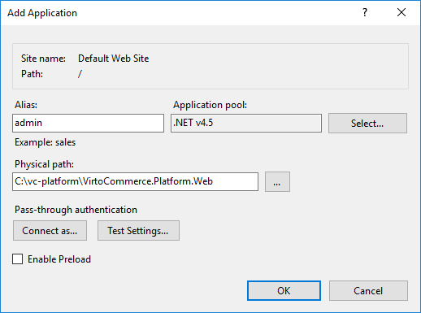

Inside the **admin** application add a new virtual directory with alias **assets** and physical path to **C:\vc-platform\VirtoCommerce.Platform.Web\App_Data\Assets**. If there is no Assets directory inside App_Data, create it.

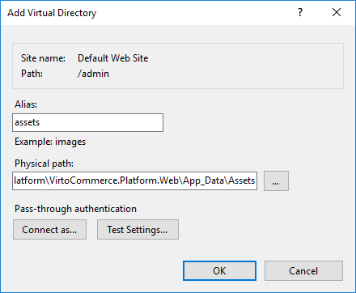

Your web site structure should be similar to the one shown below:

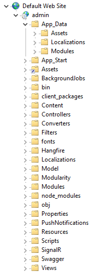

#### Configure file system

Open properties for the folder where you have extracted precompiled version or source code **(C:\vc-platform)** and give permission **Read & execute** to **Users** group if this permission is not inherited from the parent folder.
  
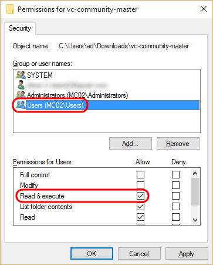

Open properties for **C:\vc-platform\VirtoCommerce.Platform.Web\App_Data** folder and give permission **Modify** to **IIS_IUSRS** user group.

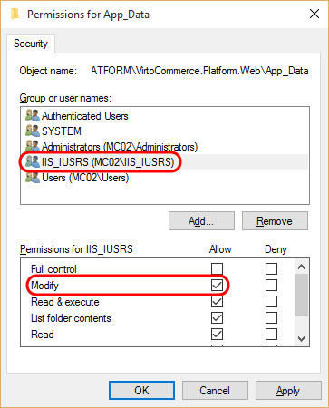

Open properties for **C:\vc-platform\VirtoCommerce.Platform.Web\Modules** (create this folder if not exsist) folder and give permission **Modify** to **IIS_IUSRS** user group as shown above.

#### Configure CMS content (optionally)

[VirtoCommerce CMS Content module](https://virtocommerce.com/apps/extensions/virto-cms-module) provide you ability to view & update CMS content from platform UI.

You can optionally change default path of CMS content:
* In the **C:\vc-platform\VirtoCommerce.Platform.Web\web.config** file in the **connectionStrings** section add the **add** node named **CmsContentConnectionString**
* Change its **connectionString** attribute value to needed folder path (**provider=LocalStorage;rootPath=~/App_Data/cms-content** connection string will be used by default).
```
<connectionStrings>
  ...
  <add name="CmsContentConnectionString" connectionString="provider={provider name};rootPath={URL to CMS content location}" />
  ...
</connectionStrings>
```

#### Start VirtoCommerce Platform

Open the http://localhost/admin URL in browser. 

A sign in page should open:

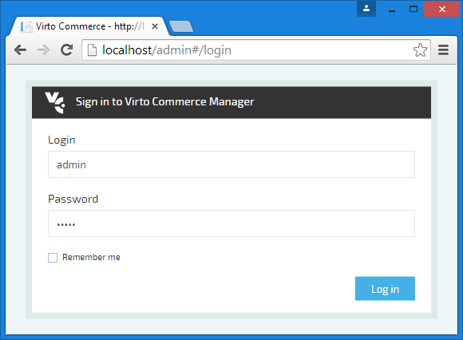

The default administrator account login is **admin** and the password is **store**.

#### Next steps (optional)

The VirtoCommerce Platform is up and running. What's next? Here are some ideas to try.

##### Install modules in VirtoCommerce Platform UI

Install some modules as described in [Modules management](https://virtocommerce.com/docs/vc2userguide/configuration/modules-management) tutorial.

##### Manual module installation from source code

Do you prefer the installation in developer way? Great, follow these steps for each module:
* Download the latest module source code from module GitHub repository in the same way as you did that for VirtoCommerce Platform in first step.
* Extract it to platform's **Modules** directory. You also can extract it to any directory (**C:\vc-module** for example) and link it to the Modules directory using the following command:
```
mklink /d C:\vc-platform\VirtoCommerce.Platform\VirtoCommerce.Platform.Web\Modules C:\vc-module
```
* Open and compile module solution.
* Restart IIS.
* Open Platform app.
* The new module will be loaded automatically.
* Check its status in **Configuration → Modules → Installed**.

##### Create your own module

Why not to **create your own** module? Follow the steps described in [Developing a custom solution](https://virtocommerce.com/docs/vc2devguide/development-scenarios/developing-a-custom-solution) tutorial.

##### How platform loads modules

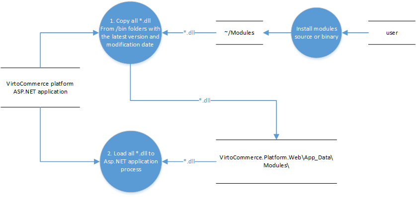

#### Sample data

If you have no data for your VirtoCommerce Platform, but want to easy develop VirtoCommerce Platform or its modules, you can install our sample data.

At first login you will see the following dialog after optional module choice & installation:

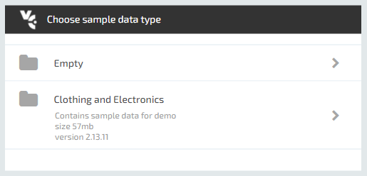

Click to **Clothing and Electronics**. Sample data installation will start.

### Storefront local installation

Deploy and configure Virto Commerce Storefront from source code and setup development environment:

#### Software requirements

* Microsoft .NET Framework 4.6.1
* Internet Information Services 7 or later
* <a href="https://www.microsoft.com/en-us/download/details.aspx?id=40784" rel="nofollow">Visual C++ Redistributable Packages for Visual Studio</a>
* Visual Studio 2015 or later (*optional*)
* Git

#### Downloading source code

Fork your own copy of VirtoCommerce Storefront to your account on GitHub:
1. Open <a href="https://github.com/VirtoCommerce/vc-storefront" rel="nofollow">VirtoCommerce Storefront in GitHub</a> and click **Fork** in the upper right corner.
2. If you are a member of an organization on GitHub, select the target for the fork.
3. Clone the forked repository to local machine:
```
git clone https://github.com/<<your GitHub user name>>/vc-storefront.git C:\vc-storefront
```
4. Switch to the cloned directory:
```
cd C:\vc-storefront
```
5. Add a reference to the original repository:
```
git remote add upstream https://github.com/VirtoCommerce/vc-storefront.git
```
In result you should get the **C:\vc-storefront** folder which contains full storefront source code.
To retrieve changes from original Virto Commerce Storefront repository, merge **upstream/master** branch.

Restore NuGet packages in one of the following ways:
* Open **VirtoCommerce.Storefront.sln** solution in Visual Studio. In Solution Explorer window right-click on solution and select **Manage NuGet Packages for Solution**. In the opened window click the **Restore** button.


* Run this command:
```
nuget restore C:\vc-storefront\VirtoCommerce.Storefront\VirtoCommerce.Storefront.sln
```
Build the solution.

#### Configuring VirtoCommerce Platform URL

* In the **C:\vc-storefront\VirtoCommerce.Storefront\web.config** file in the **connectionStrings** section find the **add** node named **VirtoCommerceBaseUrl**.
* Change its **connectionString** attribute value to the URL of your **VirtoCommerce Platform** application.

```
<connectionStrings>
  ...
  <add name="VirtoCommerceBaseUrl" connectionString="{VirtoCommerce Platform URL}" />
  ...
</connectionStrings>
```

#### Configuring API client credentials

VirtoCommerce Platform supports 2 types of authentication for API calls:

* Simple - when user id is passed in url for each API request, e.g. http://demo.virtocommerce.com/admin/api/catalog/catalogs?api_key=a348fa7508d342f6a32f8bf6c6681a2a%20
* HMAC - Hash-based message authentication code (HMAC) is used to identify a client and ensure the request integrity.

In order to enable Storefront app using VirtoCommerce Platform API, first of all create a user in VirtoCommerce Platform and generate API key of appropriate type (Simple or HMAC). Article [Working with platform API](https://virtocommerce.com/docs/vc2devguide/development-scenarios/working-with-platform-api) describes how to configure and use API in your custom solution. Then set API client credentials in **C:\vc-storefront\VirtoCommerce.Storefront\web.config**

##### Example of HMAC authentication configuration

```
<appSettings>
  ...
  <add key="vc-public-ApiAppId" value="27e0d789f12641049bd0e939185b4fd2" />
  <add key="vc-public-ApiSecretKey" value="34f0a3c12c9dbb59b63b5fece955b7b2b9a3b20f84370cba1524dd5c53503a2e2cb733536ecf7ea1e77319a47084a3a2c9d94d36069a432ecc73b72aeba6ea78" />
  ...
</appSettings>
```

##### Example of Simple authentication configuration

```
<appSettings>
  ...
  <add key="vc-public-ApiAppId" value="a348fa7508d342f6a32f8bf6c6681a2a" />
  ...
</appSettings>
```

#### Configure CMS content storage

You can configure CMS content storage path in one of the following ways:
*Create a link to VirtoCommerce Platform **cms-content** folder:
```
mklink /d C:\vc-storefront\VirtoCommerce.Storefront\App_Data\cms-content C:\vc-platform\VirtoCommerce.Platform.Web\App_Data\cms-content
```
* Change CMS content connection string:
  * In the **C:\vc-storefront\VirtoCommerce.Storefront\web.config** file in the **connectionStrings** section find the **add** node named **ContentConnectionString**
  * Change its **connectionString** attribute value to the path of folder specified in **CmsContentConnectionString** connection string in your VirtoCommerce Platform installation (**~/App_Data/cms-content** by default, i.e. you must use **provider=LocalStorage;rootPath=C:\vc-platform\VirtoCommerce.Platform.Web\App_Data\cms-content** connection string in this case)
```
<connectionStrings>
  ...
  <add name="ContentConnectionString" connectionString="provider={provider name};rootPath={URL to CMS content location}" />
  ...
</connectionStrings>
```

#### Configure themes

If you did not install sample data for your platform, you need to configure theme for you storefront stores.
To upload theme in VirtoCommerce Platform UI, follow this steps:
1. Download zip file from latest release of [any storefront theme](apps/themes).
2. Go to [VirtoCommerce CMS Content module](https://virtocommerce.com/apps/extensions/virto-cms-module) in VirtoCommerce Platform UI (**More → Content**).
3. Open **Themes** widget for your store.
4. Click to **Upload** button and select downloaded zip file.

If you want to develop storefront theme, follow [theme development documentation](https://virtcommerce.com/docs/vc2devguide/working-with-storefront/theme-development) to learn how to setup theme for your store in theme development environment.

### Storage requirements

Precompiled <a class="crosslink" href="https://virtocommerce.com/b2b-ecommerce-platform" target="_blank">Virto Commerce</a> Manager with storefront take about 130 MB. When using the Deploy to Azure button on GitHub, the Azure web app downloads the source code and compiles it on the Azure web app - this takes about 800 MB.This means even the F1 (free) service plan is enough to host both web applications. S2 has 50 GB of storage, which is more than enough for both applications and product assets (images) of very large catalog. So when choosing between S2 and P2 you should only consider the performance of these instances. 

Also it is advisable to store product assets in a separate blob storage (Azure Storage Account).