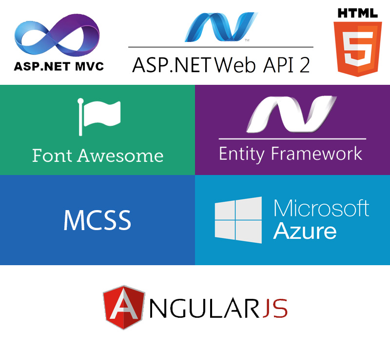

## Main goals

<a class="crosslink" href="https://virtocommerce.com/b2b-ecommerce-platform" target="_blank">Virto Commerce</a> is a flexible eCommerce framework for B2B and B2C solutions with customized services and a wide-range feature set. Virto Commerce provides full access to source code in order to design custom features, integrate with any third party system, and maintain internal control. This open approach gives companies the easiest and most cost-effective way to implement their unique custom <a class="crosslink" href="https://virtocommerce.com/b2b-ecommerce-platform" target="_blank">eCommerce solution</a>.

Virto Commerce includes the Virto Commerce Platform - **Commerce Manager** (server and management website) and **Storefronts** (the website and mobile app where customers do the shopping).

With the help of the Commerce Manager client, administrative users adjust system settings, such as search engine optimization, user accounts, payment gateways and system configuration parameters. Customer Service Representatives (CSR) use Commerce Manager client to manage customer orders and requests.

The <a class="crosslink" href="https://virtocommerce.com/ecommerce-website" target="_blank">web Storefront</a> is a website where customers shop for the products that are offered through the Commerce Manager. 

The mobile Storefront app duplicates web Storefront and gives better user experience for mobile users. Check more on [Mobile Starter app page](https://virtocommerce.com/docs/vc2userguide/introduction-to-virtocommerce/mobile-starter-app).

For the detailed descriptions of the platform components please refer to the [Developer Guide](https://virtocommerce.com/docs/vc2devguide) and [Installation Deployment Guide](https://virtocommerce.com/docs/vc2devguide/deployment).

## Architecture diagram

## Used stack of technologies

Our decision to use these technologies was the consequence of our extensive experience with Microsoft products.

We decided to use the following stack of technologies:

* **ASP.NET MVC 5** - as a web hosting technology
* **ASP.NET Web API 2** - to implement REST services
* **Entity Framework 6.1** - ORM
* **EF Migrations** - for managing database schema changes and data
* **ASP.NET Identity** - tasks related to authorization and authentication

**AngularJS** - for **SPA** user interface. One of the major decisions for picking it is due to its popularity and quality documentation. We didn’t have any prior experience working with AngularJS. Looking back, we never had any regrets with our decision to do so.

<a class="crosslink" href="https://virtocommerce.com/glossary/what-is-b2b-ecommerce" target="_blank">Platform and modules</a> are written using <a href="https://en.wikipedia.org/wiki/Domain-driven_design" rel="nofollow">DDD</a>, <a href="https://en.wikipedia.org/wiki/SOLID_(object-oriented_design)" rel="nofollow">SOLID</a>, <a href="https://en.wikipedia.org/wiki/Test-driven_development" rel="nofollow">Test Driven Development</a> methodologies. For a presentation layer, we use <a href="https://en.wikipedia.org/wiki/Model_View_ViewModel" rel="nofollow">MVVM</a> (thanks to AngularJS - the transition from WPF didn’t create any complications).

## The main advantages
* One of the main advantages of the platform is its modularity,
that gives high speed and isolation of development and releases, simplicity of scaling and increased fault tolerance.
* Used modern stack of technologies.
* The platform supports the creation of multichannel and multi language solutions.
* All code of the platform and its modules, as well as the development process is available in clear form on GitHub (https://github.com/VirtoCommerce)
* The results of code quality evaluation are also available in open form in SonarQube (https://sonar.virtocommerce.com/projects?sort=-analysis_date)