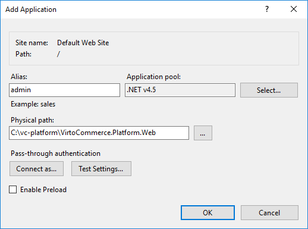
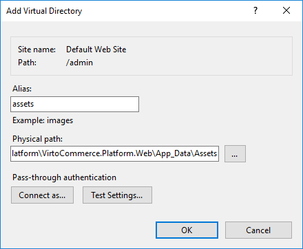
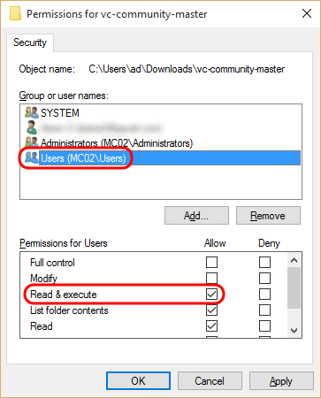

## Platform local installation

Deploy and configure Virto Commerce Platform from source code and setup development environment:

### Software requirements

* Microsoft .NET Framework 4.6.1
* Internet Information Services 7 or later
* Microsoft SQL Server 2008 or later (*Express or Full*)
* Visual Studio 2015 or later (*optional*)
* Git

### Downloading source code

Fork your own copy of VirtoCommerce Platform to your account on GitHub:
1. Open <a href="https://github.com/VirtoCommerce/vc-platform" rel="nofollow">Virto Commerce Platform in GitHub</a> and click **Fork** in the upper right corner.
2. If you are a member of an organization on GitHub, select the target for the fork.
3. Clone the forked repository to local machine:
```
git clone https://github.com/<<your GitHub user name>>/vc-platform.git C:\vc-platform
```
4. Switch to the cloned directory:
```
cd C:\vc-platform
```
5. Add a reference to the original repository:
```
git remote add upstream https://github.com/VirtoCommerce/vc-platform.git
```
In result you should get the **C:\vc-platform** folder which contains full platform source code.
To retrieve changes from original Virto Commerce Platform repository, merge **upstream/master** branch.

Restore NuGet packages in one of the following ways:
* Open **VirtoCommerce.Platform.sln** solution in Visual Studio. In Solution Explorer window right-click on solution and select **Manage NuGet Packages for Solution**. In the opened window click the **Restore** button.


* Run this command:
```
nuget restore C:\vc-platform\VirtoCommerce.Platform.Web\VirtoCommerce.Platform.sln
```
Build the solution.

### Configure SQL Server

SQL Server Authentication mode must be enabled.
  
 

Create the new login named **virto** with password **virto**. The password policy enforcement should be switched off for a simple password like this.

```
USE master; CREATE LOGIN virto WITH PASSWORD = 'virto', CHECK_POLICY = OFF
```

Give the **CREATE ANY DATABASE** permission to user virto. This will allow you to create a database automatically when Commerce Manager starts. For new databases created with this permission the user will have the **db_owner** role while access will be denied for any other database.

```
USE master; GRANT CREATE ANY DATABASE TO virto
```

Open the **C:\vc-platform\VirtoCommerce.Platform.Web\web.config** file and make sure the **VirtoCommerce** connection string has correct parameters for your configuration, particularly **Data Source** (SQL Server address), **Initial Catalog** (database name), **User ID** (user name) and **Password**.

### Configure IIS

Open **IIS Manager** and add new application to **Default Web Site** with alias **admin** and physical path to **C:\vc-platform\VirtoCommerce.Platform.Web**. Select application pool which uses **.NET CLR Version 4.0** and **Integrated pipeline mode**.



Inside the **admin** application add a new virtual directory with alias **assets** and physical path to **C:\vc-platform\VirtoCommerce.Platform.Web\App_Data\Assets**. If there is no Assets directory inside App_Data, create it.



Your web site structure should be similar to the one shown below:


### Configure file system

Open properties for the folder where you have extracted precompiled version or source code **(C:\vc-platform)** and give permission **Read & execute** to **Users** group if this permission is not inherited from the parent folder.
  


Open properties for **C:\vc-platform\VirtoCommerce.Platform.Web\App_Data** folder and give permission **Modify** to **IIS_IUSRS** user group.


Open properties for **C:\vc-platform\VirtoCommerce.Platform.Web\Modules** (create this folder if not exsist) folder and give permission **Modify** to **IIS_IUSRS** user group as shown above.

### Configure CMS content (optionally)

[VirtoCommerce CMS Content module](https://virtocommerce.com/apps/extensions/virto-cms-module) provide you ability to view & update CMS content from platform UI.

You can optionally change default path of CMS content:
* In the **C:\vc-platform\VirtoCommerce.Platform.Web\web.config** file in the **connectionStrings** section add the **add** node named **CmsContentConnectionString**
* Change its **connectionString** attribute value to needed folder path (**provider=LocalStorage;rootPath=~/App_Data/cms-content** connection string will be used by default).
```
<connectionStrings>
  ...
  <add name="CmsContentConnectionString" connectionString="provider={provider name};rootPath={URL to CMS content location}" />
  ...
</connectionStrings>
```

### Start VirtoCommerce Platform

Open the http://localhost/admin URL in browser. 

A sign in page should open:


The default administrator account login is **admin** and the password is **store**.

### Next steps (optional)

The VirtoCommerce Platform is up and running. What's next? Here are some ideas to try.

#### Install modules in VirtoCommerce Platform UI

Install some modules as described in [Modules management](https://virtocommerce.com/docs/vc2userguide/configuration/modules-management) tutorial.

#### Manual module installation from source code

Do you prefer the installation in developer way? Great, follow these steps for each module:
* Download the latest module source code from module GitHub repository in the same way as you did that for VirtoCommerce Platform in first step.
* Extract it to platform's **Modules** directory. You also can extract it to any directory (**C:\vc-module** for example) and link it to the Modules directory using the following command:
```
mklink /d C:\vc-platform\VirtoCommerce.Platform\VirtoCommerce.Platform.Web\Modules C:\vc-module
```
* Open and compile module solution.
* Restart IIS.
* Open Platform app.
* The new module will be loaded automatically.
* Check its status in **Configuration → Modules → Installed**.

#### Create your own module

Why not to **create your own** module? Follow the steps described in [Developing a custom solution](https://virtocommerce.com/docs/vc2devguide/development-scenarios/developing-a-custom-solution) tutorial.

#### How platform loads modules


### Sample data

If you have no data for your VirtoCommerce Platform, but want to easy develop VirtoCommerce Platform or its modules, you can install our sample data.

At first login you will see the following dialog after optional module choice & installation:


Click to **Clothing and Electronics**. Sample data installation will start.

### Storage requirements

Precompiled <a class="crosslink" href="https://virtocommerce.com/b2b-ecommerce-platform" target="_blank">Virto Commerce</a> Manager with storefront take about 130 MB. 