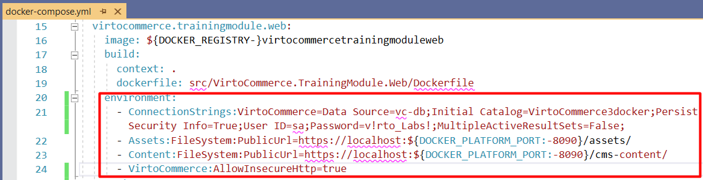

# Appsettings.json
As Virto Commerce Platform (VC Platform) is an ASP.NET Core based application, it can be configured as described in [this Microsoft article](https://docs.microsoft.com/en-us/aspnet/core/fundamentals/configuration/?view=aspnetcore-3.1).

## Configuration Settings
The configuration keys are hierarchic, and the most convenient way to manage them is working with the _appsettings.json_ file. The sections below, broken down by configuration nodes, show the overall file structure, provide default values, and explain what each key is about.

!!! note
    * All settings listed below are optional unless marked **Required**.

### ConnectionStrings
 These **required** settings represent connection strings for VC Platform and modules.

| Node | Default or Sample Value | Description  |
| ------------- | ------------------------ | ------------ |
| VirtoCommerce | E.g., `Data Source=(local);Initial Catalog=VirtoCommerce3;Persist Security Info=True;User ID=virto;Password=virto; MultipleActiveResultSets=True;Connect Timeout=30` | This **required** setting is for providing VC Platform system connection string to the SQL Server database. VC modules would revert to this connection string in case no specific connection string was defined. |
| E.g., VirtoCommerce.Catalog  | E.g., `Data Source=(local);Initial Catalog=VirtoCommerceCatalog;Persist Security Info=True;User ID=virto;Password=virto; MultipleActiveResultSets=True;Connect Timeout=30` | Other module-specific connection string(s). E.g., Virto Commerce Catalog module would use `VirtoCommerce.Catalog` connection string in case it is defined. |                           |
| RedisConnectionString | E.g., `"localhost"` | StackExchange.Redis Configuration string. Check [Redis Configuration](https://stackexchange.github.io/StackExchange.Redis/Configuration) for details. |

###  VirtoCommerce
This configuration node defines VC Platform system settings.

| Node | Default or Sample Value | Description  |
| ------------- | ------------------------ | ------------ |
| CountriesFilePath |`"localization/common/countries.json"` | Local path for the country list, which, by default, includes all countries of the world.
| CountryRegionsFilePath |`"localization/common/countriesRegions.json"` | Local path for state/province list. By default, includes the US states and Canada's provinces.
| LicenseActivationUrl |`"https://virtocommerce.com/admin/api/licenses/activate/"` | VC Platform license activation service URL
| LicenseFilePath |      `"App_Data/VirtoCommerce.lic"`                            | VC Platform license file location
| LocalUploadFolderPath | `"App_Data/Uploads"`                                     | The *Uploads* folder location
| SampleDataUrl | E.g., `"http://virtocommerce.azureedge.net/sample-data"` | URL to download sample data upon the initial Platform setup
| DiscoveryPath | `"./Modules"` | Relative or absolute folder location where the platform will discover the installed modules from
| AllowInsecureHttp | `false` | Manages how the OpenID Connect server (ASOS) handles the incoming requests: whether those arriving to non-HTTPS endpoints should be rejected or not. By default, this property is set to false to help mitigate the man-in-the-middle attacks.
| Hangfire || Background processing library (Hangfire) configuration.<br><br> `JobStorageType`: Current job storage. Supported values: _Memory_, _SqlServer_.<br> `UseHangfireServer`: Enables or disables Hangfire for this app instance.<br> `AutomaticRetryCount`: Maximum number of automatic retry attempts. <br>`SqlServerStorageOptions`: Hangfire.SqlServer.SqlServerStorageOptions. Check [Hangfire's SQL Server Configuration](https://docs.hangfire.io/en/latest/configuration/using-sql-server.html#configuration) documentation for details.
| Swagger || Allows you to disable Swagger initialization upon platform startup to prevent access to Swagger UI and documents.
| FileExtensionsBlackList || This setting is used together with the `VirtoCommerce.Platform.Security.FileExtensionsBlackList` setting (admin UI) to set the extensions of the files the platform does not permit to upload to the server. The `FileExtensionsBlackList` is not accessible from the admin UI. An administrator may provide an additional list of extensions through the UI that may be used with `FileExtensionsBlackList`.

#### Examples
Example settings for the `Hangfire` node:

```json
"Hangfire":
 { "JobStorageType": "Memory",
 "UseHangfireServer": true,
 "AutomaticRetryCount": 1,
 "SqlServerStorageOptions":
  { "CommandBatchMaxTimeout": "00:05:00",
 "SlidingInvisibilityTimeout": "00:05:00",
 "QueuePollInterval": "00:00:00",
 "UseRecommendedIsolationLevel": true,
 "UsePageLocksOnDequeue": true,
 "DisableGlobalLocks": true,
 "EnableHeavyMigrations": true
 }
 } 
```

Example settings for the `Swagger` node:

```json
"Swagger":
{
"Disable": true
}
```

Example settings for the `FileExtensionsBlackList` node:

```json
"FileExtensionsBlackList": [".pdf", ".json"]
```

### Assets
This **required** setting determines how VC Platform will be working with assets, i.e. files.

| Node | Default or Sample Value | Description  |
| ------------- | ------------------------ | ------------ |
| Provider | `"FileSystem"` | Current asset provider. Supported values: FileSystem, AzureBlobStorage.
| FileSystem || File system based asset provider configuration. Used when the `Provider` setting has the `FileSystem` value.
| AzureBlobStorage || Azure Blob Storage based asset provider configuration. Used when the `Provider` setting has the `AzureBlobStorage` value.

#### Examples
Example settings for the `FileSystem` node:

```json
"FileSystem": {
"RootPath": "~/assets",
"PublicUrl": "http://localhost:10645/assets/"
}
```
Example settings for the `AzureBlobStorage` node:

```json
"AzureBlobStorage": {
"ConnectionString": "",
"CdnUrl": ""
}  
```

### IdentityOptions
 There are options to configure the ASP.NET Core Identity system. You might want to check out [this guide](https://github.com/dotnet/AspNetCore.Docs/blob/master/aspnetcore/security/authentication/identity-configuration.md#configure-aspnet-core-identity) for details.

| Node | Description  |
| ------------- | ------------ |
| Password.PasswordHistory | The number of recent user passwords to check during password validation. An old password cannot be reused for this number of cycles.<br>If the value is set to `0` or not defined, the password history will be disabled.
| Password.RepeatedResetPasswordTimeLimit | The time limit after which a user can request password reset.
| User.MaxPasswordAge | The time span defining the maximum user password age until it expires. The user is forced to change the expired password upon login to the Platform Manager UI.<br>If the value is set to `0` or not defined, password expiration will be disabled.
| User.RemindPasswordExpiryInDays | Number of days to start showing password expiry warning in the Platform Manager UI. Used only when password expiration is enabled.

### ExternalModules
This node configures external sources, from which modules are being installed.

| Node | Default or Sample Value | Description  |
| ------------- | ------------------------ | ------------ |
| IncludePrerelease | `false` | Shows module versions marked as *Prerelease* if value is `true`.
| ModulesManifestUrl | E.g., `"https://raw.githubusercontent.com/VirtoCommerce/vc-modules/master/modules_v3.json"` | URL to the *.json* file that contains module manifests.
| AuthorizationToken | | The authorization token to access `ModulesManifestUrl`, added to the `Authorization` header, if specified.
| AutoInstallModuleBundles | `["commerce"]` | Group(s) of modules to install automatically during the initial Platform setup. If you do not need to install anything here, provide an empty array.

### Caching
This node manages caching configuration.

| Node | Default or Sample Value | Description  |
| ------------- | ------------------------ | ------------ |
| Redis || Redis configuration, which includes the message channel to use and number of times to retry.
| CacheEnabled | `true` | If set to `true`, cache entries are retained based on the _expiration settings_. Otherwise, cache entries will expire immediately.<br>Used if _ConnectionStrings\:RedisConnectionString_ is not specified.
| CacheSlidingExpiration | E.g., `"0:15:00"` | Cache entry will expire if it has not been accessed in a set amount of time. Used in case `CacheAbsoluteExpiration` was not defined.
| CacheAbsoluteExpiration | E.g., `"0:5:00"` | Cache entry will expire after a set amount of time. Used in case `RedisConnectionString` was not specified.

#### Examples
Example settings for the `Redis` node:

```json
"Redis": {
"ChannelName": "VirtoCommerceChannel",
"BusRetryCount": 3
} 
```

### Notifications
This enables notification configuration for the `VirtoCommerce.Notifications` module.

| Node | Default or Sample Value | Description  |
| ------------- | ------------------------ | ------------ |
| Gateway | E.g., `"SendGrid"` | The current notification sending gateway. The out of the box implemented and supported values are `Smtp`, `SendGrid`.
| DefaultSender | E.g., `"noreply@gmail.com"` | This **required** setting provides sender identification used by the current notification sending gateway.
| Smtp || SMTP gateway configuration. Used if the `Gateway` setting has the `Smtp` value.
| SendGrid || SendGrid gateway configuration. Used when the `Gateway` setting has the `SendGrid` value.

#### Examples
Example settings for the `Smtp` node:

```json
"Smtp": {
"SmtpServer": "http://smtp.gmail.com",
"Port": 587,
"Login": "my-login",
"Password": "my-password"
}
```

Example settings for the `SendGrid` node:

```json
"SendGrid": {
"ApiKey": "my-SendGrid-Api-Key"
} 
```

### Search
This configures full text search for the `VirtoCommerce.Search` module.

| Node | Default or Sample Value | Description  |
| ------------- | ------------------------ | ------------ |
| Provider | E.g., `"Lucene"` | This **required** setting specifies the current search provider. The supported values are  `Lucene`, `AzureSearch`, and `ElasticSearch`.
| Scope | E.g., `"default"`   | This setting determines the scope to use and is **required**.
| Lucene | | Lucene provider configuration for the _VirtoCommerce.LuceneSearch_ module. Used when the `Provider` setting has the `Lucene` vaue.
| AzureSearch | | AzureSearch provider configuration for the _VirtoCommerce.AzureSearch_ module. Used when the `Provider` setting has the `AzureSearch` value.
| ElasticSearch | | Elasticsearch  provider configuration for the _VirtoCommerce.ElasticSearch_ module. Used when the `Provider` setting has the `ElasticSearch` value.

#### Examples
Example settings for the `Lucene` node:

```json
"Lucene": {
"Path": "App_Data/Lucene"
} 
```

Example settings for the `AzureSearch` node:

```json
"AzureSearch": {
"SearchServiceName": "my-ServiceName",
"Key": "my-AccessKey"
} 
```

Example settings for the `ElasticSearch` node:

```json
"ElasticSearch": {
"Server": "localhost:9200",
"User": "elastic",
"Key": "",
"EnableHttpCompression": ""
} 
```

### Content
This **required** setting is used for static content configuration (including themes) for the `VirtoCommerce.Content` module.

| Node | Default or Sample Value | Description  |
| ------------- | ------------------------ | ------------ |
| Provider | `"FileSystem"` | Current content (file) provider. The supported values are `FileSystem` and `AzureBlobStorage`.
| FileSystem | | File system based content provider configuration. This is the default provider used unless `AzureBlobStorage` is set as the current provider.
| AzureBlobStorage | | Azure Blob Storage based content provider configuration. Used when the `Provider` setting has `AzureBlobStorage` as value.

#### Examples
Example settings for the `FileSystem` node:

```json
"FileSystem": {
"RootPath": "~/cms-content",
"PublicUrl": "http://localhost:10645/cms-content/"
}  
```

Example settings for the `AzureBlobStorage` node:

```json
"AzureBlobStorage": {
"ConnectionString": "",
"CdnUrl": ""
}
```

### AzureAd
This node is used for authentication with Azure Active Directory. Check [how to enable authentication with Azure Active Directory](https://github.com/VirtoCommerce/vc-platform/blob/master/docs/techniques/authentication-with-azure-ad.md) for details.

| Node | Default or Sample Value | Description  |
| ------------- | ------------------------ | ------------ |
| Enabled | `false` | Enables authentication with Azure Active Directory. By default, this value is `false`, i.e. the authentication is deisabled.
| UsePreferredUsername | `false` | If set to `true`, the system will check the `preffered_username` in case the `upn` claim returns empty.
| Priority | 0 | Configures the priority of the Azure Active Directory login popup on the _Login_ page. The lowest value means the highest priority.

### PasswordLogin
This node enables authentication with username and password.

| Node | Default or Sample Value | Description  |
| ------------- | ------------------------ | ------------ |
| Enabled | `true` | Always enabled by default. Setting to `false` will disable logging in with username and password.
| Priority | 0 | Configures the priority of the password login popup on the _Login_ page. The lowest value means the highest priority.

### LoginPageUI
This node is used for configuration of the background screen and background pattern of the _Login_ page.

| Node | Default or Sample Value | Description  |
| ------------- | ------------------------ | ------------ |
| BackgroundUrl | | Login page background URI. If set, takes priority over the preset.
| PatternUrl | | Login page background pattern URI. If set, takes priority over the preset.
| Preset | `demo` | Login page background preset name. If set, searches the preset from the preset list and applies `BackgroundUrl` and `PatternUrl` from it.
| Presets | | A list of background presets.

#### Examples
Example settings for the `Presets` node:

```json
[
{ "Name": "demo", "BackgroundUrl": "images/login_background.png", "PatternUrl": "/images/pattern-demo.svg"
},
{ "Name": "prod", "BackgroundUrl": "", "PatternUrl": "/images/pattern-live.svg"
}
] 
```

## Hierarchic Keys and Separators
When working with keys, one should follow these rules:

* Within the Configuration API, a colon separator (`:`) works on all platforms.
* In environment variables, a colon separator may not work on all platforms. A double underscore, `__`, is supported by all platforms and is automatically converted into a colon `:`.
* In Azure Key Vault, hierarchic keys use double hyphen `--` as a separator. The Azure Key Vault configuration provider automatically replaces `--` with a `:` when the secrets are loaded into the app configuration.

The images below show some examples of using the above rules:


*Configuring ElasticSearch on localhost in the `appsettings.json` file*




_Configuring `VirtoCommerce ConnectionString` and other settings through **environment variables** in the **docker-compose.yml** file_


_Configuring `AzureSearch` and other settings trough the **Application settings** in **Azure**_


You can find more details in [this ASP.NET configuration guide](https://docs.microsoft.com/en-us/aspnet/core/fundamentals/configuration/?view=aspnetcore-3.1#configuration-keys-and-values).

