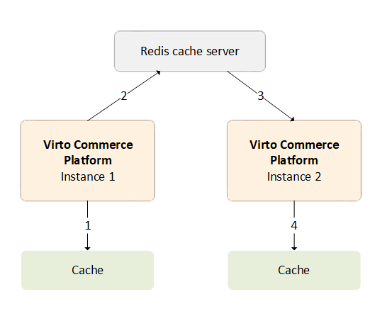

# Setting up Redis Backplane for Scaling out
Running multiple instances of your application, all accessing the same distributed cache, can be challenging: the instances should find out when the data was changed and the local cache data becomes irrelevant.  One way to solve this problem is by connecting all application instances to a service that sends messages whenever cache data becomes invalid. Redis, an in-memory key-value storage, supports a messaging system with the publish/subscribe (Pub/Sub) model as follows:

{: width="450"}

1. One platform instance evicts some data from cache.
2. The message for this event is sent to the backplane. 
3. The backplane knows all connected clients and which servers they are on.
4. The backplane sends a message to all clients via their respective servers.

For more information on why we do not use distributed cache to solve this problem, read the [article](https://virtocommerce.medium.com/how-we-improved-the-performance-of-b2b-ecommerce-platform-by-data-caching-in-azure-cloud-71b27995066c).

## Implementing Cache Backplane Using Redis Pub/Sub Channel

Redis Pub/Sub is used to send messages to the Redis server on any key change:
   
   * Clearing cache. 
   * Clearing region.
   * Removing key operation, etc. 

Each cache instance with the same configuration subscribes to the same channel and can respond to these messages to keep other cache handles in sync with the master.

To add a Redis cache backplane to the Virto platform at the configuration stage, copy `StackExchange.Redis`, the primary connection string, to [Configuration](https://docs.microsoft.com/en-us/aspnet/core/fundamentals/configuration/?view=aspnetcore-6.0):

   * For local deployment, save the connection string with [Secret Manager](https://docs.microsoft.com/en-us/aspnet/core/security/app-secrets?view=aspnetcore-6.0#secret-manager) or [appsetting.json](../../Configuration-Reference/appsettingsjson.md):
      
      ``` json title="appsettings.json"
      "ConnectionStrings": {
         ...
         //Add RedisConnectionString value to start using Redis server as backplane for memory cache synchronization
         "RedisConnectionString": "vc.redis.cache.windows.net:6380,password={password}=,ssl=True,abortConnect=False"
         ...
      },
      ```
        
   * For Azure based instance, save the connection string in App Service Configuration or another secure storage.

!!!warning
	* Use the same `RedisConnectionString` for all platform instances. Their local cache instances must be synchronized as well.

### How It Works

Every time an item is removed or updated, the platform sends a message to the backplane, which stores the information needed to update other clients. All other clients receive these messages asynchronously and respond accordingly.

!!! Note "Example" 

    A cache item was updated by Client A, while Client B still has the old version in its local in-process cache. 
    With the source set, the platform can evict the item from all of Client B's local in-process cache instances and retrieve the new version from the source on the next **Get the new version** request.

Note that:

* The performance of the cache will be slightly degraded due to the network traffic and overhead involved.
* Synchronization will not occur on all clients at the same time, which may result in some minor delays.

## Additional Resources
For more information, refer to:

-   [Redis Overview](https://redis.io/)
    
-   [How to Scale out Platform Based on Azure ](https://docs.virtocommerce.org/techniques/how-scale-out-platform-on-azure/)
