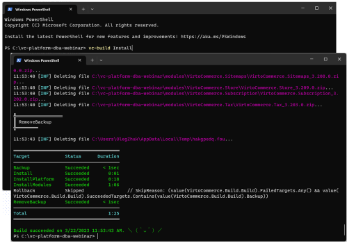
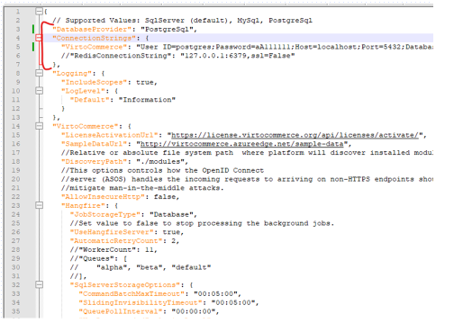
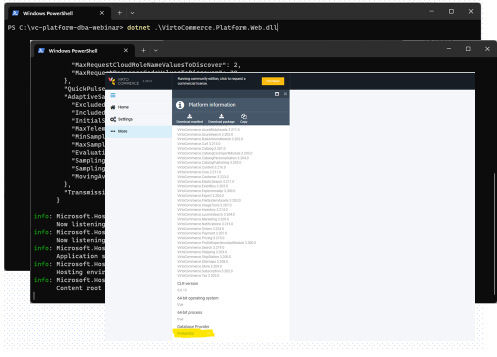

# Launching VC with DB Provider

This example demonstrates how to launch Virto Commerce with PostgreSQL.

## Prerequisites
1. PostgreSQL 12+
1. Virto Commerce CLI (VC-BUILD) 3.12+
1. Virto Commerce Platform 3.293+

## Installing and launching
1. Install Virto Commerce:

    1. Create a new folder.
    1. Open PowerShell as an administrator.
    1. Use the `cd` command to navigate to the folder created in step 1.
    1. Run the command `vc-build install` to install Virto Commerce with the Commerce bundle. Note that this command assumes you already have vc-build installed.

        

1. Setup DB Provider:

    1. Open PostgreSQL and connect to the server where you want to create the new database.
    1. Run the SQL command `CREATE DATABASE [database_name];` to create a new database.
    1. Open the project solution in Visual Studio or other text editor.
    1. Open the appsettings.json file.
    1. Change the value of the `DatabaseProvider` property to `PostgreSql`.
    1. Change the value of the `ConnectionString` property to match the connection details for the newly created PostgreSQL database. 

        

    

Connection strings for Microsoft SQL Server

        "DatabaseProvider": "SqlServer",
        "ConnectionStrings": {
        "VirtoCommerce": "Data Source=(local);Initial Catalog=VirtoCommerce3;Persist Security Info=True;User ID=virto;Password=virto;Connect Timeout=30;TrustServerCertificate=True;"
        },

    
  

    

Connection strings for MySql Server

        
        "DatabaseProvider": "MySql",
        "ConnectionStrings": {
        "VirtoCommerce": "server=localhost;user=root;password=virto;database=VirtoCommerce3;"
        },

    
 

1. Run Virto Commerce on PostgreSql.

