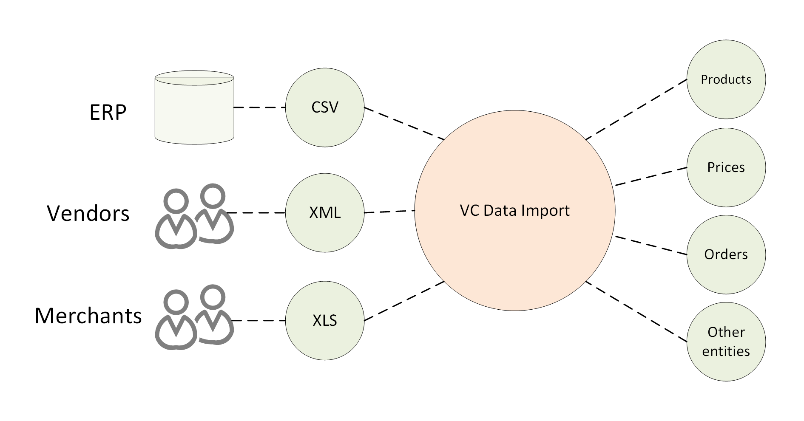
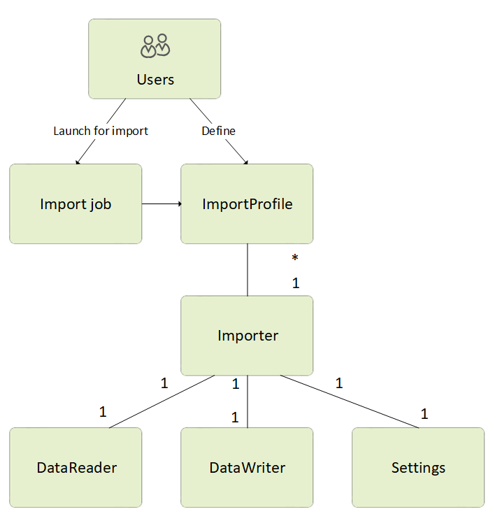

# Main Concept
The architecture and behavior of Virto Commerce Import Framework allows to easily import your data, such as product information, customers, categories, and much more, into the Virto Commerce platform.

## Overview
VC Data Import allows you to define what kind of data you want to import into your application. It uses custom configurable import profiles, where you can specify what kind of data to import and from which data sources.

{: width="650" }

Using VC Data Import, you can benefit from:

+ Managing user defined import profiles directly from the platform manager UI.
    
+ Seeing the import history with detailed logs.
    
+ Working with an extensibility model that enables extending the existing built-in importers with new data types and sources.

## Core Structure
The chart below shows VC Data Import's high level logical structure:

{: width="550" }

VC Data Import is based on three main objects:

+ **Import job:** An object for a task that imports data according to ImportProfile. You can run it:

    * Manually on-demand.
    * Regularly based on a schedule.

+ **Import profile:** A user-defined entity with a unique name acting as its ID. Each profile is associated with a certain Importer. It can also be configured through the runtime parameters in Settings that Importer might provide.
    
+ **Importer:** A piece of code that:

    * Reads data from a specific data source file (CSV, XLS, etc.).
    * Writes an object of a specific data type (products, prices, etc.) to the target system. 
    
    Each Importer consists of the three main objects:
    
    + **DataReader**: reads data from a file (CSV, XSLS, YML, etc.) or another type of external source (a database, a web service, etc.).
        
    + **DataWriter**: writes the imported objects into the system.
        
    + **Settings**: provides settings that can be used to configure ImportProfile linked to the importer in question.
        

For more information about creating your own data importers, read [Building Custom Importer](02-building-custom-importer.md).
