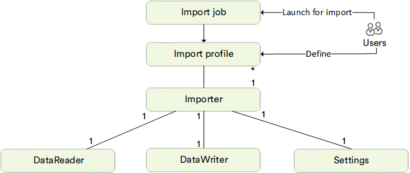

# Main Concept
The architecture and behavior of Virto Commerce Import Framework allows to easily import your data, such as product information, customers, categories, and much more, into the Virto Commerce platform.

## Overview
VC Data Import allows you to define what kind of data you want to import into your application. It uses custom configurable import profiles, where you can specify what kind of data to import and from which data sources.

{: width="650" }

Using VC Data Import, you can benefit from:

+ Managing user defined import profiles directly from the platform manager UI.
    
+ Seeing the import history with detailed logs.
    
+ Working with an extensibility model that enables extending the existing built-in importers with new data types and sources.

## Core Structure
The chart below shows VC Data Import's high level logical structure:



VC Data Import is based on three main objects:

+ **Import job:** An object for a task that imports data according to ImportProfile. You can run it:

    * Manually on-demand.
    * Regularly based on a schedule.

+ **Import profile:** A user-defined entity with a unique name acting as its ID. Each profile is associated with a certain Importer. It can also be configured through the runtime parameters in Settings that Importer might provide.
    
+ **Importer:** A piece of code that:

    * Reads data from a specific data source file (CSV, XLS, etc.).
    * Writes an object of a specific data type (products, prices, etc.) to the target system. 
    
    Each Importer consists of the three main objects:
    
    + **DataReader**: reads data from a file (CSV, XSLS, YML, etc.) or another type of external source (a database, a web service, etc.).
        
    + **DataWriter**: writes the imported objects into the system.
        
    + **Settings**: provides settings that can be used to configure ImportProfile linked to the importer in question.
        

## Additional Development Information

To create a Custom Importer, the developer needs to define their own DataReader and DataWriter, and define Settings and Validation rules, if necessary. Currently, the Module provides the ability to use the CSV Reader as part of the [VirtoCommerce.ImportModule.CsvHelper](https://www.nuget.org/packages/VirtoCommerce.ImportModule.CsvHelper) package as a help, but does not restrict the developer from writing their own Readers for any data sources.

The following Module services are also available for developers to use in the [UI](03-import-app.md#user-interface-and-work-scenarios):

* `IImportRunService` is the main service for managing the execution of the import process. The service provides access to methods for previewing `PreviewAsync``, launching an import `RunImportAsync`, and creating a similar import task in the form of a background job `RunImportBackgroundJob`.

* `IImportProfilesSearchService` and `IImportRunHistorySearchService` provide search capabilities for `ImportProfiles` and `ImportRunHistory` respectively.

* `IImportProfileCrudService` and `IImportRunHistoryCrudService` provide facilities for CRUD operations on `ImportProfiles` and `ImportRunHistory` respectively.

Developers can extend authorizations for newly created Importers. The `DataImporterBuilder` has `WithAuthorizationReqirement` and `WithAuthorizationPermission` methods to set custom permissions if necessary.

{: width="25"} [Building Custom Importer](02-building-custom-importer.md)

## Import App

Import App is the new user interface, based on [Virto Custom App Development](https://docs.virtocommerce.org/new/dev_docs/custom-apps-development/overview/).

### Key Features

* Expandable with [VC Shell](https://github.com/VirtoCommerce/vc-shell). 
* Import-on-demand for Operator user.

### Folder Structure

```text
├─ public                                    // static assets, images, etc
├─ src
│  ├─ api_client                             // generated API clients folder
│  ├─ composables                            // application composables
│  ├─ locales                                // locale files used to provide translated content
│  ├─ modules                                // the collection of custom modules
│  │  ├─ ...                                 // module folder
│  │     ├─ components                       // components specific for this module
│  │     ├─ composables                      // shared logic written using Composable API pattern.
│  │     ├─ locales                          // locale files used to provide translated content specific for this module
│  │     ├─ pages                            // set of module pages used within Application router
│  │     └─ index.ts                         // module entry point
│  ├─ pages                                  // set of application pages used within Application router.
│  ├─ router                                 // SPA routing configuration
│  ├─ styles                                 // extras application style files
│  └─ types                                  // typescript .d.ts files
```

### Getting Started

```bash
# install and configure package dependencies and git hooks
$ yarn

# build application
$ yarn build

# start application with hot reload at localhost:8080
$ yarn serve
```

###  Version Bumping

```bash
$ yarn bump patch/minor/major
```

{: width="25"} [Import App](import-app.md)

