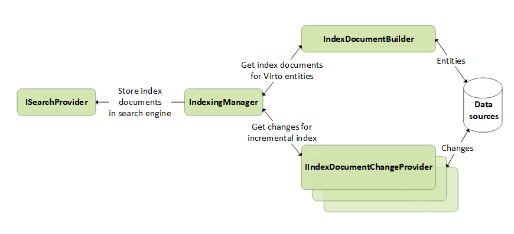

# Indexing Overview

Common Indexing is a search engine agnostic process for data indexation.

The process chart of such indexing may look as follows:

To do indexing, the process performs the following steps:

1. `IndexingManager` starts the indexing process for every affected entity in a scope of the specific document types that are requested.

2. It then requests the list of changed entity identifiers that need indexing, by running `IIndexDocumentChangesProvider` at the specific date for incremental indexing or all entities for overall index rebuild. 

3. It gets the resulting index documents for entity identifiers by calling `IIndexDocumentBuilder` instances.

4. Finally, it collects index documents and saves them in the search index storage through `ISearchProvider`.

The key indexing features are:

+ [Specialized UI and API in Platform Manager](indexing-in-platform-manager.md) for routine tasks with indexing.

+ Index document enrichment: You can compose an index document from the fields taken from multiple data sources.<!---(TODO: Link how to create a new indexer# Enrichment )-->

+ Custom  indexers: When developing an indexer, you'll specify a data source and a search index (destination). Currently, the process of defining a new indexer requires development efforts<!---(TODO: Link how to create a new indexer)-->. Also, thanks to search engine agnostic capabilities, you need to create a custom indexer only once to work with all search providers without any changes.

+ Manual and incremental index updates: You can run indexers on demand or on a recurring basis. Virto updates search indexes by periodically adding or removing data entities that have changed in the Commerce Engine. Thanks to incremental index updates, the search engine updates the indexes with index documents  based on new, changed, or deleted items in the data sources.<!---TODO: Link Incremental index updates-->

+ [Blue/Green indexing](blue-green-indexing.md): Allows you to perform zero downtime upgrades of your index. You can run a full index rebuild or long time indexing tasks on other index instances and switch them to published index the production environment is connected to, when these tasks are finished.