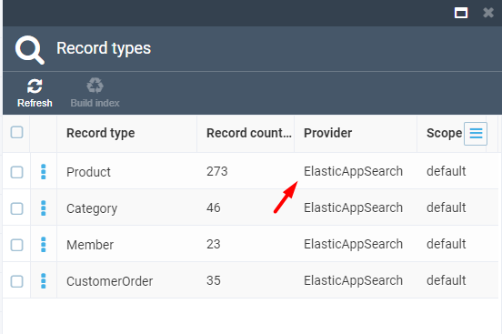
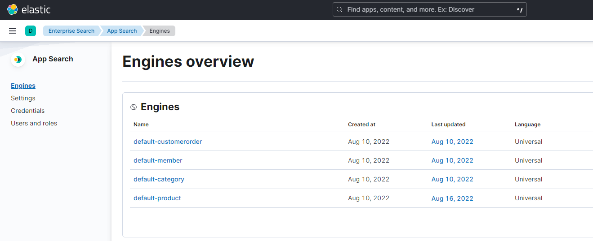
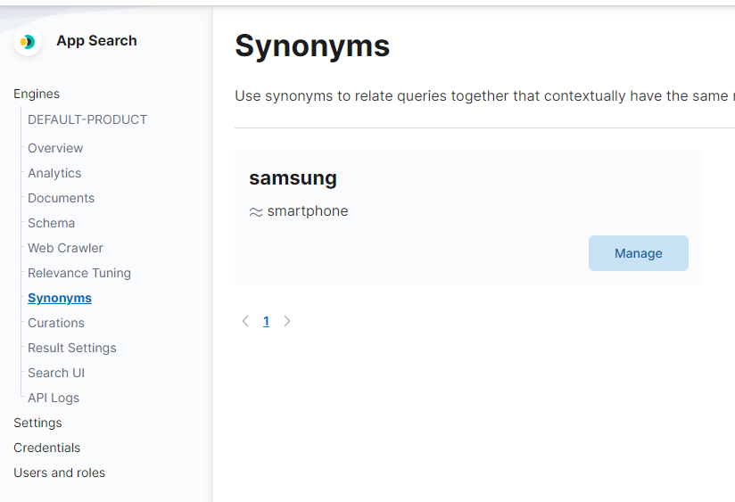

# Configuring Elastic App Search

This guide will explain how to configure and run Elastic App Search for your environment.

## Prerequisites
In order to start using Elastic App Search, you need to:

+ Install the latest version of `vc-platform` (3.x), either [on Windows](https://github.com/VirtoCommerce/vc-platform/blob/master/docs/getting-started/deploy-from-precompiled-binaries-windows.md) or [on Linux](https://github.com/VirtoCommerce/vc-platform/blob/master/docs/getting-started/deploy-from-precompiled-binaries-linux.md)
+ Install the `vc-module-experience-api` module using [this guide](https://github.com/VirtoCommerce/vc-module-experience-api/blob/dev/docs/getting-started.md)
+ Install the [vc-module-profile-experience-api](https://github.com/VirtoCommerce/vc-module-profile-experience-api) module
+ Install [Node.js](https://nodejs.org/en/download/) v.16.X
+ Install [Yarn](https://classic.yarnpkg.com/lang/en/docs/install/#windows-stable) Package Manager by running this command:

  ```
  npm install --global yarn
  ```

### Installing `vc-storefront`
You will also need to install `vc-storefront` by:

+ Cloning [https://github.com/VirtoCommerce/vc-storefront](https://github.com/VirtoCommerce/vc-storefront) in to a local folder
+ Opening the **appsettings.json** file in a text editor
- In the **Endpoint** section, changing **Url**, **UserName**, and **Password** with the correct path and credentials for Virto Commerce Platform:

```json
 "Endpoint": {
     "Url": "https://localhost:5001",
     "UserName": "admin",
     "Password": "store"
 }
```

### Setting up `Vue B2B Theme`
Finally, you will also need to set up `Vue B2B Theme`:

+ Clone the repo into the folder where Storefront is installed:

```bash
    git clone https://github.com/VirtoCommerce/vue-starter-theme.git "C:\vc-storefront\VirtoCommerce.Storefront\wwwroot\cms-content\themes\{store-name}\default"
```

+ Change the current directory to the default theme directory (change `{store-name}` to the store you want to use, e.g., `B2B-store`) :

```bash
    cd C:\vc-storefront\VirtoCommerce.Storefront\VirtoCommerce.Storefront\wwwroot\cms-content\themes\{store-name}\default
```
+ Install the dependencies:

```bash
    npm install
    yarn
```

+ Start the theme in the development mode with hot reload support:

```bash
yarn dev
```

- Or build the theme to get an installable artifact:

```bash
yarn compress
```

## Setting up Elastic App Search

### Deploying Elastic App Search using Docker
To deploy Elastic App Search using Docker, do the following: 

+ Install `Docker` for [Windows](https://docs.docker.com/desktop/install/windows-install/) or [Linux](https://www.docker.com/get-started/)
+ Install `Elastic App Search` Container using `Docker-Compose`:

    + Create a directory and with a file named `.env` inside:

        ```
        STACK_VERSION=8.3.3
        ELASTIC_PASSWORD=!!!changeme!!!
        KIBANA_PASSWORD=!!!changeme!!!
        ES_PORT=9200
        CLUSTER_NAME=es-cluster
        LICENSE=basic
        MEM_LIMIT=1073741824
        KIBANA_PORT=5601
        ENTERPRISE_SEARCH_PORT=3002
        ENCRYPTION_KEYS=secret
        ```

   + Create a strong password and place it instead of `!!!changeme!!!`
   + Create a file named `docker-compose.yml` and place it with the `.env` file:
   
        ```yml
        version: "2.2"

        services:
        setup:
            image: docker.elastic.co/elasticsearch/elasticsearch:${STACK_VERSION}
            volumes:
            - certs:/usr/share/elasticsearch/config/certs
            user: "0"
            command: >
            bash -c '
                if [ x${ELASTIC_PASSWORD} == x ]; then
                echo "Set the ELASTIC_PASSWORD environment variable in the .env file";
                exit 1;
                elif [ x${KIBANA_PASSWORD} == x ]; then
                echo "Set the KIBANA_PASSWORD environment variable in the .env file";
                exit 1;
                fi;
                if [ ! -f certs/ca.zip ]; then
                echo "Creating CA";
                bin/elasticsearch-certutil ca --silent --pem -out config/certs/ca.zip;
                unzip config/certs/ca.zip -d config/certs;
                fi;
                if [ ! -f certs/certs.zip ]; then
                echo "Creating certs";
                echo -ne \
                "instances:\n"\
                "  - name: es01\n"\
                "    dns:\n"\
                "      - es01\n"\
                "      - localhost\n"\
                "    ip:\n"\
                "      - 127.0.0.1\n"\
                > config/certs/instances.yml;
                bin/elasticsearch-certutil cert --silent --pem -out config/certs/certs.zip --in config/certs/instances.yml --ca-cert config/certs/ca/ca.crt --ca-key config/certs/ca/ca.key;
                unzip config/certs/certs.zip -d config/certs;
                fi;
                echo "Setting file permissions"
                chown -R root:root config/certs;
                find . -type d -exec chmod 750 \{\} \;;
                find . -type f -exec chmod 640 \{\} \;;
                echo "Waiting for Elasticsearch availability";
                until curl -s --cacert config/certs/ca/ca.crt https://es01:9200 | grep -q "missing authentication credentials"; do sleep 30; done;
                echo "Setting kibana_system password";
                until curl -s -X POST --cacert config/certs/ca/ca.crt -u elastic:${ELASTIC_PASSWORD} -H "Content-Type: application/json" https://es01:9200/_security/user/kibana_system/_password -d "{\"password\":\"${KIBANA_PASSWORD}\"}" | grep -q "^{}"; do sleep 10; done;
                echo "All done!";
            '
            healthcheck:
            test: ["CMD-SHELL", "[ -f config/certs/es01/es01.crt ]"]
            interval: 1s
            timeout: 5s
            retries: 120

        es01:
            depends_on:
            setup:
                condition: service_healthy
            image: docker.elastic.co/elasticsearch/elasticsearch:${STACK_VERSION}
            volumes:
            - certs:/usr/share/elasticsearch/config/certs
            - esdata01:/usr/share/elasticsearch/data
            ports:
            - ${ES_PORT}:9200
            environment:
            - node.name=es01
            - cluster.name=${CLUSTER_NAME}
            - cluster.initial_master_nodes=es01
            - ELASTIC_PASSWORD=${ELASTIC_PASSWORD}
            - bootstrap.memory_lock=true
            - xpack.security.enabled=true
            - xpack.security.http.ssl.enabled=true
            - xpack.security.http.ssl.key=certs/es01/es01.key
            - xpack.security.http.ssl.certificate=certs/es01/es01.crt
            - xpack.security.http.ssl.certificate_authorities=certs/ca/ca.crt
            - xpack.security.http.ssl.verification_mode=certificate
            - xpack.security.transport.ssl.enabled=true
            - xpack.security.transport.ssl.key=certs/es01/es01.key
            - xpack.security.transport.ssl.certificate=certs/es01/es01.crt
            - xpack.security.transport.ssl.certificate_authorities=certs/ca/ca.crt
            - xpack.security.transport.ssl.verification_mode=certificate
            - xpack.license.self_generated.type=${LICENSE}
            mem_limit: ${MEM_LIMIT}
            ulimits:
            memlock:
                soft: -1
                hard: -1
            healthcheck:
            test:
                [
                    "CMD-SHELL",
                    "curl -s --cacert config/certs/ca/ca.crt https://localhost:9200 | grep -q 'missing authentication credentials'",
                ]
            interval: 10s
            timeout: 10s
            retries: 120

        kibana:
            depends_on:
            es01:
                condition: service_healthy
            image: docker.elastic.co/kibana/kibana:${STACK_VERSION}
            volumes:
            - certs:/usr/share/kibana/config/certs
            - kibanadata:/usr/share/kibana/data
            ports:
            - ${KIBANA_PORT}:5601
            environment:
            - SERVERNAME=kibana
            - ELASTICSEARCH_HOSTS=https://es01:9200
            - ELASTICSEARCH_USERNAME=kibana_system
            - ELASTICSEARCH_PASSWORD=${KIBANA_PASSWORD}
            - ELASTICSEARCH_SSL_CERTIFICATEAUTHORITIES=config/certs/ca/ca.crt
            - ENTERPRISESEARCH_HOST=http://enterprisesearch:${ENTERPRISE_SEARCH_PORT}
            mem_limit: ${MEM_LIMIT}
            healthcheck:
            test:
                [
                    "CMD-SHELL",
                    "curl -s -I http://localhost:5601 | grep -q 'HTTP/1.1 302 Found'",
                ]
            interval: 10s
            timeout: 10s
            retries: 120

        enterprisesearch:
            depends_on:
            es01:
                condition: service_healthy
            kibana:
                condition: service_healthy
            image: docker.elastic.co/enterprise-search/enterprise-search:${STACK_VERSION}
            volumes:
            - certs:/usr/share/enterprise-search/config/certs
            - enterprisesearchdata:/usr/share/enterprise-search/config
            ports:
            - ${ENTERPRISE_SEARCH_PORT}:3002
            environment:
            - SERVERNAME=enterprisesearch
            - secret_management.encryption_keys=[${ENCRYPTION_KEYS}]
            - allow_es_settings_modification=true
            - elasticsearch.host=https://es01:9200
            - elasticsearch.username=elastic
            - elasticsearch.password=${ELASTIC_PASSWORD}
            - elasticsearch.ssl.enabled=true
            - app_search.engine.total_fields.limit=128
            - elasticsearch.ssl.certificate_authority=/usr/share/enterprise-search/config/certs/ca/ca.crt
            - kibana.external_url=http://kibana:5601
            mem_limit: ${MEM_LIMIT}
            healthcheck:
            test:
                [
                    "CMD-SHELL",
                    "curl -s -I http://localhost:3002 | grep -q 'HTTP/1.1 302 Found'",
                ]
            interval: 10s
            timeout: 10s
            retries: 120

        volumes:
        certs:
            driver: local
        enterprisesearchdata:
            driver: local
        esdata01:
            driver: local
        kibanadata:
            driver: local
        ```

!!! note
	There are custom settings for `enterprisesearch` in the `.yml` file:
	 
   ```     
  app_search.engine.total_fields.limit=128
  ```
  
  + Bring up the Elastic cluster with the following command (run it from the directory where the `.yml` file is):
  
        ```
        docker-compose up
    ``` 
    
+ Access Kibana at http://localhost:5601. Log in as `elastic` for username, your password being the value you provided for ELASTIC_PASSWORD in your `.env` file. Then Access Elasticsearch at http://localhost:9200.

!!!tip 
	You can find more info on deploying Elastic App Search with Docker [here](https://www.elastic.co/guide/en/enterprise-search/8.3/docker.html).

### Setting up Elastic App Search on Platform
To install Elastic App Search for Virto Platform, do the following:

+ Install the [vc-module-elastic-app-search](https://github.com/VirtoCommerce/vc-module-elastic-app-search) module
+ Modify the Platform configuration to use Elastic App Search:

```json
"Search": {
    "Provider": "ElasticAppSearch",
    "Scope": "default",
    "ElasticAppSearch": {
        "Endpoint": "https://localhost:3002",
        "PrivateApiKey": "private-key"
    }
}
```

+ Open `Kibana` (localhost:5601), navigate to `Enterprise Search` > `Open App Search` > `Credentials`, copy Private Key, and assign it to the `PrivateApiKey` setting:

    

+ Run Platform and build the indexes. You should see the `ElasticAppSearch` value for `Provider`: 

    

+ Navigate back to `Kibana` and confirm that engines (indexes) are created:

    

## Running Storefont and Working with App Search

### Running `vc-storefront` Application

+ Navigate to the Storefront root directory:

```bash
cd C:\vc-storefront\VirtoCommerce.Storefront
```

+ Build and run the Storefront application:

```bash
dotnet run
```


### Working with Elastic App Search

- In `Kibana`, open the App Search `Engines` overview page. Here can see four engines created after rebuilding the indexes. Clicking on the `products` engine, you will see general analytics about incoming queries and will be able to manage indexed documents and tune engine behavior with `Relevance Tuning`, `Synonyms`, and `Curations`.

+ Open the `Documents` menu to examine all indexed documents and their content. 

+ Open the `Schema` menu to see which fields the documents contain. You can examine product index contents in the Platform admin UI by opening the ***Products*** screen and clicking the ***Index*** widget.

+ Open `Synonyms` and add search query synonyms. For instance, associating the ***Sony*** keyword with the ***Samsung*** keyword and trying out the same query as before will yield a different result: you will also get all documents relevant to the ***Samsung*** keyword. Go to Storefront and see that the integration works and you get both ***Sony*** and ***Samsung*** products by the ***Sony*** keyword:



+ `Curation` is a tool, by which you can handpick the results for certain search queries. E.g., search by the ***Sony*** keyword again and examine the entries. You can delete a specific document from the result set by clicking the ***Delete*** button, and add a new document by clicking the ***Add manually*** button and selecting a document from a different result set. Save the curation and check it in the Storefront:

