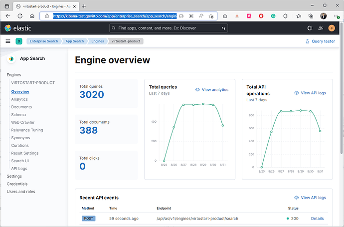

# Elastic Search App Overview

Search powers the way people shop and helps them find exactly what they are looking for, instantly. Virto Commerce can bring unparalleled relevance and personalized suggestions, optimize product discovery, turning browsers into buyers with seamless transactions that inspire repeat purchases.

Virto Commerce and Elastic App Search bring the next level of ecommerce administration experience. You can use analytics to improve ecommerce search relevance without any development effort.

## Prerequisites

To start using Elastic App Search, you will need to install and configure the following:

1.  [Elastic App Search 8.x](https://www.elastic.co/enterprise-search)
2.  [Virto Commerce 3.2xx](https://github.com/VirtoCommerce/)
3.  [Elastic App Search Virto Commerce Module 3.2xx](https://docs.virtocommerce.org/modules/elastic-app-search/eas-setup-guide/)
4.  [Virto Storefront 6.x](https://github.com/VirtoCommerce/)
5.  [Vue B2B Theme 1.x](https://github.com/VirtoCommerce/)

!!! note
	After completing the above steps, you will also need to rebuild the index in Virto Commerce.

!!! note
	If you are already using Virto Commerce, we recommend you testing it by using the Elastic App Search module.

## Using Analytics

Every time a customer searches for something on your website, they provide your business with valuable information about what they are looking for.

To view this info, you can use Kibana and Open:  **Enterprise Search**  →  **App Search**  →  **Engines**:

By default, Virto Commerce adds four engines: ***Product***, ***Category***, ***CustomerOrder***, and ***Member***.

Choose the ***Product*** engine and review the `Overview`  section, where you can find basic information on product queries and API requests per day:

Choose ***Analytics*** to dive into customer experience and query data. Out-of-the-box data collection, metrics, and visualizations on search keywords give you all you need to glean insights from the user behavior:

## Improving Search Relevance

With Elastic App Search, you can make relevance and tune adjustments, or promote/demote results based on your findings in a few clicks, right from the management interface.

Below, you can find out how to improve the search relevance with:

+  Synonyms
+  Curations
+  Relevance Tuning

### Using Synonyms

Sometimes, users will use different terminology than your context might expect.

In  the ***Top queries with no results***  section, you can find query results. For example, your customers might have searched for  `duplicator`, but when you go to Storefront and try searching  `duplicator`, you didn’t find any product for it:

It is a common mistake that may to poor search relevance: you are selling movies, but they want  _films_.

The Synonym feature builds  ***synonym sets***. A synonym set contains two or more queries that have similar meanings. Each synonym set can contain up to 32 words.

To manage synonyms through the App Search dashboard, choose  ***Synonyms***, choose  ***Create a synonym set***, and add a synonym set.

Once you click ***Save***, the synonym set will be applied:

Now, if your customer searches  for `duplicator`, they will see the appropriate product set:

Configuring  ***Synonyms***  is a useful way to guide your users to the most relevant content. It is most useful when you know the precise terms they are searching for. For that, you should explore ***Analytics***, so that you might be aware of your insightful capabilities.

If you are looking to provide even more precise and curated results, venture to the ***Curations*** section.

### Curations

Curations allow search operators to customize search results for specific queries.

For instance, you can use promoted products to ensure that the specified products always match a query and receive the highest relevance scores. Imagine an ecommerce store with featured product results.

Similarly, use  `hidden documents`  to exclude particular products from the results.

Here is how you can boost product search score for, e.g., `office printer`  search query.

Manage curations using Kibana:

1.  Open  ***Enterprise Search***  →  ***App Search***  →  ***Engines***  →  ***product_  engine*** →  ***Curations***
2.  Add a curation for  `office printer`
3.  In our example, we promote two products: ***565507636 - HP OfficeJet Pro 6978 All-in-One Multifunction*** and ***551879675 - HP LaserJet Pro MFP M521dn - multifunction printer (B/W)***:

Once you click ***Save***, the curation will be applied:

!!! note
	Currently, Elastic App Search offers an upgrade to the ***Platinum*** subscription to harness the power of machine learning. By analyzing your engine’s analytics, App Search is able to suggest new or updated curations. This way, you can effortlessly help your users find exactly what they are looking for.

If you are looking for advanced results, continue reading to the ***Relevance Tuning*** section.

### Relevance Tuning

Out of the box, App Search provides quality search relevance.

Built on top of Elasticsearch, App Search is a managed, the expertly crafted distillation of its finest points. It provides tools to help you further tune the search experience to optimize for your own needs.

We recommend you reviewing [this step by step guide](https://www.elastic.co/guide/en/app-search/8.3/relevance-tuning-guide.html).

## Performance

After running load tests and comparing Elasticsearch Vs Elastic App Search, we can confirm that both engines are ready for production and demonstrate the same results.

## Limitations

For performance and historical reasons, App Search has default limitations on some objects and API calls. You can review the current limitations [here](https://www.elastic.co/guide/en/app-search/8.3/limits.html).