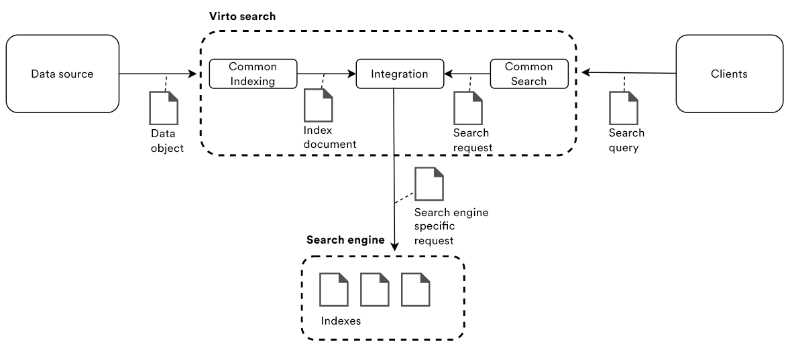
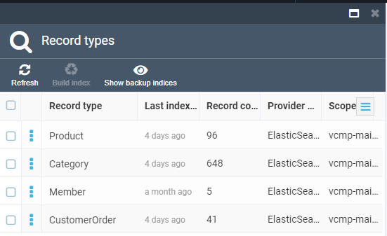
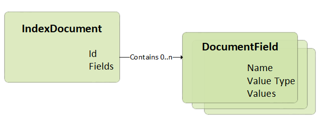
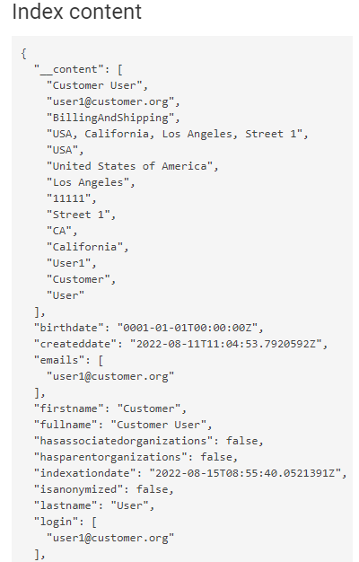

# Indexed Search Overview

This article provides an overview of indexed search that is one of the key features of any ecommerce solution.

Virto Search is a search component that gives developers infrastructure, APIs, and tools for building a rich search experience over heterogeneous platform entities.

Search is foundational to any ecommerce app that surfaces text content to users, with common scenarios including catalog or various entities search, or data exploration.

Architecturally, a search service sits between the data stores that contain your unindexed data, and the client app that sends query requests to a search index and handles the response and external search engines that manage all index and search requests. 

Below, you can find more info on the main Virto Commerce Indexed Search concepts: 

**Search indexes:** A logical group (container) that contains all documents (rows) of a single document (*Type*). Each document also has *Fields* (columns). Usually it is mapped to a specific index within the index provider, e.g., Elasticsearch index. In Virto, we have the following indexes by default:

+ Product: For catalog item search

+ Category: For catalog category search

+ Member: For customer data  search

+ CustomerOrder: For order search

**Index document:** Conceptually, a document is a single unit of searchable data in your index. For example, it may be a document for each product in the catalog. Mapping these concepts to more familiar database equivalents, we can say that search index is an equivalent to a table, while documents are roughly equivalent to rows in the table.

The structure of a document is determined by the index schema, as illustrated below. The *Fields* collection is typically the largest part of an index, where each field is named, assigned a value type, and attributed with allowable behaviors that determine how it is used.

Here is how an index may look like:

**[Indexing](indexing/overview.md):** A process for data indexing that extracts searchable content from various data sources and populates a search index within the specific search provider with instances of  index documents created from the source data by index document builders.

**[Search query](search-query-syntax-reference.md):** A string consisting of keywords and terms that is processed by custom query syntax parser, which transforms it to a common search request. In other words, it is a complete specification of what should be returned as a result. Here is an example:

`Asus color:Black,Blue price.usd:[100 TO 200)`

**Search:** Enables performing search tasks with the indexed data, receives the search phrase in a special query language and interprets the string into a Virto common search request object that can be supplied to a specific search engine through the integration connector. The key search features include:

+ Full text search with extensions for fuzzy search, proximity search, term boosting, and regular expressions

+ Faceted navigation and filters that allow users to navigate through a website by applying filters for categories, attributes, price ranges, and so on. This can be used to incorporate faceted navigation into your application's UI, enhance query formulation, and filter based on user or developer-specified criteria. 

**Integration:** Middleware providing integration to a specific search engine that enables mapping for objects of internal intermediated types, index documents and search requests, into the respective document and query objects a particular search engine expects to receive.     

**Search Engine:** A specific index search engine that handles all indexing and search requests. Virto has ready-made integrations with the following services:

+ Lucene (only for the dev mode)

+ [Elasticsearch](integration/configuring-elasticsearch.md)

+ [Elastic App Search](integration/configuring-elastic-app-search.md)

+ [Azure Cognitive Search](integration/configuring-azure-cognitive-search.md)