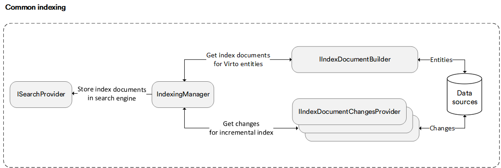

# Indexed Search Overview

The common search component is an entry point in Virto commerce application that is used to perform search request. 

The chart below shows the components used to process a search request:



A specific search service (e.g `ProductIndexedSearchService`) is designed to handle search requests for particular domain entities, such as catalog products or customers. A specific search service processes a search query starts with parsing the query text to convert it to the object of the search request by calling `ISearchRequestBuilder`. Then search request is sent to the specific search engine through the `ISearchProvider` abstraction that uses an index to retrieve documents with matching terms.  

At the next stage, all specific search services are materialized in all found documents via fetching the entities by their identifiers from the data source (e.g., database) and return the resulting entities to the requester. 

!!! note
	In Virto search, we use an additional roundtrip call to the data source to get the actual entity data for the resulting documents the index engine returns.

Restated, query execution has four stages:

1. Query parsing

2. Index document retrieval

3. Resulting documented enrichment with entities are taken from data source 

## Anatomy of Search Request and Query Parsing
A search request is a complete specification of what should be returned in the result set. It has search engine agnostic nature; this generic form enables easily switching between different search engines without any business logic changes. In simplest form, it is an empty query with no criteria of any kind.

The following example shows how a query string saying `black brand:Asus` will be converted into the search request: 

```cs
new SearchRequest
            {
                SearchKeywords = new [] { "black" },
                Filter = new[] { new TermFilter { FieldName : new [] { "brand", "Asus"} },,
                Sorting = "name:desc",
                Skip = 0,
                Take = 20
             };
```