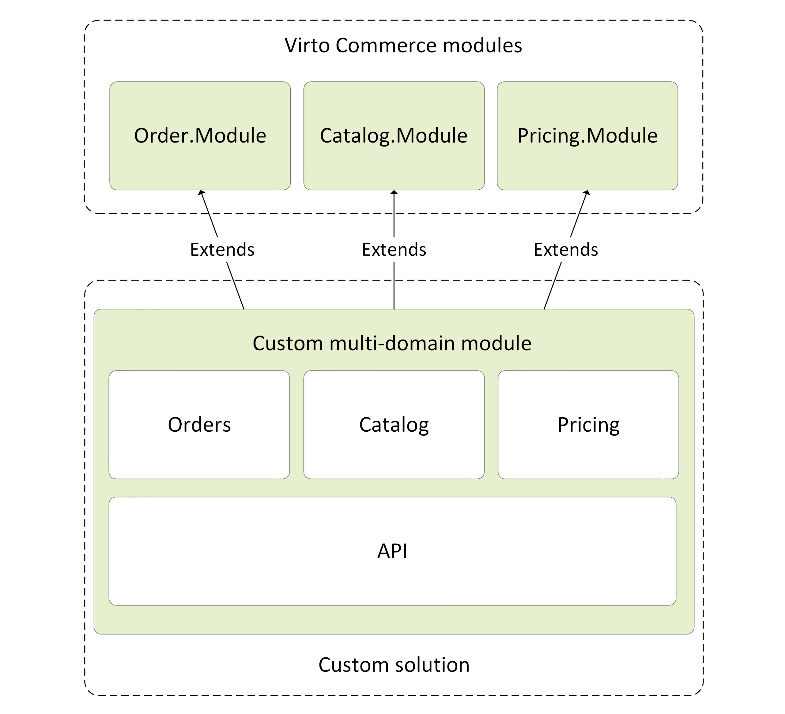

# Best Practices

## Identifying Domain Model Boundaries for Each Module and Best Number of Modules for Custom Solution

When it comes to identifying model boundaries and size for each module, the goal is not to get to the most granular separation possible, although you should tend towards having smaller modules, when possible. Instead, however, your goal is to get to the most meaningful separation guided by your domain knowledge.

The emphasis is not on the size but on business capabilities. In addition, if you need cohesion for a certain area of the application based on a high number of dependencies, this means you need a single module, too. Cohesion is a way to identify how to break modules apart or group them together. Ultimately, while you gain more knowledge about the domain, you should adapt the size of your module, iteratively.

!!! warning
    * A Virto module basically represents a unit for compilation and distribution of functionality, which means it has exactly one deployment unit. Please do not consider any module as a single possible way of separation of domains and business logic. You might organize a well designed multiple domain architecture within a single module.

A large number of modules that have many dependencies and are closely coupled together might significantly affect the development team productivity, deployment, and the maintenance processes due to dependency hell and cascade releases.

Implementing your entire custom solution into a single module will be a good choice if your project satisfies all of the below requirements:

- You have a single development team and single code review and release flow (same dev life cycle).
    
- Most of your business logic is based on the core Virto modules and simply extends them.
    
- You do not have any strict scale requirement that causes your solution to run some modules independently as standalone services.
    

One can draw parallels between how your code can spread among Virto modules and how the same code can be arranged in poly or mono repositories.

For those who want to learn more, this [article](https://blog.upcoding.fr/microservices-in-a-monorepo/) explains the advantages of a mono repository without giving away the benefits of poly repositories, while [this one](https://www.kamilgrzybek.com/design/modular-monolith-primer) will tell you about the *Modular Monolith* architecture.
