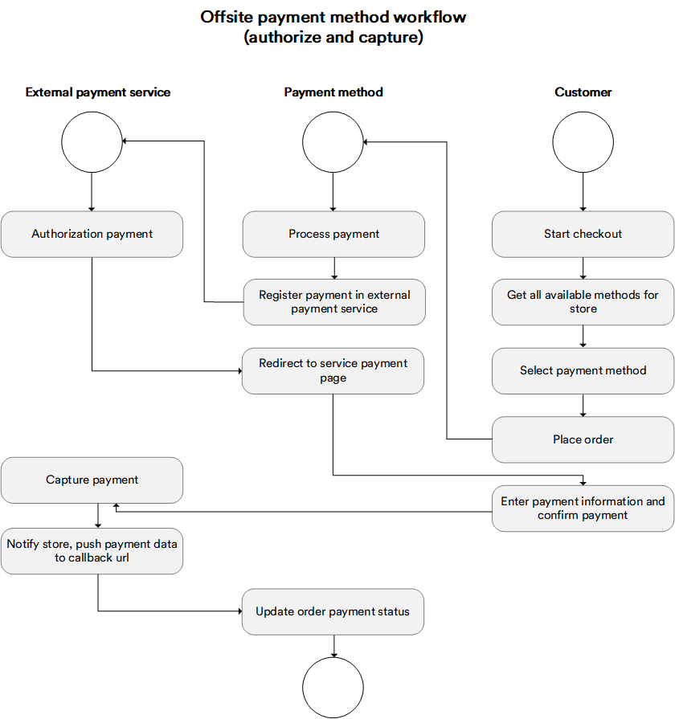

There are two approaches of working with payment systems:

+ Off-site: The customer fills in the required payment credentials in payment system.
+ On-site: The customer fills in the required payment details on the seller's system side. Once the required details are filled, the seller's system sends a request to the payment system. In some specific cases, the customer will be asked to enter additional security data to commit the transaction (MasterCard SecureCode).

VirtoCommerce supports both off-site and on-site payment method implementations.

To view or download our sample code, click [here](https://github.com/VirtoCommerce/vc-module-payment/blob/master/src/VirtoCommerce.Payment.Data/DefaultManualPaymentMethod.cs).

## Concepts

This chart shows how the off-site payment method works:



## Defining New Payment Method

In order to define a new payment method, you need to:

+ Create a new module by following [this guide](../../../Tutorials-and-How-tos/Tutorials/creating-custom-module.md)
+ Create a class derived from the `PaymentMethod` abstract class and override all abstract methods; each of them will be called on the appropriate stage of the payment processing workflow:

```C#
  public class DefaultManualPaymentMethod : PaymentMethod
    {
		//has to implement payment transaction registration in an outside payment system;
		//gets ProcessPaymentEvaluationContext as a parameter, which contains all the required information to create a payment transaction in an outside payment system;
        //returns ProcessPaymentResult as a result, which includes the OuterId property, that has to be set to PaymentId. That way it associates payment in the Virto Commerce platform with the payment transaction in //the outside payment system
        public override ProcessPaymentRequestResult ProcessPayment(ProcessPaymentRequest request) { ... }
		//has to implement payment status check in the outside payment system;
 		//get PostProcessPaymentEvaluationContext as a parameter, which contains all the required information to check payment status in outside payment system;
		//returns PostProcessPaymentResult as a result, which includes the payment status result returned by the outside payment system
		public override PostProcessPaymentRequestResult PostProcessPayment(PostProcessPaymentRequest request) { ... }
		 public override VoidPaymentRequestResult VoidProcessPayment(VoidPaymentRequest request) { ... }
		 public override CapturePaymentRequestResult CaptureProcessPayment(CapturePaymentRequest request) { ... }
		 public override RefundPaymentRequestResult RefundProcessPayment(RefundPaymentRequest request) { ... }
		 //has to impelement querystring request processing. The request comes to `push url` from outside payment system or frontend. The `push url` is set in account settings of most payment systems or during
		//payment transaction processing in outside payment system (ProcessPayment method).
		//as a result of successfully checked (valid) payment the OuterId property of ValidatePostProcessRequestResult has to be set. It identifies payment in VirtoCommerce with the transaction in outside payment system.
		 public override ValidatePostProcessRequestResult ValidatePostProcessRequest(System.Collections.Specialized.NameValueCollection queryString) { ... }
	}
```

+ Register your module class in the DI container. This must be done in the `PostInitialize` method. You can also associate the settings, which will be used in your method and can be changed in the management UI. 

```C#
public void PostInitialize(IApplicationBuilder applicationBuilder)
{
  ...

	 	var settingsRegistrar = appBuilder.ApplicationServices.GetRequiredService<ISettingsRegistrar>();
        var paymentMethodsRegistrar = appBuilder.ApplicationServices.GetRequiredService<IPaymentMethodsRegistrar>();
        paymentMethodsRegistrar.RegisterPaymentMethod<DefaultManualPaymentMethod>();
		//Associate the settings with the particular payment method
        settingsRegistrar.RegisterSettingsForType(ModuleConstants.Settings.DefaultManualPaymentMethod.AllSettings, typeof(DefaultManualPaymentMethod).Name);
  ...
}
```

A very important property belonging to the payment method is `PaymentMethodType`, which defines the actions run by the front end to get the transaction registration result. Currently, there are two types of actions defined, with more being implemented in future:

*Redirection*: Use this type of action if the payment method redirects the user to an outside URL. In order to do so, point the link to the `RedirectUrl` property in the `ProcessPaymentResult`. The front end will use it to redirect the customer (for example, this will happen with the Paypal Express Checkout payment method). 

*PreparedForm*: Use this type of action in case the payment method provides an HTML form for filling in the credentials. Namely, you need to set the `HtmlForm` property in the `ProcessPaymentResult` with an HTML form the outside payment system returns or with the generated form in our payment system. An example of such behavior would be the Klarna Checkout payment method.

## Enable and Configure Payment Method for Store

After your module is installed in your target system, all your payment methods should appear and be available for configuration in every store in your system under the `Store->Payment` method widget. You can configure payment methods for each store individually:

+ Enable or disable a method for the current store
+ Change priority to determine the order in which the payment methods will be displayed at checkout
+ Edit all settings and what you define for the payment method
+ Use a custom UI for more detailed payment method configuration

After you are done configuring, your payment method will appear in the front end checkout page, and the customer will be able to select it as an option.

## UI Customization

If our standard user interface is not enough, you may consider implementing your own UI for managing payment methods through the standard UI extension point (widget container with the `paymentMethodDetail` group). You can read more about extending the existing UI with widgets [here](widgets.md).
