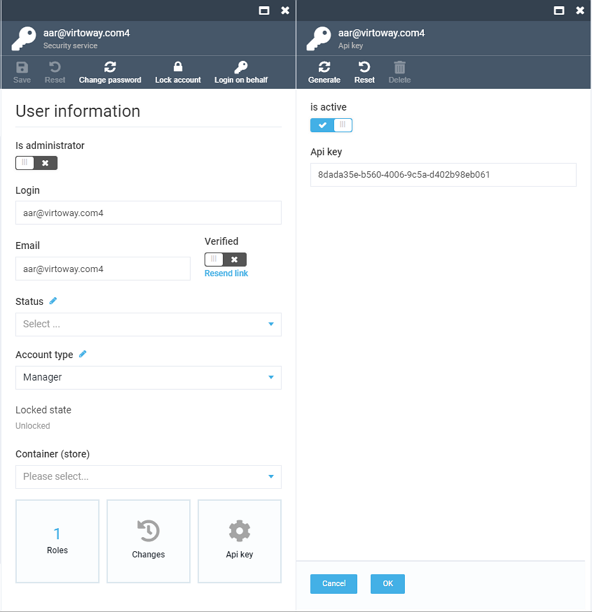

Virto commerce supports simple authentication based on sending an API key across all requests to authenticate a user.

One of the clear advantages of using API key authentication is its inherent simplicity. It is a single key that allows you to authenticate just by including it. This simplicity also enables the user to make calls easily, with cURL, interactive docs, or even in their browser.

## Creating an API key

To create a new API key,  navigate to ***Security> Users***,  select a user entity and open the ***API Key*** widget:



!!! note
	Each API key must be associated with a user account, as all requests with an API key will be authorized on behalf of the user that API key is associated with.

## Using an API Key

You can include the API key into a REST API call as a query parameter with the following format (replace ***API_KEY*** with the key string of your API key):

```
GET https://{platform_host}/api/some_resource?api_key=API_KEY
```

Alternatively, you can use the `api_key` header to provide your key:

```
GET http://{platform_host}/api/some_resource 
api_key: API_KEY
```
