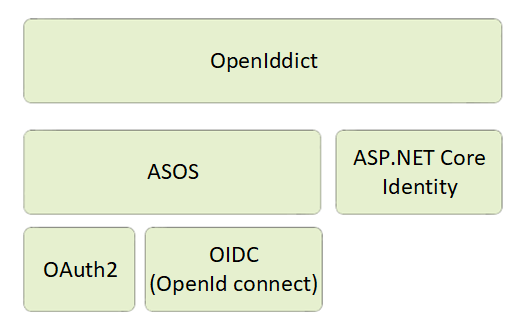

# Authenticating with ASP.NET Core Identity

Virto platform uses [ASP.NET](http://asp.net/) Core Identity as a membership system.

Using [ASP.NET](http://asp.net/) Core Identity enables several scenarios:

+ Creating new user data using the `UserManager type` (`userManager.CreateAsync`)

+ Authenticating users through the `SignInManager` type. You can use `signInManager.SignInAsync` to sign in directly, or `signInManager.PasswordSignInAsync` to confirm the user’s password is correct and then sign them in

+ Identifying a user based on information stored in a cookie or barrier token so that requests from a browser could include the signed-in user’s identity and claims

## Issuing JWT tokens with OpenIddict

To enable token authentication, ASP.NET Core supports multiple options for using **OAuth 2.0** and **OpenID Connect**. We take advantage of a good third-party library and use **OpenIddict** to provide a simple and easy-to-use solution to implement an OpenID Connect server within the platform application.

**OpenIddict** is based on `AspNet.Security.OpenIdConnect.Server` (ASOS) to control the **OpenID Connect** authentication flow and can be used with any membership stack, including ASP.NET Core Identity. Also, it supports [various token formats] (https://openiddict.github.io/openiddict-documentation/guide/token-formats.html), although in Virto platform, we use only JWT token for authorization because of the following advantages:

+ **Stateless:** The token contains all information to identify the user, eliminating the need for session state.

+ **Reusability:** A number of separate servers running on multiple platforms and domains can reuse the same token for authenticating the user. It is easy to build an application that shares permissions with other applications.

+ **JWT Security:** No cookies means you have no need to protect against cross-site request forgery attacks (CSRF).

+ **Performance:** No server-side lookup to find and deserialize the session on each request; you only need to calculate the HMAC SHA-256 to validate the token and parse its content.

Adding an **OpenID Connect** server to the platform allows you to support token authentication, as well as to manage all your users using a local password or an external identity provider (e.g. Azure Active Directory) for all your applications in a single place, with the power to control who can access your API and the information that is exposed to each client. 

Virto platform uses JWT token authentication and OAuth2 Password, Client Credentials and Refresh token flows to issue and consume authorization token for clients (see [here](https://openiddict.github.io/openiddict-documentation/guide/token-formats.html) for details).

You can read more  about how **OpenIddict** is integrated into Virto Commerce [here](https://virtocommerce.com/blog/how-to-secure-aspnet-core-applications-with-openiddict-using-virto-commerce-platform).

## Additional Resources
For more information, feel free to check out these useful resources:

+ [Understanding OAuth2](http://www.bubblecode.net/en/2016/01/22/understanding-oauth2/)

+ [ASP.NET Core Authentication](https://docs.microsoft.com/aspnet/core/security/authentication/identity)

+ [Resource-Based Authentication](https://docs.microsoft.com/en-us/aspnet/core/security/authorization/resourcebased?view=aspnetcore-3.0)

+ [ASP.NET Core Authorization](https://docs.microsoft.com/aspnet/core/security/authorization/introduction)

+ [Role-based Authorization](https://docs.microsoft.com/aspnet/core/security/authorization/roles)

+ [Custom Policy-Based Authorization](https://docs.microsoft.com/aspnet/core/security/authorization/policies)