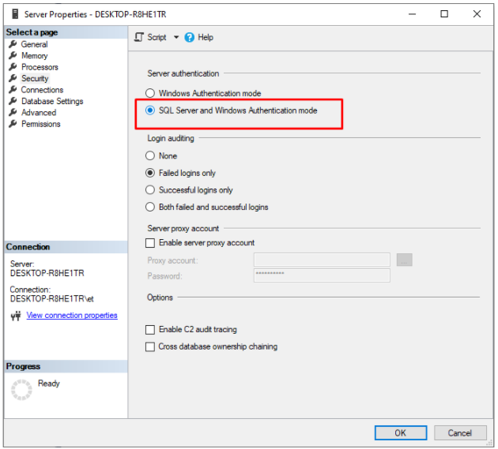

# Prerequisites
To run Virto Commerce, install:

1. Required software components:

    * [ASP.NET Core Runtime 6.0.2](https://dotnet.microsoft.com/en-us/download/dotnet/6.0 "Installing ASP.NET Core Runtime")
    * [MS SQL Server 2017 or higher](https://www.microsoft.com/en-us/sql-server/sql-server-downloads "Installing MS SQL Server")

    !!! note
        * After installing MS SQL server, please switch its authentication to mixed mode, as described [here](https://www.top-password.com/knowledge/sql-server-authentication-mode.html).

    

    - [Virto Commerce CLI](https://github.com/VirtoCommerce/vc-build), our proprietary command line interface that enables automating the installation process and updating the dependencies.

1. Optional software components:

    * For VirtoCommerce 3.200 or higher, install MS Visual Studio 2022 (version 17.0 or higher). 
    * To edit the source code, install [.NET 6 SDK](https://dotnet.microsoft.com/en-us/download/dotnet/6.0 "Installing .NET 6 SDK").
    * For better search capabilities, install [Elastic search 7.15](https://www.elastic.co/downloads/past-releases/elasticsearch-7-15-0). 

        !!! note
            * By default, VirtoCommerce uses [Lucene .NET](https://lucenenet.apache.org/). However, it cannot be used in production due to its limited functionality.
