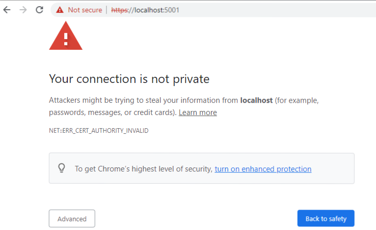
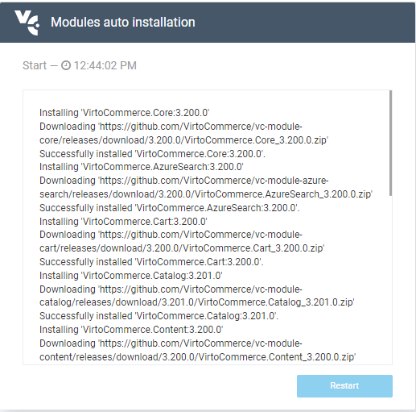

# Manual Installation with Precompiled Binaries
To install Virto Commerce on a Windows based PC:

1. Download precompiled platform version:

	1. Go to the [Releases](https://github.com/VirtoCommerce/vc-platform/releases "https://github.com/VirtoCommerce/vc-platform/releases") section of our public GitHub repository.
	1. Unpack the *VirtoCommerce.Platform.3.x.x.zip* to a local directory, for example, C:\vc-platform-3. The archive contains the website built. It can be run without additional compilation. The source code is not included.

1. Update settings file:

	1. Open the *appsettings.json* file in your text editor.
	1. Change the `VirtoCommerce` string in the `ConnectionStrings` section.

	!!! warning
		* The provided user must have sufficient permissions to create a new database.

	<details><summary>Connection strings section example</summary>
		
	```json title="appsettings.json"
	"ConnectionStrings": {
	"VirtoCommerce" : "Data Source={SQL Server URL};Initial Catalog={Database name};Persist Security Info=True;User ID={User name};Password={User password};MultipleActiveResultSets=True;Connect Timeout=30"
	},
	```
	</details>

	<details><summary>Modified string section example</summary>

	```json title="appsettings.json"
	`"VirtoCommerce": "Data Source=(local);Initial Catalog=VirtoCommerce3;Persist Security Info=True;User ID=virto;Password=virto;Connect Timeout=30",`
	```
	</details>


1. Install and trust a self-signed SSL certificate by running `dotnet dev-certs https --trust`.
	For more information, read [this Microsoft article](https://docs.microsoft.com/en-us/aspnet/core/security/enforcing-ssl?view=aspnetcore-3.0&tabs=visual-studio#trust).

1. Launch the platform by running `dotnet VirtoCommerce.Platform.Web.dll`.

	!!! note
		This command runs the Platform enforcing the HTTPS schema. Add HTTP URLs in the `--urls` argument of the `dotnet` command for development or demo purposes (see below). For security reasons, never use it in the production mode.
		
		```
		dotnet VirtoCommerce.Platform.Web.dll --urls=http://localhost:5000
		```

1. Launch the platform for the first time:
	
	1. Open your browser and type http://localhost:5000 or https://localhost:5001. 
		1. If you get the *Your connection is not private* error, use one of the following methods:
			* Click *Advanced* and then *Proceed to...*:
			
			* Use a [self-signed certificate](https://www.hanselman.com/blog/DevelopingLocallyWithASPNETCoreUnderHTTPSSSLAndSelfSignedCerts.aspx).
		1. The application creates and initializes the database. The sign in page appears. 
	1. Supply *admin* for login and *store* for password.
	1. The installation wizard starts downloading default modules and sample data:
		
	1. After installation, reset default credentials:
		

Your platform is ready to go.
