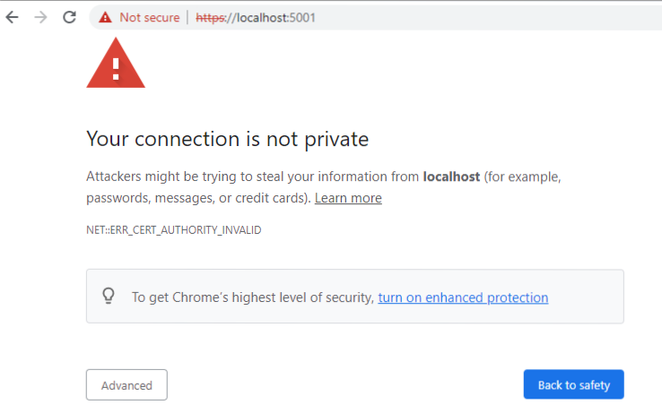


# Installation Using Virto Commerce CLI
Virto Commerce Global Tool CLI, or vc-build, is our official [.NET Core GlobalTool](https://docs.microsoft.com/en-us/dotnet/core/tools/global-tools "https://docs.microsoft.com/en-us/dotnet/core/tools/global-tools"). It helps you:

* Build, test, and deploy releases. 
* Create and push NuGet packages.
* Provide package management for projects based on VirtoCommerce.
* Automate common DevOps tasks.

This is a guide to installing VirtCommerce in demo mode on Windows using Virto Commerce's proprietary command line interface (CLI).

## Installation Process
To install the Virto Commerce platform using CLI:

1. Run `1dotnet tool install -g VirtoCommerce.GlobalTool` to install vc-build.
1. Create an empty folder on your local disk for the platform files. To install it on your C drive, type `1cd c:\vc-platform`
1. Run `1vc-build install` to install both platform and modules with the latest versions.

Now you have the latest platform application release with the default module settings installed to your `C:\vc-platform` folder.

!!! tip
    * You can use `vc-build` for other operations, such as updating the existing Virto packages or installing new ones. For more information, read [this article](https://github.com/VirtoCommerce/vc-build/blob/main/docs/CLI-tools/package-management.md).

## Post Installation Steps
Once the platform is installed:

1. Adjust SQL connection settings:

    1. Open the *appsettings.json* file in your text editor.
    1. Change the `VirtoCommerce` string in the `ConnectionStrings` section.

    !!! warning
        * The provided user must have sufficient permissions to create a new database.

	<details><summary>Connection strings section example</summary>
		
	```json title="appsettings.json"
	"ConnectionStrings": {
	"VirtoCommerce" : "Data Source={SQL Server URL};Initial Catalog={Database name};Persist Security Info=True;User ID={User name};Password={User password};MultipleActiveResultSets=True;Connect Timeout=30"
	},
	```
	</details>

	<details><summary>Modified string section example</summary>

	```json title="appsettings.json"
	`"VirtoCommerce": "Data Source=(local);Initial Catalog=VirtoCommerce3;Persist Security Info=True;User ID=virto;Password=virto;Connect Timeout=30",`
	```
	</details>

1. Install and trust self-signed SSL certificate by running `dotnet dev-certs https --trust`.

    For more information, read [this Microsoft article](https://docs.microsoft.com/en-us/aspnet/core/security/enforcing-ssl?view=aspnetcore-3.0&tabs=visual-studio#trust).

1. Launch the platform by running `dotnet VirtoCommerce.Platform.Web.dll`

    !!! note
		This command runs the Platform enforcing the HTTPS schema. Add HTTP URLs in the `--urls` argument of the `dotnet` command for development or demo purposes (see below). For security reasons, never use it in the production mode.
		
		```
		dotnet VirtoCommerce.Platform.Web.dll --urls=http://localhost:5000
		```

1. Launch the platform for the first time:
	
	1. Open your browser and type http://localhost:5000 or https://localhost:5001. 
		1. If you get the *Your connection is not private* error, use one of the following methods:
			* Click *Advanced* and then *Proceed to...*:
			
			* Use a [self-signed certificate](https://www.hanselman.com/blog/DevelopingLocallyWithASPNETCoreUnderHTTPSSSLAndSelfSignedCerts.aspx).
		1. The application creates and initializes the database. The sign in page appears. 
	1. Supply *admin* for login and *store* for password.
	1. The installation wizard starts downloading default modules and sample data:
		
	1. After installation, reset default credentials:
		

Your platform is ready to go.
