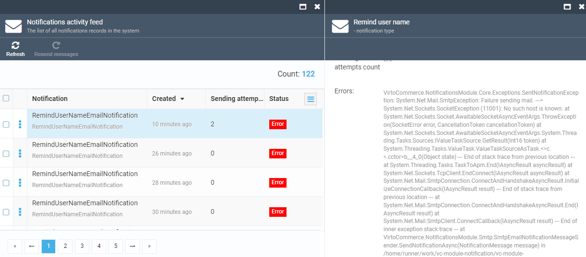

# Configuring Email Notifications
Virto Commerce Platform enables sending email notifications for various system events, such as restoring passwords, customer order processing, etc. To send such notifications, use a third-party email service provider by setting up an mail gateway so that the platform may start sending emails. Currently, there are two gateways options: SMTP and SendGrid.

## Prerequisites
To enable sending and receiving notifications, you must have the [Notification module](https://github.com/VirtoCommerce/vc-module-notification ) installed.

## Configuring SMTP Email Settings
To enable sending notifications through Gmail:

1. Turn on the  **Allow less secure apps** option in [Google Security Settings](https://www.google.com/settings/security/lesssecureapps "https://www.google.com/settings/security/lesssecureapps"). 

1. Edit the **Notifications** section in the **appsettings.json** file:

    ```json title="appsettings.json"
    1 ...
    2 "Notifications": {
    3        "Gateway": "Smtp",
    4        "DefaultSender": "noreply@gmail.com", //the default sender address
    5        "Smtp": {
    6            "SmtpServer": "http://smtp.gmail.com",
    7            "Port": 587, //TLS port
    8            "Login": "", //Your full Gmail address (e.g. you@gmail.com)
    9            "Password": "" //The password that you use to log in to Gmail
    10        },
    11    },
    12 ....
    ```

!!! warning
    * After modifying the **appsettings.json** file, restart the application to apply the changes.

## Configuring SendGrid Email Settings
To work with the SendGrid settings:

1. Register a SendGrid account according to [this SendGrid article](https://docs.sendgrid.com/for-developers/partners/microsoft-azure-2021).

1. Edit the **Notifications** section in the **appsettings.json** file:

    ```json title="appsettings.json"
    1 ...
    2 "Notifications": {
    3         "Gateway": "SendGrid",
    4        "DefaultSender": "noreply@gmail.com", //the default sender address
    5        "SendGrid": {
    6            "ApiKey": "your API key", //SendGrid API key
    7        },
    8    },
    9....
    ```

## Testing Notification Sending Process

To test your notifications, use REST Admin API queries that require a valid access token.

To test whether an email has been sent successfully:

1. Run the query:

    ```
    curl -X POST "https://localhost:5001/api/notifications/send" -H  "accept: text/plain" -H  "Authorization: Bearer {access_token}" -H  "Content-Type: application/json-patch+json" -d '{"type":"RemindUserNameEmailNotification","from":"no-reply@mail.com","to":"{your email}"}''
    ```

1. In case of success, you will receive an test email on your email account. Otherwise, go to **Notifications** → **Notification activity feed** to see which error(s) led to a failure:


