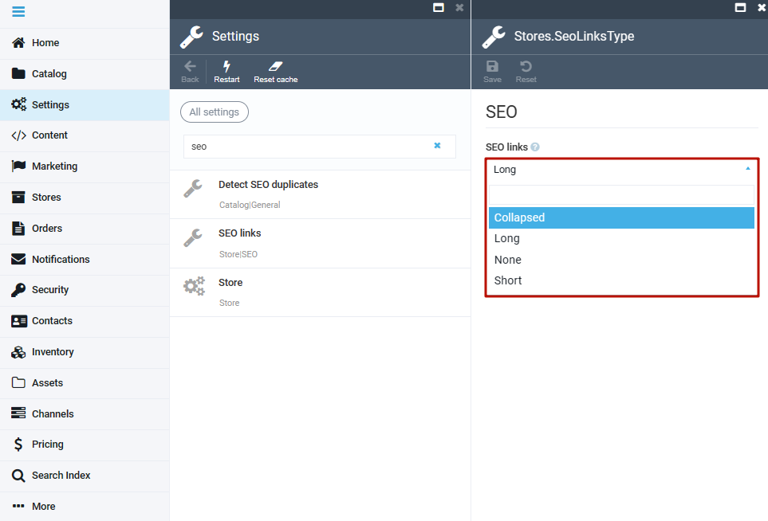

# Facets

Faceted search (sometimes also called faceted navigation) allows users to navigate through a web site by applying filters for categories, attributes, price ranges and so on. The main idea behind faceted search is to present the attributes of the documents of the previous search result as filters, which can be used by the user to narrow down search results along with calculate statistical counts to aid.

Facet calculation is requested by providing facet expression via the facet query parameter. Consider for example the following two facets:

`facet: "color price:[TO 100),[100 TO 200])"`

??? "Sample return"
    ```json linenums="1"
    "data": {
        "products": {
          "totalCount": 182,
          "items": [...],
          "range_facets": [
            {
              "name": "price_*-100_100-200",
              "ranges": [
                {
                  "from": 0,
                  "to": 100,
                  "count": 5959,
                  "includeTo": false,
                  "includeFrom": true
                },
                {
                  "from": 100,
                  "to": 200,
                  "count": 2143,
                  "includeTo": true,
                  "includeFrom": true
                }
              ]
            }
          ],
          "term_facets": [
            {
              "name": "color",
              "terms": [
                {
                  "term": "EXPRESSO",
                  "count": 2343
                },
                {
                  "term": "Sierra Brown",
                  "count": 362
                },
                ...
            }]
        }
    }
    ```

## TermFacet expression

To retrieve facet counts for all occurring values of a product document field the following notations can be applied:

| Query                               | Description                                                                                                   |
|-------------------------------------|---------------------------------------------------------------------------------------------------------------|
| `facet: "category.path"`            | Counts the products of all categories.                                                                        |
| `facet: "{propertyName}"`           | Counts the product documents for all occurring values of custom properties.                                   |
| `facet: "properties.{propertyName}"`| Counts the product documents for all occurring values of custom properties using the specified property name. |

## TermFacet result

The term type facets provide the counts for each of the different values the query parameter happens to have.

| Field            | Description                                                                                                                                               |
|------------------|-----------------------------------------------------------------------------------------------------------------------------------------------------------|
| `name`           | Represents the key of the requested facet taken from the facet expression.                                                                                |
| `terms.term`     | Represents one of the values for the field specified in the facet expression,<br>for which at least one product could be found.                              |
| `terms.count`    | Represents the number of products for which the term applies.                                                                                             |
| `terms.isSelected` | Indicates whether the requested facet term is used in the `filter` expression.<br>This flag simplifies displaying the already selected facet terms on the frontend. |

## RangeFacet expression

To aggregate facet counts across ranges of values, the range qualifier can be applied analogous to the filter parameters. The `range` notation is applicable to the date, time, datetime, number and money type fields.

| Query                                             | Description                                                                                                  |
|---------------------------------------------------|--------------------------------------------------------------------------------------------------------------|
| `facet: "price.{currency}:[TO 100),[100 TO 200])"`| Counts the products whose price falls in one of the specified ranges.                                        |
| `facet: "properties.{propertyName}[1 TO 100)"`    | Counts the products whose values of the custom property fall in one of the specified ranges.                 |

## RangeFacet result

The range facet type counts the products for which the query value is a range specified in the range expression. Range facets are typically used to determine the minimum and maximum value for example product prices to filter products by price with a range slider.

| Field               | Description                                                                                                                                                              |
|---------------------|--------------------------------------------------------------------------------------------------------------------------------------------------------------------------|
| `name`              | Represents the key of the requested facet taken from the facet expression.<br>It is built from range parameters concatenated by "_". Example: `price_*-100_100-200`.        |
| `ranges.from`       | Represents the lower endpoint of the range in number format.                                                                                                             |
| `ranges.to`         | Represents the upper endpoint of the range in string format.                                                                                                             |
| `ranges.count`      | Represents the number of products that fall into the specified range.                                                                                                    |
| `ranges.includeTo`  | Indicates whether the lower bound of the range is included.                                                                                                              |
| `ranges.includeFrom`| Indicates whether the upper bound of the range is included.                                                                                                              |
| `ranges.isSelected` | Indicates whether the requested facet term is used in the `filter` expression.<br>This flag simplifies displaying the already selected facet terms on the frontend.         |

## Querying Product Breadcrumbs

When querying breadcrumbs of the product make sure your store's **SEO Links** setting is **not** set to **None**, otherwise breadcrumbs for the store would not be created:

1. Open the Platform.
1. Select **Settings**.
1. Select **SEO links**.
1. From a dropdown list, select any option other than **None**.
  
  