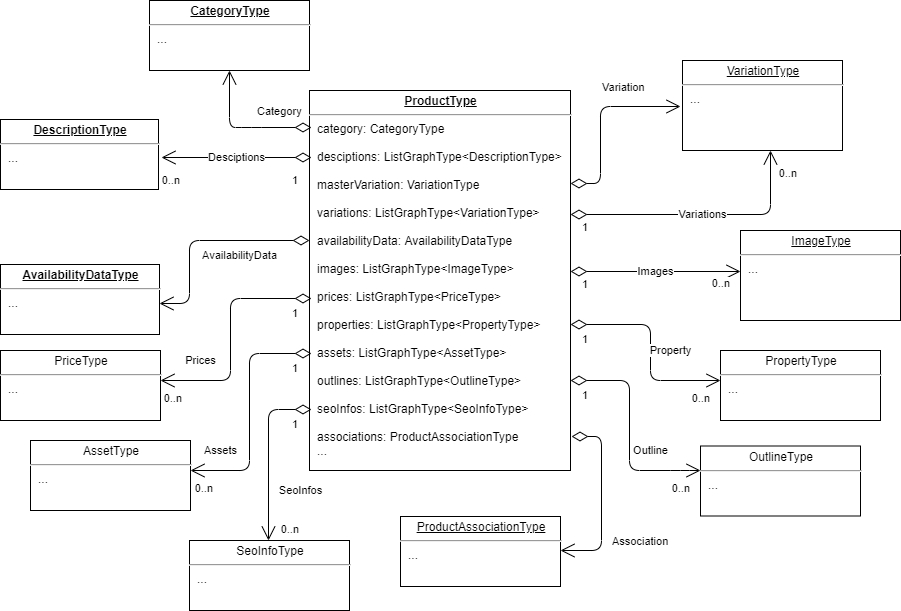
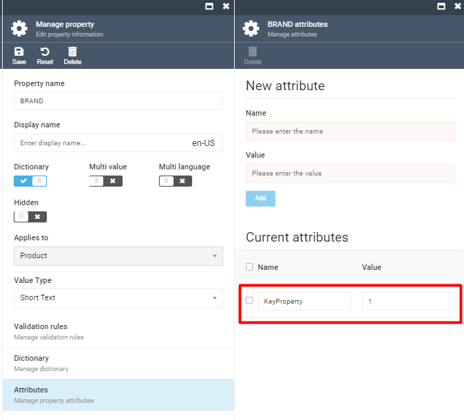

# ProductType
The chart below shows the `ProductType` parameter and all its child parameters and options:



## Schema Fields

|# |Name             |Type                                 |Description|
|--|-----------------|-------------------------------------|-----------|
| 1|id               |StringGraphType                      |The unique ID of the product|
| 2|code             |StringGraphType                      |The product SKU|
| 3|catalogId        |StringGraphType                      |CatalogId of the product|
| 4|category         |[CategoryType](#categorytype) |Field to resolve category of the requested product|
| 5|name             |StringGraphType                      |Name of the product|
| 6|descriptions     |List of DesciptionType               |Reviews of product|
| 7|productType      |StringGraphType                      |The type of product|
| 8|slug             |StringGraphType                      |Url of the product|
| 9|metaDescription  |StringGraphType                      |Meta description of the product|
|10|metaKeywords     |StringGraphType                      |Meta keywords of the product|
|11|metaTitle        |StringGraphType                      |Meta title of the product|
|12|imgSrc           |StringGraphType                      |Main image of the product|
|13|outerId          |StringGraphType                      |Category outer Id|
|14|brandName        |StringGraphType                      |Brand name of the product|
|15|masterVariation  |VariationType                        |Main variation of the product|
|16|variations       |List of VariationType                |Product variations|
|17|availabilityData |AvailabilityDataType                 |Product availability information|
|18|images           |List of ImageType                    |Product images|
|19|prices           |List of PriceType                    |Product prices|
|20|properties       |List of PropertyType                 |Product properties|
|21|assets           |List of AssetType                    |Product assets|
|22|outlines         |List of OutlineType                  |Category outlines|
|23|seoInfos         |List of SeoInfoType                  |SEO information of the product|
|24|associations     |ProductAssociationType               |Product associations|
|25|breadcrumbs      |BreadcrumbType                       |Product navigation information|
|26|videos           |VideoType                            |Product videos|
|27|keyProperties    |List of PropertyType                 |Configurable list of properties

## Product Key Properties

The `ProductType` query has a special configurable field, `keyProperties`. To make a catalog property appear in the `keyProperties` list, you need to configure it in the Catalog module by adding the `KeyProperty` attribute to `Property Attributes`. `KeyProperties` are auto sorted by the attribute value in the ascending order.



The `keyProperties` field can be limited by the `take` argument.

## Example
The following query enables showing only first three key properties:

```json
query {
  products(
    storeId: "B2B-store"
    cultureName: "en-US"
  ) {
    items 
    {
      keyProperties (take:3) {
        name
        value
      }
    }
  }
}
```