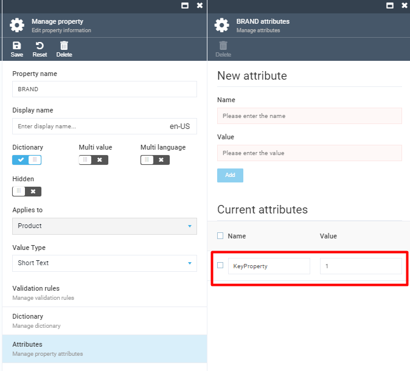

# ProductType ==~object~==

The `productType` field represents the type or category of the product. It is used to classify products into different categories or types, allowing for easier organization and filtering within the catalog.

## Fields

| Field                                                                   	| Description                                                                                  	|
|-------------------------------------------------------------------------	|---------------------------------------------------------------------------------------------	|
| `id` {==String!==}                                                      	| The product Id.                                                                              	|
| `code` {==String!==}                                                    	| The SKU of the product.                                                                      	|
| `catalogId` {==String==}                                                 	| The catalog Id.                                                                             	|
| `productType` {==String==}                                              	| The type of product.                                                                         	|
| `minQuantity` {==Int==}                                                  	| The minimum quantity that can be ordered for the product.                                    	|
| `maxQuantity` {==Int==}                                                  	| The maximum quantity that can be ordered for the product.                                    	|
| `outline` {==String==}                                                   	| The hierarchical outline.                                                                   	|
| `slug` {==String==}                                                      	| The URL slug for the product, related to the request.                                        	|
| `name` {==String!==}                                                     	| The name of the product.                                                                    	|
| `seoInfo` [{==SeoInfo==}](SeoInfo.md)                                     | Request related SEO info.                                                                    	|
| `descriptions(...)` [{==DescriptionType==}](DescriptionType.md)           | Additional descriptions of the product.                                                      	|
| `description(...)` [{==DescriptionType==}](DescriptionType.md)            | A description or review associated with the product.                                         	|
| `category` [{==Category==}](category/CategoryType.md)                     | The category to which the product is associated.                                             	|
| `imgSrc` {==String==}                                                    	| The URL or path to the main image of the product.                                            	|
| `outerId` {==String==}                                                  	| The external Id of the category to which the product belongs.                           	    |
| `brandName` {==String==}                                                 	| The brand name associated with the product.                                                  	|
| `masterVariation` [{==VariationType==}](VariationType.md)                	| The main variation of the product.                                                           	|
| `variations` [{==VariationType==}](VariationType.md)                     	| A list of variations available for the product.                                              	|
| `hasVariations` {==Boolean==}                                           	| Indicates whether the product has variations or not.                                         	|
| `availabilityData` [{==AvailabilityData==}](AvailabilityData.md)        	| Information about the availability of the product.                                           	|
| `images` [{==ImageType==}](ImageType.md)                                	| The images associated with the product.                                                     	|
| `price` [{==PriceType==}](Price/PriceType.md)                             | The price of the product.                                                                    	|
| `prices` [{==PriceType==}](Price/PriceType.md)         	                  | A list of prices associated with the product.                                                	|
| `properties(...)` [{==Property==}](Property/Property.md)                	| The properties associated with the product.                                                 	|
| `keyProperties(...)` [{==Property==}](Property/Property.md)               | The properties associated with the product. The `keyProperties` field can be limited by the `take` argument.        	|
| `assets` [{==Asset==}](Asset.md)                                         	| The assets associated with the product.                                                     	|
| `outlines` [{==OutlineType==}](OutlineType.md)                           	| A list of category outlines.                                                                	|
| `breadcrumbs` [{==Breadcrumb==}](Breadcrumb.md)                           | The breadcrumbs representing the product's position.                                          |
| `vendor` [{==CommonVendor==}](CommonVendor/Commonvendor.md)            	  | The vendor associated with the product.                                                       |
| `inWishlist` {==Boolean!==}                            	                  | Indicates whether the product is in the user's wishlist or not.                               |
| `associations(...)` [{==ProductAssociationConnection==}](ProductAssociation/ProductAssociationConnection.md) 	| The associations or relationships of the product with other products. This field is resolved using the object.  	|
| `videos(...)` [{==VideoConnection==}](VideoConnection/VideoConnection.md)| The videos associated with the product.                                                      	|

## Examples

=== "Query"
    ```json linenums="1"
    query {
      products(
        storeId: "B2B-store"
        cultureName: "en-US"
      ) {
        items 
        {
          keyProperties (take:3) {
            name
            value
            label
            displayOrder
            propertyDictItems
            {
              pageInfo
              {
                endCursor
                hasNextPage
                hasPreviousPage
              }
              totalCount
              items
              {
                sortOrder
                __typename
                value
              }
            }
            id
            type
          }
        }
      }
    }
    ```

=== "Return"
    ```json linenums="1"
    {
      "data": {
        "products": {
          "items": [
            {
              "keyProperties": []
            },
            {
              "keyProperties": []
            },
            {
              "keyProperties": []
            },
            {
              "keyProperties": []
            }
          ]
        }
      }
    }
    ```


## Configuring `keyProperties`
To make a catalog property appear in the `keyProperties` list:

  1. Open the platform and go to the **Catalog** module.
  1. Click the three dots next the name of the required catalog and select **Manage** from the dropdown menu.
  1. Selects the **Properties** widget.
  1. In the new blade, select the **Product property** from a list.
  1. In the **Manage property** blade select **Attributes**.
  1. Add the **KeyProperty** attribute to **Current attributes**.`KeyProperties` are automatically sorted in ascending order based on the attribute value.

    