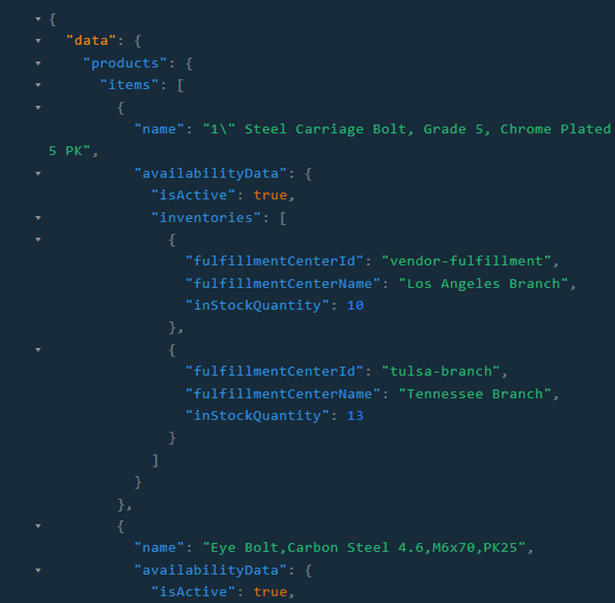

<<<<<<< Updated upstream
# Fulfillment Centers

This connection allows you to search for fulfillment centers.

## Definition

```
fulfillmentCenters(after: String, first: Int, storeId: String, query: String, sort: String, fulfillmentCenterIds: [String])
```

## Arguments

|#|Name        |Type         |Description|
|--|-----------|-------------|-----------|
| 1|first |IntGraphType |Pagination size. Default is 20|
| 2|after |StringGraphType |Pagination cursor|
| 3|sort |StringGraphType |The sort expression|
| 4|storeId |StringGraphType |Search fulfillment centers by store ID|
| 5|query |StringGraphType |Search by fulfillment center name|
| 6|fulfillmentCenterIds |List of StringGraphType |Get fulfillment centers by provided IDs. Note: this argument is exclusive, if set it will override all other arguments|


## Example 1

Getting two fulfillment centers by known IDs:

```js
query {
  fulfillmentCenters(
    fulfillmentCenterIds: ["vendor-fulfillment", "los-angeles-fulfillment"]
  ) {
    totalCount
    items {
      id
      name
      shortDescription
      address {
        city
        countryCode
      }
    }
  }
}
```

## Example 2

Getting all fulfillment centers attached to B2B Store: 

```js
query {
  fulfillmentCenters(
    storeId: "B2B-store"
  )
   {
    totalCount
    items {
      id
      name
      outerId
      geoLocation
    }
  }
}
```

## Example 3

Requesting stock quantities for a specific product across different fulfilment centres to track inventory levels, manage product availability, and make informed decisions about shipping and fulfilment:
```js
{
  products (storeId:"B2B-store")
  {
    items{
      name
      availabilityData
=======
# FullfillmentCenters ==~query~==

This connection allows you to search for fulfillment centers.

## Argument

| Argument                          	| Description                                                                                            	|
|-----------------------------------	|--------------------------------------------------------------------------------------------------------	|
| `after` {==String==}               	| Defines a cursor value to paginate through the results.                                                	|
| `first` {==Int==}                  	| Indicates the number of pages in a single query.                                                       	|
| `storeId` {==String==}             	| Specifies the ID of the store to retrieve pages from.                                                  	|
| `query` {==String==}               	| Performs the full-text search.                                                                         	|
| `sort` {==String==}                	| Specifies the sorting order of the returned products.                                                  	|
| `fullfillmentCentersIds` {==String==} 	| Identifies fullfillment centers. This argument is exclusive! If set, it overrides all other arguments. 	|

## Possible returns

| Possible return                                           	                    | Description                                                   	|
|-------------------------------------------------------------------------------	|---------------------------------------------------------------	|
| [`FulfillmentCenterConnection`](../objects/FulfillmentCenterConnection.md) 	    | A data type that describes a fulfillment center.              	|

## Examples
<hr />
=== "Query 1"
    ```json
    {
      fulfillmentCenters(
        fulfillmentCenterIds: ["vendor-fulfillment", "los-angeles-fulfillment"]
      ) {
        totalCount
        items {
          id
          name
          shortDescription
          address {
            city
            countryCode
          }
        }
      }
    }
    ```

=== "Return 1"
    ```json
    {
      "data": {
        "fulfillmentCenters": {
          "totalCount": 1,
          "items": [
            {
              "id": "vendor-fulfillment",
              "name": "Los Angeles Branch",
              "shortDescription": null,
              "address": {
                "city": "Los Angeles",
                "countryCode": "USA"
              }
            }
          ]
        }
      }
    }    
    ```
=== "Query 2"
    ```json
    {
      products (storeId:"B2B-store")
>>>>>>> Stashed changes
      {
        isActive
        inventories
        {
          fulfillmentCenterId
          fulfillmentCenterName
          inStockQuantity
        }
      }
    }
<<<<<<< Updated upstream
  }
}
```
Result: 



=======
    ```
=== "Return 2"
    ```json
    {
      "data": {
        "products": {
          "items": [
            {
              "name": "SunBriteTV DS-3214P-BL 32\" Weatherproof LED - Portrait Mode (Black)",
              "availabilityData": {
                "isActive": true,
                "inventories": [
                  {
                    "fulfillmentCenterId": "tulsa-branch",
                    "fulfillmentCenterName": "Tennessee Branch",
                    "inStockQuantity": 760
                  },
                  {
                    "fulfillmentCenterId": "142ba5568ae4454aad553ece41b9c3b5",
                    "fulfillmentCenterName": "Chicago Branch",
                    "inStockQuantity": 10
                  },
                  {
                    "fulfillmentCenterId": "vendor-fulfillment",
                    "fulfillmentCenterName": "Los Angeles Branch",
                    "inStockQuantity": 5
                  }
                }
            }
          ]
        }
      }
    }
    ```
>>>>>>> Stashed changes
