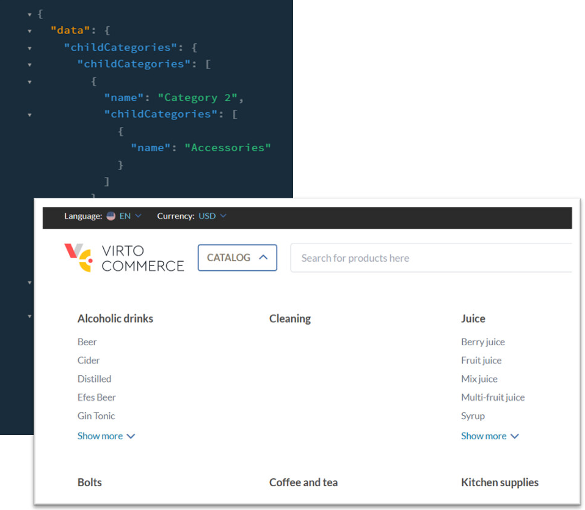

# Child Categories 

This query allows you to retrieve a list of child categories for a given parent category. 

<<<<<<< Updated upstream
## Example
```
query {
    childCategories(
        storeId: "test"
        categoryId: null
        maxLevel: 2
        onlyActive: true
    ) {
        childCategories {
            name
            childCategories {
                name
=======
## Argument

| Argument                          	| Description                                                                       	|
|-----------------------------------	|-----------------------------------------------------------------------------------	|
| `storeId` {==String==}              	| Specifies the ID of the store to retrieve pages from.                             	|
| `userId` {==String==}               	| Identifies the user.                                                              	|
| `cultureName` {==String==}          	| Specifies the language.                                                           	|
| `currencyCode` {==String==}         	| A standardized code representing a specific currency.                             	|
| `categoryId` {==String==}           	| Filters the child categories based on a specific category ID.                     	|
| `maxLevel` {==Int==}                	| Determines the maximum depth or level of child categories to retrieve.            	|
| `onlyActive` {==Boolean==}          	| Indicates whether only active child categories should be included in the results. 	|
| `productFilter` {==String==}        	| Specifies filtering criteria for the products within the child categories.        	|

## Possible returns

| Possible return                                           	                    | Description                                                   	|
|-------------------------------------------------------------------------------	|---------------------------------------------------------------	|
| `ChildCategoriesQueryResponseType` 	                                            | A response for a query that retrieves child categories.           |

## Examples
<hr />
=== "Query"
    ```json
    {
    childCategories(storeId:"B2B-Store",
    cultureName:"en-US",
    currencyCode:"USD",
    maxLevel:1
    productFilter:
    "category.subtree:fc596540864a41bf8ab78734ee7353a3 
    price:(0 TO) instock_quantity:(0 TO)" ),
    {
        childCategories {
        name
        id
        code
        }
    }
    }
    ```

=== "Return"
    ```json
    {
    "data": {
        "childCategories": {
        "childCategories": [
            {
            "name": "Bolts",
            "id": "02fe37dcaeb2458a831011abe43fd335",
            "code": "cd9312"
            },
            {
            "name": "Printers",
            "id": "d6019d4d27e44854a58ebbd5428b873b",
            "code": "b76cb"
            },
            {
            "name": "Test",
            "id": "ef80faed-03b6-42ac-bfae-cfdace0981e7",
            "code": "a7dec"
>>>>>>> Stashed changes
            }
        }
    }
<<<<<<< Updated upstream
}
```
## Result 




=======
    }
    ```
>>>>>>> Stashed changes
