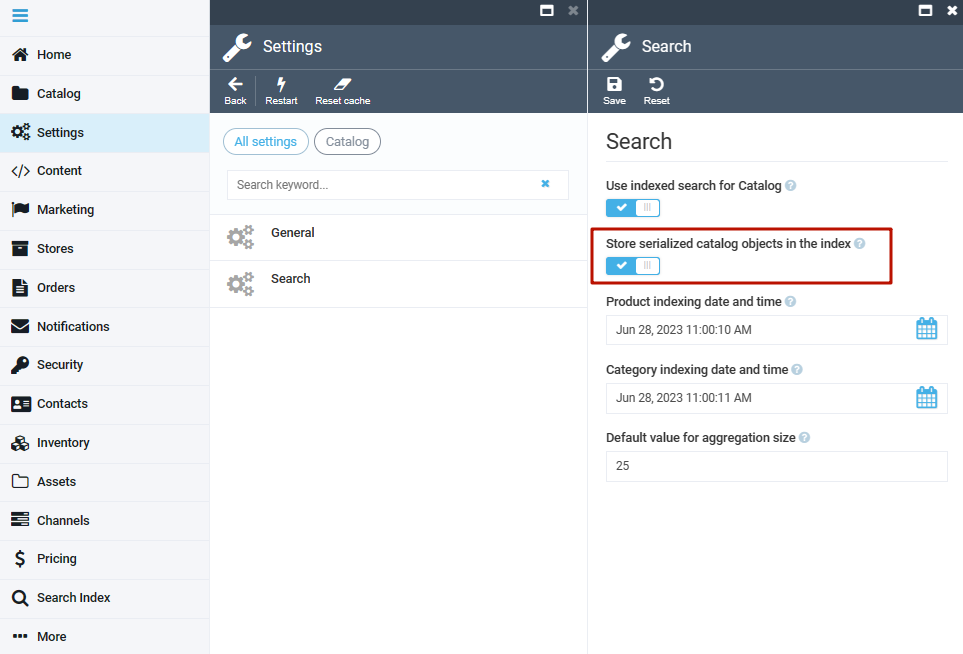

# Getting Started

This section explains how to prepare your environment for testing XApi.

## Prerequisites

* VC platform 3.0 or higher.
* The platform configured to use ElasticSearch engine.
  ```json title="appsettings.json"
  "Search": {
      "Provider": "ElasticSearch",
      "Scope": "default",
      "ElasticSearch": {
          "Server": "localhost:9200",
          "User": "elastic",
          "Key": "",
          "EnableHttpCompression": ""
      },
      "OrderFullTextSearchEnabled": true
  }
  ```

## Presettings

To start using XApi:

1. Open the Platform and go to **Settings**.
1. Select **Catalog**.
1. Select **Search**.
1. Enable **Store serialized catalog objects in index** option:

    

1. Rebuild index.

## Test Environment

To set up the test environment:

1. Install `vc-module-experience-api` on the platform version 3.0 or higher, using [this guide](https://github.com/VirtoCommerce/vc-platform/blob/master/docs/developer-guide/deploy-module-from-source-code.md).
1. Restart the platform instance.
1. Open GraphQL UI playground in the browser: **http://{platform url}/ui/playground**

??? "View sample request"
    ```json
    {
      product(id: "0f7a77cc1b9a46a29f6a159e5cd49ad1")
      {
        id
        name

        properties {
          name
          type
          values
        }
      }

      products(query: "sony" fuzzy: true filter: "price.USD:(400 TO 1000]")
      {
        totalCount
        items {
          name
          id
          prices (currency: "USD") {
            list
            currency
          }
        }
      }
    }
    ```
