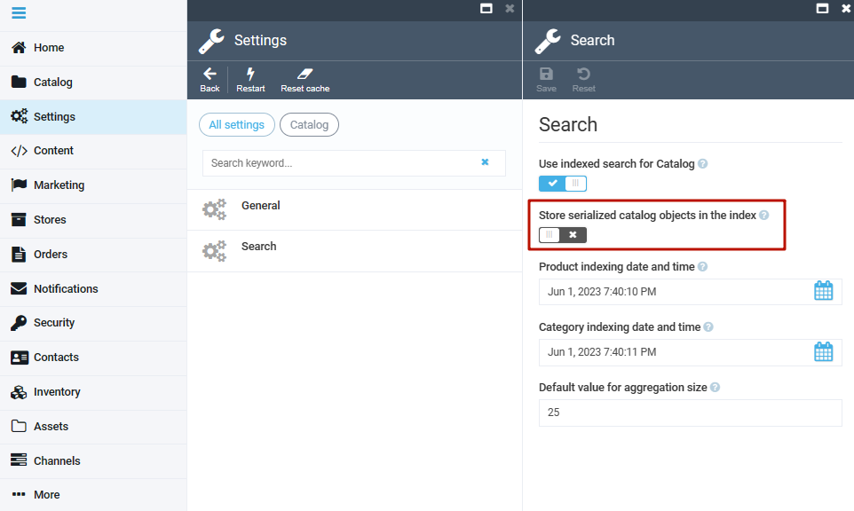
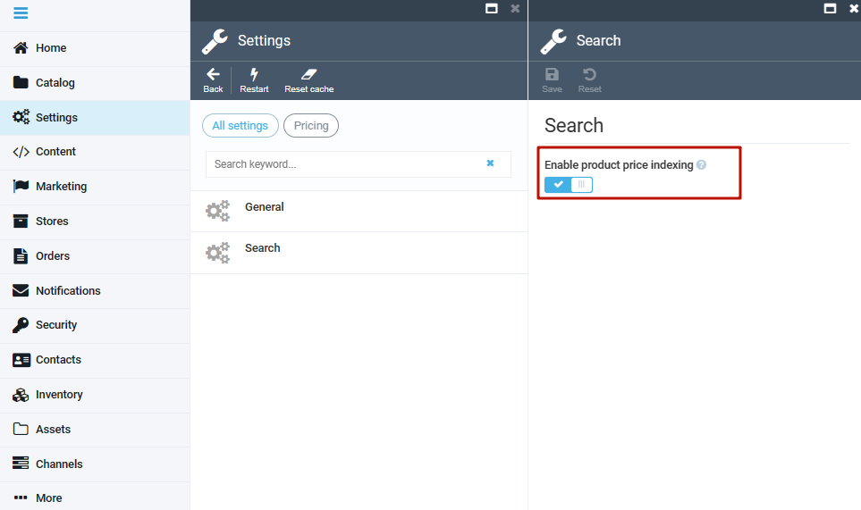

# Getting Started
The Experience API (xAPI) project is primarily an intermediated layer between clients and enterprise  services powered by GraphQL protocol. 
It is tightly coupled to a specific user/touchpoint experience with fast and reliable access. At the same time, it represents an implementation of the back end for front end (BFF) design pattern.

## Prerequisites
To run our xAPI, you will need:

* VC platform 3.0 or later.
* The platform configured to use ElasticSearch engine.

```json title="appsettings.json"
"Search": {
    "Provider": "ElasticSearch",
    "Scope": "default",
    "ElasticSearch": {
        "Server": "localhost:9200",
        "User": "elastic",
        "Key": "",
        "EnableHttpCompression": ""
    },
    "OrderFullTextSearchEnabled": true
}
```
## Enabling indexing

To enable indexing:

1. Open **Settings**, choose **Catalog**, and then choose **Search**.
1. Turn **Store serialized catalog objects in the index** to on and click **Save**.

    

1. Open **Settings**, choose **Pricing**, and then choose **Search**.
1. Turn **Enable product price indexing** to on and click **Save**.

    

1. Rebuild index.

## Using test environment

To start using test environment:

1. Deploy `vc-module-experience-api` into the platform of 3.0 version or later according to [this article](https://github.com/VirtoCommerce/vc-platform/blob/master/docs/developer-guide/deploy-module-from-source-code.md).
1. Restart the platform instance.
1. Open GraphQL UI playground in browser `http://{platform url}/ui/playground`.
