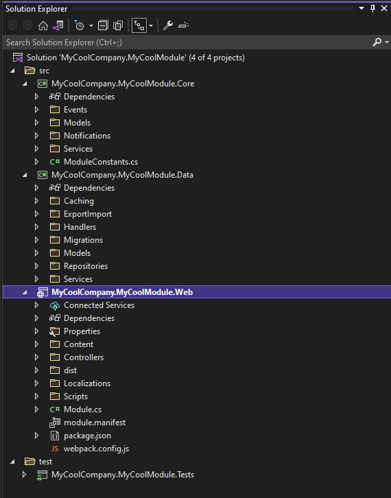
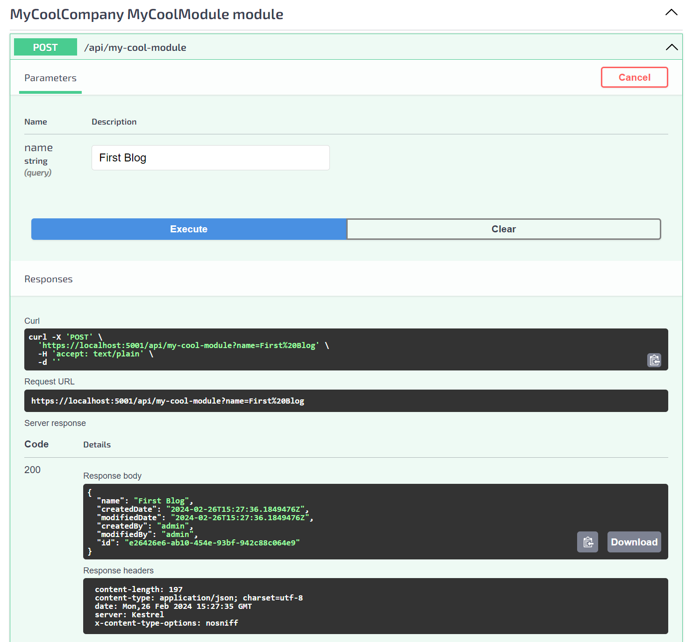
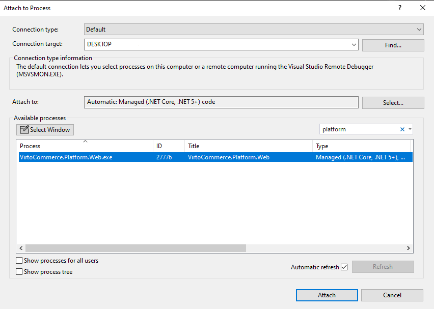
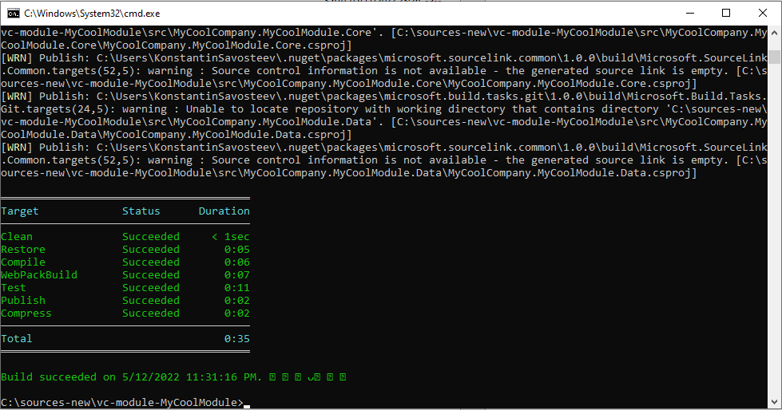
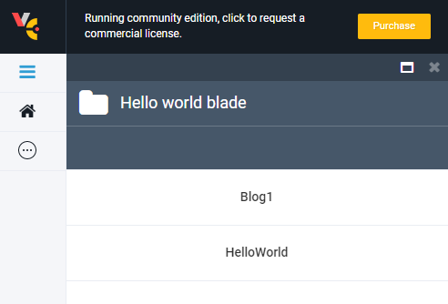

# Creating New Module

The Virto Commerce ecosystem allows you to create your own custom module according to your business or technical needs. In this tutorial, you will learn how you can do so.

## Creating Solution from Template
To run your own Virto Commerce module, you can create it from scratch. However, it is recommendable you do it based on a predefined template. For that, you need to: 

* Create a source directory or, if you already have it, navigate to it
* Open Windows CMD or PowerShell
* Run these commands:

```console
	dotnet new --install VirtoCommerce.Module.Template
	dotnet new vc-module --ModuleName MyCoolModule --Author "Jon Doe" --CompanyName MyCoolCompany --PlatformVersion "3.200.0" --PlatformNuGetPackageVersion "3.200.0"
```

Once you are done, you will get your `vc-module-MyCoolModule` solution with the following structure, which you will be able to see as you open your newly created module with Visual Studio:



## Working with Database

Your next step is connecting your module to a database. Namely, you need to define a model, entity, and repository classes that would make up the persistent layer.

* In the *Data Project Models* directory, add a file called `Blog.cs` with the following code:

```csharp
using System;
using VirtoCommerce.Platform.Core.Common;

namespace MyCoolCompany.MyCoolModule.Core.Models;

public class Blog : AuditableEntity, ICloneable
{
    public string Name { get; set; }

    public object Clone() => MemberwiseClone();
}
```

and another one called `BlogEntity.cs` with the following code:

```csharp
using MyCoolCompany.MyCoolModule.Core.Models;
using VirtoCommerce.Platform.Core.Common;
using VirtoCommerce.Platform.Core.Domain;

namespace MyCoolCompany.MyCoolModule.Data.Models;

public class BlogEntity : AuditableEntity, IDataEntity<BlogEntity, Blog>
{
    public string Name { get; set; }

    public Blog ToModel(Blog model)
    {
        model.Id = Id;
        model.Name = Name;

        return model;
    }

    public BlogEntity FromModel(Blog model, PrimaryKeyResolvingMap pkMap)
    {
        pkMap.AddPair(model, this);

        Id = model.Id;
        Name = model.Name;

        return this;
    }

    public void Patch(BlogEntity target)
    {
        target.Name = Name;
    }
}
```

* In the *Data Project Repositories* directory, add `BlogRepository.cs` with the following code:

```csharp
using System;
using System.Collections.Generic;
using System.Linq;
using System.Threading.Tasks;
using Microsoft.EntityFrameworkCore;
using MyCoolCompany.MyCoolModule.Data.Models;
using VirtoCommerce.Platform.Core.Domain;
using VirtoCommerce.Platform.Data.Infrastructure;

namespace MyCoolCompany.MyCoolModule.Data.Repositories;

public class BlogRepository : DbContextRepositoryBase<MyCoolModuleDbContext>
{
    public BlogRepository(MyCoolModuleDbContext dbContext, IUnitOfWork unitOfWork = null)
        : base(dbContext, unitOfWork)
    {
    }

    public IQueryable<BlogEntity> Blogs => DbContext.Set<BlogEntity>();

    public virtual async Task<ICollection<BlogEntity>> GetBlogsByIdsAsync(IEnumerable<string> ids)
    {
        var result = await Blogs.Where(x => ids.Contains(x.Id)).ToListAsync();

        return result;
    }
}
```

* In the same *Data Project Repositories* directory, change the `MyCoolModuleDbContext.cs` file as follows:

```csharp
using EntityFrameworkCore.Triggers;
using Microsoft.EntityFrameworkCore;
using MyCoolCompany.MyCoolModule.Data.Models;

namespace MyCoolCompany.MyCoolModule.Data.Repositories;

public class MyCoolModuleDbContext : DbContextWithTriggers
{
    public MyCoolModuleDbContext(DbContextOptions<MyCoolModuleDbContext> options)
      : base(options)
    {
    }

    protected MyCoolModuleDbContext(DbContextOptions options)
        : base(options)
    {
    }

    protected override void OnModelCreating(ModelBuilder modelBuilder)
    {
        modelBuilder.Entity<BlogEntity>().ToTable("Blogs").HasKey(x => x.Id);
        modelBuilder.Entity<BlogEntity>().Property(x => x.Id).HasMaxLength(128).ValueGeneratedOnAdd();
        modelBuilder.Entity<BlogEntity>().Property(x => x.Name).HasMaxLength(128);

        base.OnModelCreating(modelBuilder);
    }
}
```

* Create the initial migration file in Visual Studio:
	* Navigate to *Tools > NuGet Package Manager > Package Manager Console*
	* Run the following command:

	```console
	Add-Migration InitialMigration -Context MyCoolCompany.MyCoolModule.Data.Repositories.MyCoolModuleDbContext -Verbose -OutputDir Migrations -Project MyCoolCompany.MyCoolModule.Data -StartupProject MyCoolCompany.MyCoolModule.Data -Debug
	```
This will bring the `InitialMigration.cs` file to the *Data Project Migrations* directory.

## Adding New API

Next, you need to define services and an API layer to access the model.

* In the *Data Project Services* directory, add the `BlogService.cs` file with the following code:

```csharp
using System;
using System.Collections.Generic;
using System.Threading.Tasks;
using MyCoolCompany.MyCoolModule.Core.Models;
using MyCoolCompany.MyCoolModule.Data.Models;
using MyCoolCompany.MyCoolModule.Data.Repositories;
using VirtoCommerce.Platform.Core.Caching;
using VirtoCommerce.Platform.Core.Common;
using VirtoCommerce.Platform.Core.Events;
using VirtoCommerce.Platform.Data.GenericCrud;

namespace MyCoolCompany.MyCoolModule.Data.Services;

public class BlogService : CrudService<Blog, BlogEntity, BlogChangingEvent, BlogChangedEvent>
{
    public BlogService(
        Func<BlogRepository> repositoryFactory,
        IPlatformMemoryCache platformMemoryCache,
        IEventPublisher eventPublisher) : base(repositoryFactory, platformMemoryCache, eventPublisher)
    {
    }

    protected override async Task<IEnumerable<BlogEntity>> LoadEntities(IRepository repository, IEnumerable<string> ids, string responseGroup)
    {
        var blogRepository = repository as BlogRepository;
        return await blogRepository.GetBlogsByIdsAsync(ids);
    }
}

public class BlogChangedEvent : GenericChangedEntryEvent<Blog>
{
    public BlogChangedEvent(IEnumerable<GenericChangedEntry<Blog>> changedEntries)
        : base(changedEntries)
    {
    }
}

public class BlogChangingEvent : GenericChangedEntryEvent<Blog>
{
    public BlogChangingEvent(IEnumerable<GenericChangedEntry<Blog>> changedEntries)
        : base(changedEntries)
    {
    }
}
```

and another file, `BlogSearchService.cs`, with the following code:

```csharp
using System;
using System.Collections.Generic;
using System.Linq;
using MyCoolCompany.MyCoolModule.Core.Models;
using MyCoolCompany.MyCoolModule.Data.Models;
using MyCoolCompany.MyCoolModule.Data.Repositories;
using VirtoCommerce.Platform.Core.Caching;
using VirtoCommerce.Platform.Core.Common;
using VirtoCommerce.Platform.Core.GenericCrud;
using VirtoCommerce.Platform.Data.GenericCrud;

namespace MyCoolCompany.MyCoolModule.Data.Services;

public class BlogSearchService : SearchService<BlogSearchCriteria, BlogSearchResult, Blog, BlogEntity>
{
    public BlogSearchService(
        Func<BlogRepository> repositoryFactory,
        IPlatformMemoryCache platformMemoryCache,
        ICrudService<Blog> crudService)
         : base(repositoryFactory, platformMemoryCache, crudService)

    {
    }

    protected override IQueryable<BlogEntity> BuildQuery(IRepository repository, BlogSearchCriteria criteria)
    {
        var query = ((BlogRepository)repository).Blogs;
        return query;
    }

    protected override IList<SortInfo> BuildSortExpression(BlogSearchCriteria criteria)
    {
        var sortInfos = criteria.SortInfos;

        if (sortInfos.IsNullOrEmpty())
        {
            sortInfos = new[]
            {
                    new SortInfo { SortColumn = nameof(BlogEntity.Id) }
                };
        }

        return sortInfos;
    }
}

public class BlogSearchCriteria : SearchCriteriaBase { }
public class BlogSearchResult : GenericSearchResult<Blog> { }
```

* In the *Web project Controllers/Api* directory, change `MyCoolModuleController.cs` as follows: 

```csharp
using System.Collections.Generic;
using System.Threading.Tasks;
using Microsoft.AspNetCore.Mvc;
using MyCoolCompany.MyCoolModule.Core.Models;
using MyCoolCompany.MyCoolModule.Data.Services;
using VirtoCommerce.Platform.Core.GenericCrud;

namespace MyCoolCompany.MyCoolModule.Web.Controllers.Api
{
    [Route("api/MyCoolModule")]
    public class MyCoolModuleController : Controller
    {
        private readonly ICrudService<Blog> _blogService;
        private readonly ISearchService<BlogSearchCriteria, BlogSearchResult, Blog> _blogSearchService;

        public MyCoolModuleController(
            ICrudService<Blog> blogService,
            ISearchService<BlogSearchCriteria, BlogSearchResult, Blog> blogSearchService)
        {
            _blogService = blogService;
            _blogSearchService = blogSearchService;
        }

        [HttpPost]
        [Route("")]
        public async Task<ActionResult<Blog>> AddBlog(string name)
        {
            var blog = new Blog { Name = name };

            await _blogService.SaveChangesAsync(new List<Blog> { blog });

            return Ok(blog);
        }

        [HttpGet]
        [Route("")]
        public async Task<ActionResult<BlogSearchResult>> GetAll()
        {
            var result = await _blogSearchService.SearchAsync(new BlogSearchCriteria());

            return Ok(result);
        }
    }
}
```

* Register all created services by changing the **Initialize** method in `Module.cs` as follows:

```csharp
	public void Initialize(IServiceCollection serviceCollection)
	{
		// database initialization
		serviceCollection.AddDbContext<MyCoolModuleDbContext>((provider, options) =>
		{
			var configuration = provider.GetRequiredService<IConfiguration>();
			options.UseSqlServer(configuration.GetConnectionString(ModuleInfo.Id) ?? configuration.GetConnectionString("VirtoCommerce"));
		});

		serviceCollection.AddTransient<BlogRepository>();
		serviceCollection.AddTransient<Func<BlogRepository>>(provider => () => provider.CreateScope().ServiceProvider.GetRequiredService<BlogRepository>());

		serviceCollection.AddTransient<ICrudService<Blog>, BlogService>();
		serviceCollection.AddTransient<ISearchService<BlogSearchCriteria, BlogSearchResult, Blog>, BlogSearchService>();
	}
}
```

## Testing and Debugging API

After you are done creating your module, you need then to install it from your source and debug it. This can be handled with a few steps:

* Link the *Module Web* directory to the *Platform/modules* directory: 
```console
	mklink /d c:\source\vc-platform\src\VirtoCommerce.Platform.Web\modules\my-cool-module\ c:\source\vc-module-MyCoolModule\src\MyCoolCompany.MyCoolModule.Web\
```

!!! note
    * In the above example, `c:\source\` means the path to your repository.

* Restart the platform

* Open Swagger API at http://localhost:10645/docs/index.html, find `MyCoolModule extension module`, and run the POST method to verify whether everything is working properly:



This will create a new blog record.

* Finally, to debug your module, attach the platform process to the Visual Studio module solution by navigating to *Tools > Attach to Process > [Find the platform process] > Attach*:



## Extending VC Manager with New UI 

Our module template provides scripts that will help you extend the Platform Manager UI. You can find these scripts in the *Web Scripts* directory:
+ module.js: contains UI module registration code 
+ resources/my-cool-module-api.js: contains the web API service
+ blades/hello-world.js: houses the basic blade template

To start extending the Platform Manager UI, do the following:

* Change **blades/hello-world.js** as follows:

```js
	angular.module('MyCoolModule')
		.controller('MyCoolModule.helloWorldController', ['$scope', 'MyCoolModule.webApi', function ($scope, api) {
			var blade = $scope.blade;
			blade.title = 'MyCoolModule';

			blade.refresh = function () {
				api.get(function (data) {
					blade.title = 'MyCoolModule.blades.hello-world.title';
					blade.data = data.results;
					blade.isLoading = false;
				});
			};

			blade.refresh();
		}]);
```

* Change **blades/hello-world.html** as follows:
* 
```html
<div class="blade-content">
    <div class="blade-inner">
        <div class="inner-block">
            <div class="table-wrapper">
                <table class="table __normal">
                    <tbody ng-model="blade.data">
                        <tr class="table-item" ng-repeat="data in blade.data track by data.name">
                            <td class="table-col">
                                <div class="table-t">
                                    {{ data.name }}
                                </div>
                            </td>
                        </tr>
                    </tbody>
                </table>
            </div>
        </div>
    </div>
</div>
```

* Build script artifacts:
	* Navigate to the module *Web project* directory
	* Open Windows CMD or PowerShell and run the following commands:

	```console
	npm install
	npm run webpack:build
	```

* Verify that the platform UI was extended with your module scripts: by opening the platform UI and navigating to the `MyCoolModule` menu, you should see all created *Blogs* records.

## Adding Authentication Options
Our module template also provides you with out of the box default authentication permissions, which are located in the `ModuleConstants.cs` file:
 
```csharp
	public static class Permissions
	{
		public const string Access = "MyCoolModule:access";
		public const string Create = "MyCoolModule:create";
		public const string Read = "MyCoolModule:read";
		public const string Update = "MyCoolModule:update";
		public const string Delete = "MyCoolModule:delete";
	}
```

You can find the registration code inside the `Module.cs` *PostInitialize* method:

```csharp
	// register permissions
	var permissionsProvider = appBuilder.ApplicationServices.GetRequiredService<IPermissionsRegistrar>();
	permissionsProvider.RegisterPermissions(ModuleConstants.Security.Permissions.AllPermissions.Select(x =>
		new Permission()
		{
			GroupName = "MyCoolModule",
			ModuleId = ModuleInfo.Id,
			Name = x
		}).ToArray());
```

To restrict access to an endpoint with a permission, add the **Authorize** attribute to it:

```csharp
	[HttpGet]
	[Route("")]
	[Authorize(ModuleConstants.Security.Permissions.Read)]
	public async Task<ActionResult<BlogSearchResult>> GetAll()
```

## Packing Your Module

To build your custom module for distribution, use our Virto Commerce CLI tool:

* Navigate to the module root  directory
* Open Windows CMD or PowerShell
* Run the following commands:

```console
	dotnet tool install VirtoCommerce.GlobalTool -g
	vc-build compress
```

This is what you will get:



!!! note
    * The new module package will be created in the *Artifacts* folder. 

## Distribution and Installation

The module package can be uploaded and installed to the Virto Commerce Platform. To do this, you need to:

* Open Virto Commerce Admin Portal and sign into it
* Select the `Modules` menu and navigate to the `Advanced` section
* Install or update the module from a file
* Restart the platform

If the module is installed properly, you should see the new module in the list of the installed modules, Admin UI, and Swagger API:


