# Button
The `vc-button` component is an extension to standard input element with theming and icons.

## Basic
Text to display on the button is passed via slot.

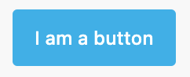

```html
<vc-button>I am a button</vc-button>
```

## Disabled
When disabled is present, the element cannot be edited and focused.

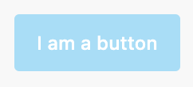

```html
<vc-button disabled>I am a button</vc-button>
```

## Variant
Variant defines the color of the button. It could be `primary`, `danger`, `warning`.

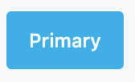 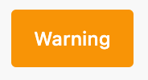 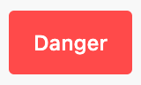

```html
<vc-button variant="primary">Primary</vc-button>
<vc-button variant="warning">Warning</vc-button>
<vc-button variant="danger">Danger</vc-button>
```

## Icons
Icon of a button is specified with icon property and `icon` size is configured with `iconSize` property. Also you can use `iconClass` property to add custom class to icon.

Default `iconSize` is `s`.

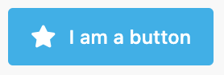

```html
<vc-button icon="fas fa-star">I am a button</vc-button>
```

## Small
Button provides small size as alternative to the standard.

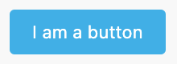

```html
<vc-button small>I am a button</vc-button>
```

## Outline
Outlined buttons display a border without a background initially.

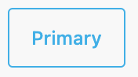 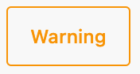 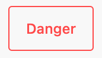

```html
<vc-button variant="primary" outline>Primary</vc-button>
<vc-button variant="warning" outline>Warning</vc-button>
<vc-button variant="danger" outline>Danger</vc-button>
```

## Selected
Selected button state is used to indicate that the button is selected.

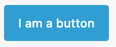

```html
<vc-button selected>I am a button</vc-button>
```

## Text
Text buttons are displayed as textual elements. They don't have background and border.

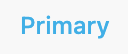 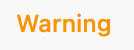 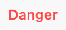

```html
<vc-button variant="primary" text>Primary</vc-button>
<vc-button variant="warning" text>Warning</vc-button>
<vc-button variant="danger" text>Danger</vc-button>
```

## Raised
Raised buttons display a shadow to indicate elevation.

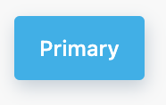 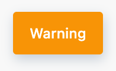 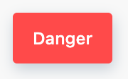

```html
<vc-button variant="primary" raised>Primary</vc-button>
<vc-button variant="warning" raised>Warning</vc-button>
<vc-button variant="danger" raised>Danger</vc-button>
```

# Usage

=== "Basic Vue"

    ```html
    <template>
        <vc-button>I am a button</vc-button>
    </template>
    ```

=== "Dynamic Views"

    ```typescript
    {
        id: "buttonId",
        component: "vc-button",
        method: "buttonClick",
        content: "I am a button",
    }
    ```


# Button API

## Basic Vue

### Props

| Name      | Type              | Description                                                     |
| --------- | ----------------- | --------------------------------------------------------------- |
| `variant` | `string`          | Variant defines the color of the button. It could be `primary`, `danger`, `warning`. |
| `icon`    | `string`          | Icon of a button. Uses [AwesomeIcons](https://fontawesome.com/) package. |
| `iconSize`| `string`          | Icon size. Could be `xs`, `s`, `m`, `l`, `xl`, `xxl`, `xxxl`. Default is `s`. |
| `small`   | `boolean`         | Makes button small sized.                                       |
| `outline` | `boolean`         | Outlined buttons display a border without a background initially. |
| `text`    | `boolean`         | Text buttons are displayed as textual elements. They don't have background and border. |
| `raised`  | `boolean`         | Raised buttons display a shadow to indicate elevation.          |
| `selected`| `boolean`         | Selected button state is used to indicate that the button is selected. |
| `disabled`| `boolean`         | When disabled is present, the element cannot be edited and focused. |
| `iconClass`| `string`         | Custom class for icon.                                          |

### Slots

| Name      | Description                                                     |
| --------- | --------------------------------------------------------------- |
| `default` | Button inner text.                                              |

### Emits

| Name      | Parameters        | ReturnType | Description                                                     |
| --------- | ----------------- | ---------- | --------------------------------------------------------------- |
| `click`   | value: `Event`      | `void`     | Emitted when button is clicked.                                   |


## Dynamic Views
Sсhema interface for button looks like this:

```typescript
interface ButtonSchema {
    id: string;
    component: "vc-button";
    content: string;
    small?: boolean;
    icon?: string;
    iconSize?: "xs" | "s" | "m" | "l" | "xl" | "xxl" | "xxxl";
    text?: boolean;
    method?: string;
    disabled?: {
        method: string;
    };
    visibility?: {
        method: string;
    };
}
```

| Property       | Type              | Description                                                     |
| -------------- | ----------------- | --------------------------------------------------------------- |
| `id`           | `string`          | Unique identifier for `vc-button` component.                    |
| `component`    | `vc-button`       | Component used in schema.                                      |
| `content`      | `string`          | Button inner text.                                              |
| `small`        | `boolean`         | Makes button small sized.                                      |
| `icon`         | `string`          | Button icon. Uses [AwesomeIcons](https://fontawesome.com/) package         |
| `iconSize`     | `string`          | Size of the button icon.                                       |
| `text`         | `string`          | Button as text without overlay.                                |
| `method`       | `string`          | Method to be called when the button is clicked. Method should be defined in the blade `scope`. |
| `disabled`     | `{method: string}` | Disabled state for component, could be used to disable button based on some conditions. Method or variable should be defined in the blade `scope` and should return a boolean value. |
| `visibility`   | `{method: string}` | Visibility state for component, could be used to hide button based on some conditions. Method or variable should be defined in the blade `scope` and should return a boolean value. |
