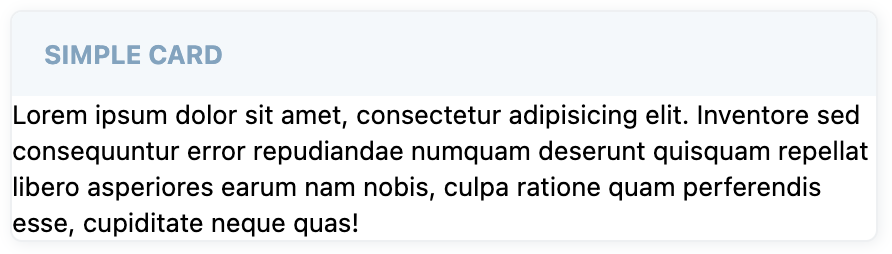

# Card
Card is a flexible and collapsible container component.

## Usage
Card is created with a `header` property and default slot as it's content.




=== "Basic Vue"

    ```html
    <template>
        <vc-card header="Card label"></vc-card>
    </template>
    ```

=== "Dynamic Views"

    To start using all the available card properties, specify the `vc-card` component when creating the schema.

    Base usage looks like this:

    ```typescript
    {
        id: "cardId",
        component: "vc-card",
        label: "Card label",
        fields: [
            // other components schemas
        ],
    }
    ```

As card has the ability of deep nesting, you can add other cards or controls to it and create complex UI interfaces.

## Card API

## Basic Vue

### Props

| Name              | Type                                         | Description                                  |
|-------------------|----------------------------------------------|----------------------------------------------|
| `header`          | `string`                                     | The header of the component.                 |
| `icon`            | `string`                                     | The icon associated with the component.      |
| `isCollapsable`   | `boolean`                                    | Indicates whether the component is collapsible. |
| `isCollapsed`     | `boolean`                                    | Indicates whether the component is initially collapsed. |
| `fill`            | `boolean`                                    | Indicates whether the content of the card should fill available space. |
| `variant`         | `"default" \| "success" \| "danger"`          | The variant of the component.                |

### Slots

| Name      | Description                                                     |
| --------- | --------------------------------------------------------------- |
| `default` | Card content slot.                                              |
| `actions` | Slot for any customizable component to show in the right corner of the card header                           |

### Emits

| Name      | Parameters        | ReturnType | Description                                                     |
| --------- | ----------------- | ---------- | --------------------------------------------------------------- |
| `header:click` | `void` | `void` | Emitted when the header is clicked.                           |
| `state:collapsed` | isCollapsedState: `boolean` | `void` | Emitted when the card is collapsed or expanded.                           |

## Dynamic Views
Schema interface for card looks like this:

```typescript
interface CardSchema {
    id: string;
    component: "vc-card";
    label: string;
    fields: ControlSchema[];
    action?: ButtonSchema & {
        method: string;
    };
    collapsible?: boolean;
    visibility?: {
        method: string;
    };
}
```

| Property       | Type                                  | Description                                                     |
| -------------- | ------------------------------------- | --------------------------------------------------------------- |
| `id`           | `string`                              | Unique identifier for `vc-card` component.                     |
| `component`    | `vc-card`                             | Component used in schema.                                      |
| `label`        | `string`                              | Card label that is displayed in the header. Also available interpolation `{}` syntax based on current element context.                    |
| `fields`       | `ControlSchema[]`                    | Array of schemas for components that will be displayed inside the card. |
| `action`       | `ButtonSchema & {method: string}`    | Action button that is displayed in the top right corner of the card. Could be used to trigger some actions. |
| `collapsible`  | `boolean`                             | Makes the card collapsible.                                     |
| `visibility`   | `{method: string}`                   | Visibility state for the component, could be used to hide the card based on some conditions. Method or variable should be defined in the blade `scope` and should return a boolean value. |


### Example
Card example with action button and fieldset component containing several inputs from `vc-app` project:

=== "Screenshot"

    

=== "Code"

    ```typescript title="vc-app-extend/src/modules/offers/pages/details.ts" linenums="1"
    {
        id: "pricingCard",
            component: "vc-card",
            label: "Pricing",
            action: {
                id: "addPrice",
                component: "vc-button",
                content: "Add price",
                small: true,
                method: "addPrice",
            },
            fields: [
                {
                id: "pricesFieldset",
                component: "vc-fieldset",
                property: "prices",
                columns: 3,
                remove: {
                    method: "removePrice",
                },
                fields: [
                    {
                        id: "listPrice",
                        component: "vc-input-currency",
                        label: "List price",
                        property: "listPrice",
                        placeholder: "Set list price",
                        optionProperty: "currency",
                        optionValue: "value",
                        optionLabel: "title",
                        rules: {
                            required: true,
                            min_value: 0,
                        },
                    },
                    {
                        id: "salePrice",
                        component: "vc-input-currency",
                        label: "Sales price",
                        property: "salePrice",
                        placeholder: "Set product sales price",
                        optionProperty: "currency",
                        optionValue: "value",
                        optionLabel: "title",
                    },
                    {
                        id: "minQuantity",
                        component: "vc-input",
                        label: "Minimum quantity",
                        property: "minQuantity",
                        placeholder: "Enter product minimal quantity in order",
                        clearable: true,
                        rules: {
                            required: true,
                            min_value: 0,
                        },
                        variant: "number",
                    },
                ],
                },
            ],
    }
    ```
