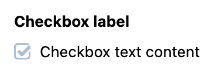

# Checkbox
Checkbox is an extension to standard checkbox element with theming.

## Usage


=== "Basic Vue"

    ```html
    <template>
        <vc-checkbox :modelValue="checkboxProperty" label="Checkbox label">{{ Checkbox text content }}</vc-checkbox>
    </template>
    ```

=== "Dynamic Views"

    To start using all the available checkbox properties, specify the `vc-checkbox` component when creating the schema.

    Base usage looks like this:

    ```typescript
    {
        id: "checkboxId",
        component: "vc-checkbox",
        label: "Checkbox label",
        property: "checkboxProperty",
        content: "Checkbox text content",
    }
    ```

## Checkbox API

## Basic Vue

### Props

| Property       | Type                  | Description                                          |
| -------------- | --------------------- | ---------------------------------------------------- |
| `modelValue`   | `MaybeRef<boolean>`   | The value of the component.                           |
| `disabled`     | `boolean`             | Disabled state for the component.                     |
| `required`     | `boolean`             | Indicates if the component is required.               |
| `name`         | `string`              | The name attribute of the component.                  |
| `errorMessage` | `string`              | The error message to display when validation fails.   |
| `trueValue`    | `boolean`             | Set value for checked state. Default: true                         |
| `falseValue`   | `boolean`             | Set value for unchecked state. Default: false                        |
| `label`        | `string`              | The label of the component.                           |
| `tooltip`      | `string`              | The tooltip text to display when hovering over the component. |

### Slots

| Name      | Description                                                     |
| --------- | --------------------------------------------------------------- |
| `default` | Checkbox text content slot.                                              |
| `error` | Slot for error message                           |

### Emits

| Name      | Parameters        | ReturnType | Description                                                     |
| --------- | ----------------- | ---------- | --------------------------------------------------------------- |
| `update:modelValue` | value: `boolean` | `void`     | Emitted when the value of the component changes.                |

## Dynamic Views
Schema interface for checkbox looks like this:

```typescript
interface CheckboxSchema {
    id: string;
    component: "vc-checkbox";
    trueValue?: boolean;
    falseValue?: boolean;
    label?: string;
    rules?: IValidationRules;
    tooltip?: string;
    property: string;
    content?: string;
    update?: {
        method: string
    };
    disabled?: {
        method: string;
    };
    visibility?: {
        method: string;
    };
}
```

| Property | Type | Description |
| --- | --- | --- |
| `id` | `string` | Unique identifier for `vc-checkbox` component. |
| `component` | `string` | `vc-checkbox` |
| `trueValue` | `boolean` | Set value for checked state. |
| `falseValue` | `boolean` | Set value for unchecked state. |
| `label` | `string` | Checkbox label that is displayed above the checkbox. Also available interpolation `{}` syntax based on current element context. |
| `rules` | `IValidationRules` | Checkbox validation rules. Could be used to validate checkbox value. Uses [VeeValidate](https://vee-validate.logaretm.com/v4/) validation rules. |
| `tooltip` | `string` | Checkbox tooltip that is displayed when hovering over the checkbox label tooltip icon. |
| `property` | `string` | Property name that is used for binding checkbox value to blade data. <br> Supports deep nested properties like `property[1].myProperty`. <br> Additionally, you have the flexibility to bind any function or computed property that returns a value and retrieve changed value as an argument for the function. |
| `content` | `string` | Text content that is displayed on the right side of the checkbox. |
| `update` | `{method: string}` | Update method that is called when checkbox value is changed. Method should be defined in the blade `scope`. |
| `disabled` | `{method: string}` | Disabled state for component, could be used to disable checkbox based on some conditions. Method or variable should be defined in the blade `scope` and should return a boolean value. |
| `visibility` | `{method: string}` | Visibility state for component, could be used to hide checkbox based on some conditions. Method or variable should be defined in the blade `scope` and should return a boolean value. |
