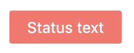

# Status
Status component is used to display a status badge with customizable view, icon and its size, title and badge content text.

## Usage


=== "Basic Vue"

    ```html
    <template>
        <vc-status variant="danger" :outline="false">Status text</vc-status>
    </template>
    ```

=== "Dynamic Views"

    To start using all the available status properties, specify the `vc-status` component when creating the schema.

    Base usage looks like this:

    ```typescript
    {
        id: "statusId",
        component: "vc-status",
        variant: "danger",
        content: {
            method: "statusText",
        },
    }
    ```

## Status API

## Basic Vue

### Props

| Property | Type | Description |
| --- | --- | --- |
| `variant` | `"info" \| "warning" \| "danger" \| "success" \| "light-danger"` | Status variant. |
| `outline` | `boolean` | Whether the status is outlined or not. |
| `extend` | `boolean` | Whether the status is extendable or not. |

### Slots

| Name      | Description                                                     |
| --------- | --------------------------------------------------------------- |
| `default` | Status content slot.                                              |


## Dynamic Views
Schema interface for status looks like this:

```typescript
interface StatusSchema {
    id: string;
    component: "vc-status";
    variant: "info" | "warning" | "danger" | "success" | "light-danger";
    icon?: string;
    iconVariant?: "warning" | "danger" | "success";
    iconSize?: "xs" | "s" | "m" | "l" | "xl" | "xxl" | "xxxl";
    title?: string;
    outline?: boolean;
    extend?: boolean;
    content?: {
        method: string;
    };
    visibility?: {
        method: string;
    };
}
```

| Property | Type | Description |
| --- | --- | --- |
| `id` | `string` | Unique identifier for the `vc-status` component. |
| `component` | `vc-status` | Component used in schema. |
| `variant` | `string` | Status variant. |
| `icon` | `string` | Icon to show in status badge. Uses [AwesomeIcons](https://fontawesome.com/) package  |
| `iconVariant` | `string` | Icon variant. |
| `iconSize` | `string` | Icon size. |
| `title` | `string` | Status title. |
| `outline` | `boolean` | Whether the status is outlined or not. |
| `extend` | `boolean` | Whether the status is extendable or not. |
| `content` | `{method: string}` | Method to call to get status content. Method should be defined in the blade `scope` and should return string value. |
| `visibility` | `{method: string}` | Visibility state for component, could be used to hide status based on some conditions. Method or variable should be defined in the blade `scope` and should return a boolean value. |
