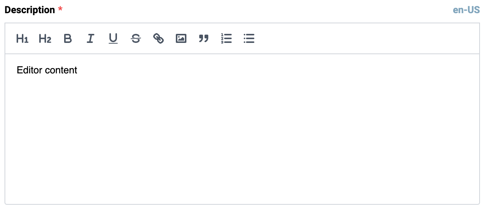

# Editor
Editor is a component that allows you to display a Rich Text Editor, based on Vue-wrapped [Quill](https://vueup.github.io/vue-quill/).

## Usage



=== "Basic Vue"

    ```html
    <template>
        <vc-editor
            label="Editor label"
            :modelValue="editorProperty"
            :placeholder="Editor placeholder"
        ></vc-editor>
    </template>
    ```

=== "Dynamic Views"

    To start using all the available editor properties, specify the `vc-editor` component when creating the schema.

    Base usage looks like this:

    ```typescript
    {
        id: "editorId",
        component: "vc-editor",
        label: "Editor label",
        property: "editorProperty",
        placeholder: "Editor placeholder",
    }
    ```

## Editor API

## Basic Vue

### Props

| Property | Type | Description |
| --- | --- | --- |
| `placeholder` | `string` | Placeholder text for the editor. |
| `modelValue` | `string \| number \| Date` | Value of the editor. |
| `required` | `boolean` | Indicates if the editor is required. |
| `disabled` | `boolean` | Indicates if the editor is disabled. |
| `label` | `string` | Label for the editor. |
| `tooltip` | `string` | Tooltip text for the editor label. |
| `errorMessage` | `string` | Error message to display when validation fails. |
| `assetsFolder` | `string` | Folder path for assets used by the editor uploader. |
| `multilanguage` | `boolean` | Indicates if the editor supports multiple languages. |
| `currentLanguage` | `string` | Current language for the editor. |

### Slots

| Name      | Description                                                     |
| --------- | --------------------------------------------------------------- |
| `error` | Slot for error message                           |


### Emits

| Name      | Parameters        | ReturnType | Description                                                     |
| --------- | ----------------- | ---------- | --------------------------------------------------------------- |
| `update:modelValue` | value: `string \| number \| Date \| null \| undefined`     | Emitted when the value of the editor changes.                |

## Dynamic Views
Schema interface for editor looks like this:

```typescript
interface EditorSchema {
    id: string;
    component: "vc-editor";
    label?: string;
    property: string;
    rules?: IValidationRules;
    placeholder?: string;
    tooltip?: string;
    multilanguage?: boolean;
    disabled?: {
        method: string;
    };
    visibility?: {
        method: string;
    };
    update?: {
        method: string;
    };
}
```

| Property | Type | Description |
| --- | --- | --- |
| `id` | `string` | Unique identifier for the `vc-editor` component. |
| `component` | `vc-editor` | Component used in schema. |
| `label` | `string` | Label for the editor. Also available interpolation `{}` syntax based on current element context. |
| `property` | `string` | Property name that is used for binding editor value to blade data.  <br> Supports deep nested properties like `property[1].myProperty`. <br> Additionally, you have the flexibility to bind any function or computed property that returns a value and retrieve changed value as an argument for the function.|
| `rules` | `IValidationRules` | Validation rules for the editor. Uses [VeeValidate](https://vee-validate.logaretm.com/v4/) validation rules. |
| `placeholder` | `string` | Placeholder text for the editor.  |
| `tooltip` | `string` | Tooltip text for the editor label. |
| `multilanguage` | `boolean` | Whether the editor supports multiple languages. |
| `disabled` | `{method: string}` | Disabled state for component, could be used to disable editor based on some conditions. Method or variable should be defined in the blade `scope` and should return a boolean value. |
| `visibility` | `{method: string}` | Visibility state for component, could be used to hide editor based on some conditions. Method or variable should be defined in the blade `scope` and should return a boolean value. |
| `update` | `{method: string}` | Method to call when the editor value is updated. Method should be defined in the blade `scope`. |
