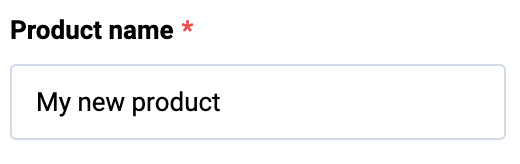

# Input
Input is an extension to standard input element.

## Usage


### Usage

=== "Basic Vue"

    ```html
    <template>
        <vc-card header="Card label"></vc-card>
    </template>
    ```

=== "Dynamic Views"

    To start using all the available input properties, specify the `vc-input` component when creating the schema.

    Base usage looks like this:

    ```typescript
    {
        id: "inputId",
        component: "vc-input",
        label: "Input label",
        property: "inputProperty",
        placeholder: "Input placeholder",
    }
    ```

## Input API

## Basic Vue

### Props

| Property | Type | Description |
| --- | --- | --- |
| `modelValue` | `string \| number \| Date \| null \| undefined` | Model of the component; Use with a listener for 'update:model-value' event OR use v-model directive |
| `label` | `string` | Input label text |
| `placeholder` | `string` | Input placeholder text |
| `type` | `"text" \| "password" \| "email" \| "tel" \| "number" \| "url" \| "time" \| "date" \| "datetime-local"` | Input type. Default value: `text` |
| `hint` | `string` | Input description (hint) text below input component |
| `clearable` | `boolean` | Appends clearable icon when a value is set; When clicked, model becomes null |
| `prefix` | `string` | Prefix |
| `suffix` | `string` | Suffix |
| `name` | `string` | Used to specify the name of the control; If not specified, it takes the value 'Field' |
| `loading` | `boolean` | Signals the user a process is in progress by displaying a spinner |
| `debounce` | `string \| number` | Debounce amount (in milliseconds) when updating model |
| `disabled` | `boolean` | Put component in disabled mode |
| `autofocus` | `boolean` | Focus field on initial component render |
| `error` | `boolean` | Does field have validation errors? |
| `errorMessage` | `string` | Validation error message (gets displayed only if 'error' is set to 'true') |
| `maxlength` | `string \| number` | Specify a max length of model. Default value: 1024 |
| `tooltip` | `string` | Input tooltip information |
| `required` | `boolean` | Input required state |
| `multilanguage` | `boolean` | Input multilanguage state |
| `currentLanguage` | `string` | Input current language |

### Slots

| Name         | Type                                      | Description                                                                                     |
| ---------------- | ----------------------------------------- | ----------------------------------------------------------------------------------------------- |
| `control`        | `(scope: { editable: boolean \| undefined; focused: boolean \| undefined; modelValue: string \| number \| Date \| null; emitValue: (value: string \| number \| Date \| null) => void; placeholder: string \| undefined; }) => any` | Slot for controls                                                                               |
| `prepend`        | void                      | Prepend outer field                                                                             |
| `prepend-inner`  | void                      | Prepend inner field                                                                             |
| `append-inner`   | void                      | Append to inner field                                                                           |
| `append`         | void                      | Append outer field                                                                              |
| `error`          | void                      | Slot for errors                                                                                 |
| `hint`           | void                      | Slot for hint text                                                                              |

### Emits

| Name               | Parameters                                  | ReturnType | Description                                                                                     |
| ------------------ | ------------------------------------------- | ---------- | ----------------------------------------------------------------------------------------------- |
| `update:modelValue` | value: `string \| number \| Date \| null` | `void`     | Emitted when the value of the component changes.                                                |

## Dynamic Views

Schema interface for input looks like this:

```typescript
interface InputSchema {
    id: string;
    component: "vc-input";
    label?: string;
    property: string;
    rules?: IValidationRules;
    placeholder?: string;
    tooltip?: string;
    clearable?: boolean;
    variant?: "number" | "text" | "password" | "email" | "tel" | "url" | "time" | "date" | "datetime-local";
    disabled?: {
        method: string;
    };
    visibility?: {
        method: string;
    };
    update?: {
        method: string;
    };
    prepend?: ControlSchema;
    prependInner?: ControlSchema;
    append?: ControlSchema;
    appendInner?: ControlSchema;
}
```

| Property | Type | Description |
| --- | --- | --- |
| `id` | `string` | Unique identifier for the `vc-input` component. |
| `component` | `vc-input` | Component used in schema. |
| `label` | `string` | Label for the input. Also available interpolation `{}` syntax based on current element context. |
| `property` | `string` | Property name that is used for binding input value to blade data.  <br> Supports deep nested properties like `property[1].myProperty`. <br> Additionally, you have the flexibility to bind any function or computed property that returns a value and retrieve changed value as an argument for the function.|
| `rules` | `IValidationRules` | Validation rules for the input. Uses [VeeValidate](https://vee-validate.logaretm.com/v4/) validation rules. |
| `placeholder` | `string` | Placeholder text for the input.  |
| `tooltip` | `string` | Tooltip text for the input label. |
| `clearable` | `boolean` | Whether the input has a clear button. |
| `variant` | `string` | Input variant. |
| `disabled` | `{method: string}` | Disabled state for component, could be used to disable input based on some conditions. Method or variable should be defined in the blade `scope` and should return a boolean value. |
| `visibility` | `{method: string}` | Visibility state for component, could be used to hide input based on some conditions. Method or variable should be defined in the blade `scope` and should return a boolean value. |
| `update` | `{method: string}` | Method to call when the input value is updated. Method should be defined in the blade `scope`. |
| `prepend` | `ControlSchema` | Schema of component to be displayed before the input. |
| `prependInner` | `ControlSchema` | Schema of component to be displayed inside the input before the value. |
| `append` | `ControlSchema` | Schema of component to be displayed after the input. |
| `appendInner` | `ControlSchema` | Schema of component to be displayed inside the input after the value. |
