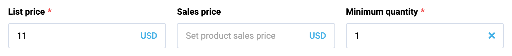

# Fieldset
Fieldset allows displaying sets of any available controls of any nested depth. It allows arranging elements in a grid with a customizable number of columns and aspect ratio that allows to control columns width, the ability to build a grid with multiple rows based on an array of data bound to the fieldset using the `property` option.
Also has visibility state settings and ability to remove elements from the fieldset.

## Usage



To start using all the available fieldset properties, specify the `vc-fieldset` component when creating the schema.

Base usage looks like this:

```typescript
{
    id: "fieldsetId",
    component: "vc-fieldset",
    fields: [
        // other components schemas
    ],
}
```

As fieldset has the ability of deep nesting, you can add other fieldsets or controls to it and create complex UI interfaces.

## Fieldset API
Schema interface for fieldset looks like this:

```typescript
interface FieldsetSchema {
    id: string;
    component: "vc-fieldset";
    fields: ControlSchema[];
    columns?: number;
    property?: string;
    aspectRatio?: number[];
    remove?: {
        method: string;
    };
    visibility?: {
        method: string;
    };
}
```

| Property | Type | Description |
| --- | --- | --- |
| `id` | `string` | Unique identifier for the fieldset. |
| `component` | `vc-fieldset` | Component used in schema. |
| `fields` | `ControlSchema[]` | Array of control schemas to be displayed in the fieldset. |
| `columns` | `number` | Number of columns to display the fields in. |
| `property` | `string` | Property name that is used for binding fieldset value to blade data.  <br> Supports deep nested properties like `property[1].myProperty`. <br> Additionally, you have the flexibility to bind any function or computed property that returns a value and retrieve changed value as an argument for the function.|
| `aspectRatio` | `number[]` | Array of numbers that define the aspect ratio of each column. Uses CSS flex-grow property. <br> Example: set to [1, 1] to make all columns equal width |
| `remove` | `{method: string}` | Method to call to remove field from the fieldset. When set - activates remove button. Used for property-based fieldsets. Method should be defined in the blade `scope`. |
| `visibility` | `{method: string}` | Visibility state for component, could be used to hide fieldset based on some conditions. Method or variable should be defined in the blade `scope` and should return a boolean value. |


## Guide
Fieldset allows you to create different display options for controls. For example, you can create a fieldset with two columns, each of which will have two inputs. To do this, you need to create a fieldset with two inputs and specify the value `2` in the `columns` parameter. You can also specify the `aspectRatio` parameter and set the aspect ratio of the column width. For example, if you specify `[1, 1]`, the columns will be the same width. If you specify `[1, 2]`, the second column will be twice as wide as the first.

Let's look at a few examples of use cases.

1) A regular fieldset with two fields in one column:

```typescript
{
        id: "fieldsetId",
        component: "vc-fieldset",
        fields: [
            {
                id: "input1",
                component: "vc-input",
                label: "Input 1",
                property: "input1",
            },
            {
                id: "input2",
                component: "vc-input",
                label: "Input 2",
                property: "input2",
            },
        ],
}
```

2) If we specify, for example, the number of columns as 2, then we will get a Fieldset with two fields in two columns:

```typescript
{
        id: "fieldsetId",
        component: "vc-fieldset",
        columns: 2,
        fields: [
            {
                id: "input1",
                component: "vc-input",
                label: "Input 1",
                property: "input1",
            },
            {
                id: "input2",
                component: "vc-input",
                label: "Input 2",
                property: "input2",
            },
        ],
}
```

3) If we have an array of data from which we want to build a fieldset, we can use the `property` parameter. In this case, each element of the array will be displayed in a separate fieldset. Also, if we want to add a delete button, we can specify a method that will be called when the delete button is clicked. In this method, we can remove an element from the data array that we specified in the `property` parameter.

```typescript
{
        id: "fieldsetId",
        component: "vc-fieldset",
        property: "fieldsetProperty",
        remove: {
            method: "removeFieldsetElement",
        },
        fields: [
            {
                id: "input1",
                component: "vc-input",
                label: "Input 1",
                property: "input1",
            },
            {
                id: "input2",
                component: "vc-input",
                label: "Input 2",
                property: "input2",
            },
        ],
}
```

If we want each field to have a label that is not manually set, but obtained when building from an array, we can use **interpolation**.
For example, if we want each field to have a label that we get from an object in the array, we can specify the following in the label parameter: `label: "{label}"`. In this case, when building the fieldset, each field will be set a label that will be obtained from the data array.

Let's consider this on the example of a small data array located in `fieldsetProperty`:

```typescript
[
    {
        label: "Label 1",
        value: "Input 1",
    },
    {
        label: "Label 2",
        value: "Input 2",
    }
]
```

Then, if we specify the following fieldset:

```typescript
{
    id: "fieldsetId",
    component: "vc-fieldset",
    property: "fieldsetProperty",
    fields: [
        {
            id: "input1",
            component: "vc-input",
            label: "{label}",
            property: "value",
        },
    ],
}
```

Then, when building the fieldset, each field will be set a label that will be obtained from the data array.

4) Also, we can specify the number of columns and `aspectRatio` for the fieldset, which will be displayed inside the fieldset. In this case, we will get a fieldset with two columns, each of which will have a fieldset with two fields and second fieldset will be twice as wide as the first.

```typescript
{
        id: "fieldsetId",
        component: "vc-fieldset",
        columns: 2,
        aspectRatio: [1, 2],
        fields: [
            {
                id: "fieldsetId",
                component: "vc-fieldset",
                fields: [
                    {
                        id: "input1",
                        component: "vc-input",
                        label: "Input 1",
                        property: "input1",
                    },
                    {
                        id: "input2",
                        component: "vc-input",
                        label: "Input 2",
                        property: "input2",
                    },
                ],
            },
            {
                id: "fieldsetId",
                component: "vc-fieldset",
                fields: [
                    {
                        id: "input1",
                        component: "vc-input",
                        label: "Input 1",
                        property: "input1",
                    },
                    {
                        id: "input2",
                        component: "vc-input",
                        label: "Input 2",
                        property: "input2",
                    },
                ],
            },
        ],
}
```


