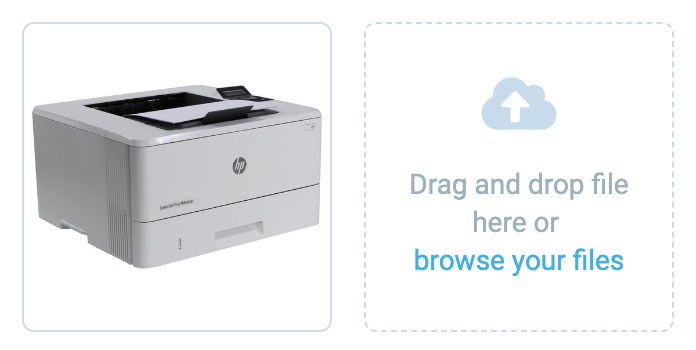

# Gallery
Gallery is a image gallery component with upload and preview.

## Usage



=== "Basic Vue"

    ```html
    <template>
        <vc-gallery :images="imagesList"></vc-gallery>
    </template>
    ```

=== "Dynamic Views"

    To start using all the available gallery properties, specify the `vc-gallery` component when creating the schema.

    Base usage looks like this:

    ```typescript
    {
        id: "galleryId",
        component: "vc-gallery",
        uploadFolder: "folderForFilesUpload",
        property: "imagesList"
    }
    ```

## Gallery API

## Basic Vue

### Props

| Property | Type | Description |
| --- | --- | --- |
| `images` | `ICommonAsset[]` | Array of images for the gallery. |
| `disabled` | `boolean` | Whether the gallery is disabled or not. |
| `required` | `boolean` | Whether the gallery is required or not. |
| `label` | `string` | Label for the gallery. |
| `tooltip` | `string` | Tooltip text for the gallery. |
| `tooltipIcon` | `string` | Icon for the tooltip. Default: `fas fa-info` |
| `uploadIcon` | `string` | Icon for the upload button. Default: `fas fa-upload` |
| `multiple` | `boolean` | Whether multiple images can be uploaded or not. |
| `variant` | `"gallery" \| "file-upload"` | Variant of the gallery component. Default: `gallery` |
| `itemActions` | `{preview: boolean, edit: boolean, remove: boolean}` | Actions to be displayed for each image in the gallery. Default: `() => ({ preview: true, edit: true, remove: true })` |
| `hideAfterUpload` | `boolean` | Whether to hide the upload overlay after uploading files or not. |
| `rules` | `string \| Record<string, unknown>` | Validation rules for the gallery. |
| `name` | `string` | Name of the gallery. Default: `Gallery` |
| `loading` | `boolean` | Whether the gallery is in a loading state or not. |

### Events

| Name               | Parameters                                  | ReturnType | Description                                                                                     |
| ------------------ | ------------------------------------------- | ---------- | ----------------------------------------------------------------------------------------------- |
| `upload`  | files: `FileList`, startingSortOrder?: `number` | `void`      | Emits files to upload with initial sortOrder. |
| `sort`    | sorted: `ICommonAsset[]`       | `void`      | Emits an sorted array.               |
| `edit`    | image: `ICommonAsset`          | `void`      | Emits image to edit.                             |
| `remove`  | image: `ICommonAsset`        | `void`      | Emits image to remove.                           |


## Dynamic Views

Schema interface for gallery looks like this:

```typescript
interface GallerySchema {
    id: string;
    component: "vc-gallery";
    label?: string;
    property: string;
    rules?: IValidationRules;
    tooltip?: string;
    hideAfterUpload?: boolean;
    actions?: {
        preview: boolean;
        edit: boolean;
        remove: boolean;
    };
    disabled?: {
        method: string;
    };
    visibility?: {
        method: string;
    };
    update?: {
        method: string;
    };
}
```

| Property | Type | Description |
| --- | --- | --- |
| `id` | `string` | Unique identifier for the `vc-gallery` component. |
| `component` | `vc-gallery` | Component used in schema. |
| `label` | `string` | Label for the gallery. Also available interpolation `{}` syntax based on current element context. |
| `property` | `string` | Property name that is used for binding gallery value to blade data.  <br> Supports deep nested properties like `property[1].myProperty`. <br> Additionally, you have the flexibility to bind any function or computed property that returns a value and retrieve changed value as an argument for the function.|
| `rules` | `IValidationRules` | Validation rules for the gallery. Uses [VeeValidate](https://vee-validate.logaretm.com/v4/) validation rules. |
| `tooltip` | `string` | Tooltip text for the gallery label. |
| `hideAfterUpload` | `boolean` | Whether to hide the upload overlay after uploading files or not. <br> Default: `false` |
| `actions` | `{preview: boolean, edit: boolean, remove: boolean}` | Actions to be displayed on hover for each image in the gallery. <br> Default: `{preview: true, edit: true, remove: true}` |
| `disabled` | `{method: string}` | Disabled state for component, could be used to disable gallery based on some conditions. Method or variable should be defined in the blade `scope` and should return a boolean value. |
| `visibility` | `{method: string}` | Visibility state for component, could be used to hide gallery based on some conditions. Method or variable should be defined in the blade `scope` and should return a boolean value. |
| `update` | `{method: string}` | Method to call when the gallery value is updated. Method should be defined in the blade `scope`. |


#### Guide
The gallery allows displaying images from an array of images, as well as uploading, previewing, editing, and deleting them. It has customizable actions for images, such as viewing, editing, and deleting.

To upload images, use the `assetsHandler` key in the details composables scope. `assetsHandler` has an interface for both images and assets, but in this case, we need the image interface. It includes a loading state, upload, remove, and edit methods. You can either use custom methods or the `useAssets` composable provided in the `@vc-shell/framework`.

##### useAssets composable
The `useAssets` composable includes asset processing methods - upload, edit, remove - as well as a loading state. The interface of the `useAssets` composable looks like this:

```typescript
interface IUseAssets {
  upload: (files: FileList, uploadPath: string, startingSortOrder?: number) => Promise<ICommonAsset[]>;
  remove: (filesToDelete: ICommonAsset[], initialAssetArr: ICommonAsset[]) => ICommonAsset[];
  edit: (updatedFiles: ICommonAsset[], initialAssetArr: ICommonAsset[]) => ICommonAsset[];
  loading: ComputedRef<boolean>;
}
```

| Property | Type | Description |
| --- | --- | --- |
| `upload` | `(files: FileList, uploadPath: string, startingSortOrder?: number) => Promise<ICommonAsset[]>` | Method for uploading files. Accepts a `FileList` object, an upload path, and an optional starting sort order. Returns a promise that resolves to an array of `ICommonAsset` objects. |
| `remove` | `(filesToDelete: ICommonAsset[], initialAssetArr: ICommonAsset[]) => ICommonAsset[]` | Method for removing files. Accepts an array of `ICommonAsset` objects to delete and the initial array of `ICommonAsset` objects. Returns an array of `ICommonAsset` objects after removing the specified files. |
| `edit` | `(updatedFiles: ICommonAsset[], initialAssetArr: ICommonAsset[]) => ICommonAsset[]` | Method for editing files. Accepts an array of `ICommonAsset` objects to update and the initial array of `ICommonAsset` objects. Returns an array of `ICommonAsset` objects after updating the specified files. |
| `loading` | `ComputedRef<boolean>` | Computed property that returns a boolean indicating whether the assets are currently being loaded. |

Now let's look at an example of connecting gallery actions in the details composable of a sample `vc-app`:

```typescript title="vc-app/src/modules/offers/composables/useOfferDetails/index.ts" linenums="1"
import { Image } from "@vc-app/api";

const { upload: imageUpload, remove: imageRemove, edit: imageEdit, loading: imageLoading } = useAssets();

const scope = ref<OfferDetailsScope>({
    ...,
    assetsHandler: {
      images: {
        loading: imageLoading,
        async upload(files: FileList, startingSortOrder: number) {
          return (await imageUpload(files, `offers/${item.value.id}`, startingSortOrder)).map((x) => new Image(x));
        },
        remove(files: ICommonAsset[]) {
          return imageRemove(files, item.value.images);
        },
        edit(files: ICommonAsset[]) {
          return imageEdit(files, item.value.images).map((x) => new Image(x));
        },
    },
    ...,
})
```

As you can see, in the `upload` and `edit` methods, we need to transform `ICommonAsset` objects into `Image` class objects from the client's API to use them in the gallery. This is necessary because `ICommonAsset` lacks some fields present in the `Image` class. Since images in the gallery often have their sortOrder, we can obtain the sortOrder of the last existing element in the array of images and pass it to the `upload` method so that the uploaded images have a sortOrder following the last existing one.

A basic example of a composable for image processing can be found in the `vc-app` sample folder in VirtoCommerce/.vc-shell repository: [useAssets](https://github.com/VirtoCommerce/vc-shell/blob/main/sample/vc-app/src/modules/common/composables/useAssets/index.ts). Since dynamic views default to using this interface, it's essential to adhere to this specific writing style.


#### Guide
Select allows you to display a list of options. To do this, you need to specify the `optionsMethod` parameter. The method should return an array of objects.

This method should follow the following signature:

```typescript
async function fetchSelectOptions(keyword?: string, skip = 0, ids?: string[]) {
    return await optionsFetchMethod({
        objectIds: ids,
        keyword,
        skip,
        take: 20 // Number of items to load per request
        })
    );
  }
```

To specify what you want to display you should use `optionLabel` as label property and `optionValue` as selected value property.
For example, if you have option like this:

    ```typescript
    {
        id: "optionId",
        title: "Option title",
    }
    ```

Then you should specify `optionLabel: "title"` and `optionValue: "id"`. What is under `optionValue` will be written in the `property` of the select.

#### Custom template
Also you can specify custom template for select options. To do this, you need to specify the `customTemplate` parameter. The parameter should contain the name of the component that will be used as a template for select options. The component should be registered globally by `moduleComponents` option in  `createDynamicAppModule` method.

The created component with the custom template has default props:

```typescript
defineProps<{
  context: {
    opt: Record<string, any>;
  };
  slotName: string;
}>();
```

Where `context` is the object that holds `opt` property that contains the option data, `slotName` is the name of the slot, that can display custom template.
`slotName` could be `selected-item` and `option`.
