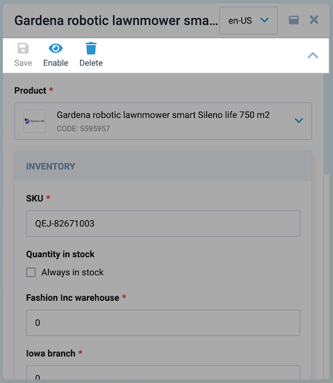

# Toolbar

The toolbar allows you to create buttons with additional actions upon clicking, such as saving or deleting data. Each toolbar button has customizable visibility, disabled status, icon, text, and a customizable method that will be invoked when the button is clicked.

## Usage



Lets take a look, how to create toolbar in two ways: using `VcBlade` component and using dynamic views.

### Basic Vue

    `VcBlade` component has `toolbar-items` prop, that accepts array of objects with `id`, `title`, `icon`, `clickHandler` and other properties.

    Lets take a look at example:

    ```html
    <template>
        <VcBlade
            ...,
            :toolbar-items="bladeToolbar"
            ...,
        >
        </VcBlade>
    </template>
    ```
    ```typescript
    const bladeToolbar = ref<IBladeToolbar[]>([
        {
            id: "refresh",
            title: 'Refresh',
            icon: "fas fa-sync-alt",
            async clickHandler() {
                // your custom refresh logic here
            },
        },
    ]);
    ```

### Dynamic Views

    To create toolbar schema you should pass `toolbar` property to the view schema object.

    Lets take a look at minified schema of the view:

    ```typescript
    import { DynamicDetailsSchema } from "@vc-shell/framework";

    const schema: DynamicDetailsSchema = {
        settings: {
            // ...
            toolbar: [
                {
                    id: "refresh",
                    title: 'Refresh',
                    icon: "fas fa-sync-alt",
                    method: "refresh",
                },
            ],
        },
    };
    ```

This schema will create toolbar with one button with `refresh` id, `Refresh` title, `fas fa-sync-alt` icon and `refresh` method.

But this button will not be visible until you add `create` method to the `toolbarOverrides` object in the view composable `scope`. Lets take a look how to do it in next section.

#### Binding properties and methods

To add interactivity to your toolbar button you should add `refresh` method to your `toolbarOverrides` object:

    ```typescript
    const useList = (args: // ...): UseList => {
        const scope = ref<ListScope>({
            // ...
            toolbarOverrides: {
                refresh: () => {
                    // your custom logic here
                },
            },
        });
    }
    ```

or you can create object with `visible` and `disabled` properties and also `clickHandler` method:

    ```typescript
    const useList = (args: // ...): UseList => {
        const scope = ref<ListScope>({
            // ...
            toolbarOverrides: {
                refresh: {
                    clickHandler(bladeContext) {
                        // your custom logic here
                    },
                    visible: true,
                    disabled: false,
                }
            }
        });
    }
    ```

`visible` and `disabled` properties can be boolean, function or even computed property that returns boolean value.

`clickHandler` method also has argument with provided `bladeContext` object.

!!! note
    More about `bladeContext` object you can find in [DynamicBladeList Blade Context](../Dynamic-Views/views/DynamicBladeList.md#dynamicbladelist-blade-context) and [DynamicBladeForm Blade Context](../Dynamic-Views/views/DynamicBladeForm.md#dynamicbladeform-blade-context) section.

## Toolbar API

## IBladeToolbar interface

| Property    | Type                                                                                   | Description                                                                                                      |
|-------------|----------------------------------------------------------------------------------------|------------------------------------------------------------------------------------------------------------------|
| id          | string                                                                                 | The ID of the toolbar item.                                                                                      |
| icon        | string \| (() => string)                                                              | The icon of the toolbar item. It can be a string or a function that returns a string.                             |
| disabled    | boolean \| ComputedRef<boolean \| undefined>                                           | Whether the toolbar item is disabled.                                                                             |
| dropdownItems | IBladeDropdownItem[]                                                                  | An array of dropdown items for the toolbar item.                                                                  |
| title       | string \| Ref<string>                                                                 | The title of the toolbar item. It can be a string or a ref to a string.                                            |
| isVisible   | boolean \| Ref<boolean \| undefined> \| ComputedRef<boolean \| undefined>              | Whether the toolbar item is visible.                                                                              |
| clickHandler | ((app?: Record<string, any> \| CoreBladeExposed \| null) => void) \| undefined       | The click handler function for the toolbar item. It takes an optional app object as a parameter.                 |
