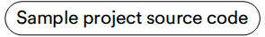
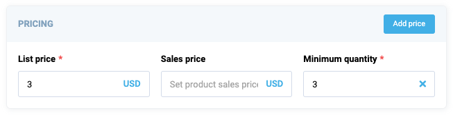

# Overview

Dynamic views allow you to use built-in components within VC Shell to create new views using a new style of description - schemas. Dynamic views under the hood leverage standard components from the VC Shell UI kit but in a slightly modified wrapper. In most cases, all the input data passed to the component when creating the schema use the same names as the component parameters. For the convenience of schema creation, each available component has its new interface.

This guide will explain which components are available for use in dynamic views and what capabilities they offer.

In this guide, we'll use the example of the `vc-app` project schemas, which is located in the `sample/vc-app/src/modules/offers/pages` folder.
[](https://github.com/VirtoCommerce/vc-shell/tree/main/sample/vc-app)

## Available Controls

### Button
Based on the `vc-button` component, allows you to add buttons to dynamic views. Could be used to trigger actions separately or in cooperation with other components. Has disabled and visibility state settings. Also has customizable size, icon, icon size, text, method called on click.

#### Usage
To start using all the available button properties, specify the `vc-button` component when creating the schema.

Base usage looks like this:

```typescript
{
    id: "buttonId",
    component: "vc-button",
    method: "buttonClick",
    content: "Button text",
}
```

#### API
Shema interface for button looks like this:

```typescript
interface ButtonSchema {
    id: string;
    component: "vc-button";
    content: string;
    small?: boolean;
    icon?: string;
    iconSize?: "xs" | "s" | "m" | "l" | "xl" | "xxl" | "xxxl";
    text?: boolean;
    method?: string;
    disabled?: {
        method: string;
    };
    visibility?: {
        method: string;
    };
}
```

| Property       | Type              | Description                                                     |
| -------------- | ----------------- | --------------------------------------------------------------- |
| `id`           | `string`          | Unique identifier for `vc-button` component.                    |
| `component`    | `vc-button`       | Component used in schema.                                      |
| `content`      | `string`          | Button inner text.                                              |
| `small`        | `boolean`         | Makes button small sized.                                      |
| `icon`         | `string`          | Button icon. Используется пакет иконок AwesomeIcons            |
| `iconSize`     | `string`          | Size of the button icon.                                       |
| `text`         | `string`          | Button as text without overlay.                                |
| `method`       | `string`          | Method to be called when the button is clicked. Method should be defined in the blade `scope`. |
| `disabled`     | `{method: string}` | Disabled state for component, could be used to disable button based on some conditions. Method or variable should be defined in the blade `scope` and should return a boolean value. |
| `visibility`   | `{method: string}` | Visibility state for component, could be used to hide button based on some conditions. Method or variable should be defined in the blade `scope` and should return a boolean value. |


### Card
Based on the `vc-card` component, allows you to create a card that can contain other components of any depth.
The component has visibility state settings. Accepts an array of component schemas in the fields that will be displayed inside the card. Also has a customizable action button displayed in the top right corner of the card.

#### Usage
To start using all the available card properties, specify the `vc-card` component when creating the schema.

Base usage looks like this:

```typescript
{
    id: "cardId",
    component: "vc-card",
    label: "Card label",
    fields: [
        // other components schemas
    ],
}
```

As card has the ability of deep nesting, you can add other cards or controls to it and create complex UI interfaces.

#### API
Shema interface for card looks like this:

```typescript
interface CardSchema {
    id: string;
    component: "vc-card";
    label: string;
    fields: ControlSchema[];
    action?: ButtonSchema & {
        method: string;
    };
    collapsible?: boolean;
    visibility?: {
        method: string;
    };
}
```

| Property       | Type                                  | Description                                                     |
| -------------- | ------------------------------------- | --------------------------------------------------------------- |
| `id`           | `string`                              | Unique identifier for `vc-card` component.                     |
| `component`    | `vc-card`                             | Component used in schema.                                      |
| `label`        | `string`                              | Card label that is displayed in the header. Also available interpolation `{}` syntax based on current element context.                    |
| `fields`       | `ControlSchema[]`                    | Array of schemas for components that will be displayed inside the card. |
| `action`       | `ButtonSchema & {method: string}`    | Action button that is displayed in the top right corner of the card. Could be used to trigger some actions. |
| `collapsible`  | `boolean`                             | Makes the card collapsible.                                     |
| `visibility`   | `{method: string}`                   | Visibility state for the component, could be used to hide the card based on some conditions. Method or variable should be defined in the blade `scope` and should return a boolean value. |


#### Example
Card example with action button and fieldset component containing several inputs from `vc-app` project:

=== "Screenshot"

    

=== "Code"

    ```typescript title="vc-app-extend/src/modules/offers/pages/details.ts" linenums="1"
    {
        id: "pricingCard",
            component: "vc-card",
            label: "Pricing",
            action: {
                id: "addPrice",
                component: "vc-button",
                content: "Add price",
                small: true,
                method: "addPrice",
            },
            fields: [
                {
                id: "pricesFieldset",
                component: "vc-fieldset",
                property: "prices",
                columns: 3,
                remove: {
                    method: "removePrice",
                },
                fields: [
                    {
                        id: "listPrice",
                        component: "vc-input-currency",
                        label: "List price",
                        property: "listPrice",
                        placeholder: "Set list price",
                        optionProperty: "currency",
                        optionValue: "value",
                        optionLabel: "title",
                        rules: {
                            required: true,
                            min_value: 0,
                        },
                    },
                    {
                        id: "salePrice",
                        component: "vc-input-currency",
                        label: "Sales price",
                        property: "salePrice",
                        placeholder: "Set product sales price",
                        optionProperty: "currency",
                        optionValue: "value",
                        optionLabel: "title",
                    },
                    {
                        id: "minQuantity",
                        component: "vc-input",
                        label: "Minimum quantity",
                        property: "minQuantity",
                        placeholder: "Enter product minimal quantity in order",
                        clearable: true,
                        rules: {
                            required: true,
                            min_value: 0,
                        },
                        variant: "number",
                    },
                ],
                },
            ],
    }
    ```

### Checkbox
Based on the `vc-checkbox` component, allows you to create a checkbox that can be checked or unchecked. The component has disabled and visibility state settings. Also has customizable label, content, and many other settings.

#### Usage
To start using all the available checkbox properties, specify the `vc-checkbox` component when creating the schema.

Base usage looks like this:

```typescript
{
    id: "checkboxId",
    component: "vc-checkbox",
    label: "Checkbox label",
    property: "checkboxProperty",
    content: "Checkbox text content",
}
```

#### API
Shema interface for checkbox looks like this:

```typescript
interface CheckboxSchema {
    id: string;
    component: "vc-checkbox";
    trueValue?: boolean;
    falseValue?: boolean;
    label?: string;
    rules?: IValidationRules;
    tooltip?: string;
    property: string;
    content?: string;
    update?: {
        method: string
    };
    disabled?: {
        method: string;
    };
    visibility?: {
        method: string;
    };
}
```


| Property | Type | Description |
| --- | --- | --- |
| `id` | `string` | Unique identifier for `vc-checkbox` component. |
| `component` | `string` | `vc-checkbox` |
| `trueValue` | `boolean` | Set value for checked state. |
| `falseValue` | `boolean` | Set value for unchecked state. |
| `label` | `string` | Checkbox label that is displayed above the checkbox. Also available interpolation `{}` syntax based on current element context. |
| `rules` | `IValidationRules` | Checkbox validation rules. Could be used to validate checkbox value. Uses [VeeValidate](https://vee-validate.logaretm.com/v4/) validation rules. |
| `tooltip` | `string` | Checkbox tooltip that is displayed when hovering over the checkbox label tooltip icon. |
| `property` | `string` | Property name that is used for binding checkbox value to blade data. |
| `content` | `string` | Text content that is displayed on the right side of the checkbox. |
| `update` | `{method: string}` | Update method that is called when checkbox value is changed. Method should be defined in the blade `scope`. |
| `disabled` | `{method: string}` | Disabled state for component, could be used to disable checkbox based on some conditions. Method or variable should be defined in the blade `scope` and should return a boolean value. |
| `visibility` | `{method: string}` | Visibility state for component, could be used to hide checkbox based on some conditions. Method or variable should be defined in the blade `scope` and should return a boolean value. |

### Dynamic Property
Based on the `vc-dynamic-property` component, allows you to display a dynamic properties controls. Has disabled and visibility state settings. Also has customizable label, placeholder, tooltip, and many other settings.

#### Usage
To start using all the available dynamic property properties, specify the `vc-dynamic-properties` component when creating the schema.

Base usage looks like this:

```typescript
{
    id: "dynamicPropertyId",
    component: "vc-dynamic-properties",
    property: "dynamicPropertyProperty",
    exclude: ["propertyToExclude"],
    include: ["propertyToInclude"],
}
```

#### API
Schema interface for dynamic property looks like this:

```typescript
interface DynamicPropertiesSchema {
    id: string;
    component: "vc-dynamic-properties";
    property: string;
    exclude?: string[];
    include?: string[];
    disabled?: {
        method: string;
    };
    visibility?: {
        method: string;
    };
}
```

| Property | Type | Description |
| --- | --- | --- |
| `id` | `string` | Unique identifier for `vc-dynamic-properties` component. |
| `component` | `vc-dynamic-properties` | Component used in schema. |
| `property` | `string` | Property name that is used for binding dynamic properties value to blade data. |
| `exclude` | `string[]` | An array of property names to exclude from the dynamic properties schema. |
| `include` | `string[]` | An array of property names to include in the dynamic properties schema. |
| `disabled` | `{method: string}` | Disabled state for component, could be used to disable dynamic properties based on some conditions. Method or variable should be defined in the blade `scope` and should return a boolean value. |
| `visibility` | `{method: string}` | Visibility state for component, could be used to hide dynamic properties based on some conditions. Method or variable should be defined in the blade `scope` and should return a boolean value. |


### Editor
Based on the `vc-editor` component, allows you to display a Rich Text Editor, based on Vue-wrapped [Quill](https://vueup.github.io/vue-quill/). The component has disabled and visibility state settings. Also has customizable label, placeholder, tooltip, and many other settings.

#### Usage
To start using all the available editor properties, specify the `vc-editor` component when creating the schema.

Base usage looks like this:

```typescript
{
    id: "editorId",
    component: "vc-editor",
    label: "Editor label",
    property: "editorProperty",
    placeholder: "Editor placeholder",
}
```

#### API
Schema interface for editor looks like this:

```typescript
interface EditorSchema {
    id: string;
    component: "vc-editor";
    label?: string;
    property: string;
    rules?: IValidationRules;
    placeholder?: string;
    tooltip?: string;
    multilanguage?: boolean;
    disabled?: {
        method: string;
    };
    visibility?: {
        method: string;
    };
    update?: {
        method: string;
    };
}
```

| Property | Type | Description |
| --- | --- | --- |
| `id` | `string` | Unique identifier for the `vc-editor` component. |
| `component` | `vc-editor` | Component used in schema. |
| `label` | `string` | Label for the editor. Also available interpolation `{}` syntax based on current element context. |
| `property` | `string` | Property name that is used for binding editor value to blade data. |
| `rules` | `IValidationRules` | Validation rules for the editor. |
| `placeholder` | `string` | Placeholder text for the editor. Uses [VeeValidate](https://vee-validate.logaretm.com/v4/) validation rules. |
| `tooltip` | `string` | Tooltip text for the editor label. |
| `multilanguage` | `boolean` | Whether the editor supports multiple languages. |
| `disabled` | `{method: string}` | Disabled state for component, could be used to disable editor based on some conditions. Method or variable should be defined in the blade `scope` and should return a boolean value. |
| `visibility` | `{method: string}` | Visibility state for component, could be used to hide editor based on some conditions. Method or variable should be defined in the blade `scope` and should return a boolean value. |
| `update` | `{method: string}` | Method to call when the editor value is updated. Method should be defined in the blade `scope`. |

### Fieldset
Fieldset allows displaying sets of any available controls of any nested depth. It allows arranging elements in a grid with a customizable number of columns and aspect ratio that allows to control columns width, the ability to build a grid with multiple rows based on an array of data bound to the fieldset using the `property` option.
Also has visibility state settings and ability to remove elements from the fieldset.

#### Usage
To start using all the available fieldset properties, specify the `vc-fieldset` component when creating the schema.

Base usage looks like this:

```typescript
{
    id: "fieldsetId",
    component: "vc-fieldset",
    fields: [
        // other components schemas
    ],
}
```

As fieldset has the ability of deep nesting, you can add other fieldsets or controls to it and create complex UI interfaces.

#### API
Schema interface for fieldset looks like this:

```typescript
interface FieldsetSchema {
    id: string;
    component: "vc-fieldset";
    fields: ControlSchema[];
    columns?: number;
    property?: string;
    aspectRatio?: number[];
    remove?: {
        method: string;
    };
    visibility?: {
        method: string;
    };
}
```

| Property | Type | Description |
| --- | --- | --- |
| `id` | `string` | Unique identifier for the fieldset. |
| `component` | `vc-fieldset` | Component used in schema. |
| `fields` | `ControlSchema[]` | Array of control schemas to be displayed in the fieldset. |
| `columns` | `number` | Number of columns to display the fields in. |
| `property` | `string` | Property name that is used for binding fieldset value to blade data. |
| `aspectRatio` | `number[]` | Array of numbers that define the aspect ratio of each column. Uses CSS flex-grow property. <br> Example: set to [1, 1] to make all columns equal width |
| `remove` | `{method: string}` | Method to call to remove field from the fieldset. When set - activates remove button. Used for property-based fieldsets. Method should be defined in the blade `scope`. |
| `visibility` | `{method: string}` | Visibility state for component, could be used to hide fieldset based on some conditions. Method or variable should be defined in the blade `scope` and should return a boolean value. |


#### Guide
Fieldset allows you to create different display options for controls. For example, you can create a fieldset with two columns, each of which will have two inputs. To do this, you need to create a fieldset with two inputs and specify the value `2` in the `columns` parameter. You can also specify the `aspectRatio` parameter and set the aspect ratio of the column width. For example, if you specify `[1, 1]`, the columns will be the same width. If you specify `[1, 2]`, the second column will be twice as wide as the first.

Let's look at a few examples of use cases.

1) A regular fieldset with two fields in one column:

```typescript
{
        id: "fieldsetId",
        component: "vc-fieldset",
        fields: [
            {
                id: "input1",
                component: "vc-input",
                label: "Input 1",
                property: "input1",
            },
            {
                id: "input2",
                component: "vc-input",
                label: "Input 2",
                property: "input2",
            },
        ],
}
```

2) If we specify, for example, the number of columns as 2, then we will get a Fieldset with two fields in two columns:

```typescript
{
        id: "fieldsetId",
        component: "vc-fieldset",
        columns: 2,
        fields: [
            {
                id: "input1",
                component: "vc-input",
                label: "Input 1",
                property: "input1",
            },
            {
                id: "input2",
                component: "vc-input",
                label: "Input 2",
                property: "input2",
            },
        ],
}
```

3) If we have an array of data from which we want to build a fieldset, we can use the `property` parameter. In this case, each element of the array will be displayed in a separate fieldset. Also, if we want to add a delete button, we can specify a method that will be called when the delete button is clicked. In this method, we can remove an element from the data array that we specified in the `property` parameter.

```typescript
{
        id: "fieldsetId",
        component: "vc-fieldset",
        property: "fieldsetProperty",
        remove: {
            method: "removeFieldsetElement",
        },
        fields: [
            {
                id: "input1",
                component: "vc-input",
                label: "Input 1",
                property: "input1",
            },
            {
                id: "input2",
                component: "vc-input",
                label: "Input 2",
                property: "input2",
            },
        ],
}
```

If we want each field to have a label that is not manually set, but obtained when building from an array, we can use **interpolation**.
For example, if we want each field to have a label that we get from an object in the array, we can specify the following in the label parameter: `label: "{label}"`. In this case, when building the fieldset, each field will be set a label that will be obtained from the data array.

Let's consider this on the example of a small data array located in `fieldsetProperty`:

```typescript
[
    {
        label: "Label 1",
        value: "Input 1",
    },
    {
        label: "Label 2",
        value: "Input 2",
    }
]
```

Then, if we specify the following fieldset:

```typescript
{
    id: "fieldsetId",
    component: "vc-fieldset",
    property: "fieldsetProperty",
    fields: [
        {
            id: "input1",
            component: "vc-input",
            label: "{label}",
            property: "value",
        },
    ],
}
```

Then, when building the fieldset, each field will be set a label that will be obtained from the data array.

4) Also, we can specify the number of columns and `aspectRatio` for the fieldset, which will be displayed inside the fieldset. In this case, we will get a fieldset with two columns, each of which will have a fieldset with two fields and second fieldset will be twice as wide as the first.

```typescript
{
        id: "fieldsetId",
        component: "vc-fieldset",
        columns: 2,
        aspectRatio: [1, 2],
        fields: [
            {
                id: "fieldsetId",
                component: "vc-fieldset",
                fields: [
                    {
                        id: "input1",
                        component: "vc-input",
                        label: "Input 1",
                        property: "input1",
                    },
                    {
                        id: "input2",
                        component: "vc-input",
                        label: "Input 2",
                        property: "input2",
                    },
                ],
            },
            {
                id: "fieldsetId",
                component: "vc-fieldset",
                fields: [
                    {
                        id: "input1",
                        component: "vc-input",
                        label: "Input 1",
                        property: "input1",
                    },
                    {
                        id: "input2",
                        component: "vc-input",
                        label: "Input 2",
                        property: "input2",
                    },
                ],
            },
        ],
}
```


### Gallery

#### Usage

#### API

#### Guide

### Input Currency

#### Usage

#### API

#### Guide

### Input

#### Usage

#### API

#### Guide

### Select

#### Usage

#### API

#### Guide

### Status

#### Usage

#### API

#### Guide
