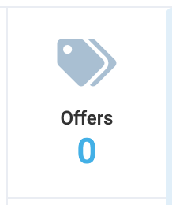

# Widgets

A widget is a standalone component that can display information and perform actions when clicked. Widgets can be used in both dynamic views and templates.

## Usage

To create a widget, you need to generate a new file within the `components/widgets` folder of your module. For instance, if you named it `MyWidget` in the schema or template, the exported component should share the same name. Essentially, widgets are standard Vue components capable of utilizing other components and markup.



## Component creation

The widget component is constructed using the `VcWidget` component from the UI kit `@vc-shell/framework`. This component accepts the following parameters as props:

| Property and Type                     | Description                   |
| ------------------------------------- | ----------------------------- |
| `title`  {==string==}                 | The title of the widget.      |
| `value`  {==string==}, {==number==}   | Count to display.             |
| `icon`   {==string==}                 | The widget's icon, using FontAwesome icons set. |
| `disabled` {==string==}               | Disabled state.               |

The widget component, by default, includes the incoming prop `modelValue`, containing the blade context. This context holds the `item` object, which contains data about the current item displayed in the blade, along with other data useful for the widget. The component also features an `update:modelValue` event that facilitates updating the blade context when necessary.

The default `Props` and `Events` of the widget component are as follows:

```typescript
const props = defineProps<{
  modelValue: T;
}>();

const emit = defineEmits<{
  (event: "update:modelValue", context: T);
}>();
```

{: width="25"} [DynamicBladeForm](../dynamic-views/Dynamic-Blade-Form.md#dynamicbladeform-blade-context)

## Counter Setup

Since the widget component operates independently, the logic for fetching data for the widget should be implemented within the component itself. To achieve this, incorporate the `useAsync` method from the `@vc-shell/framework` package into the widget component. This method serves as a wrapper for API requests, and it should be invoked when the component is mounted to update the widget's counter value. Additionally, utilize `useApiClient` to obtain an instance of the API client, which will be used for API requests.

Here is a sample implementation of the logic that fetches data for the widget:

```typescript
import { useAsync, useApiClient } from "@vc-shell/framework";
/**
 * Import your API client
 */
import { VcmpClient, QueryFromApi } from "{ path to your API client }"

/**
 * Use the imported API client
 */
const { getApiClient } = useApiClient(VcmpClient);
const client = getApiClient();

/**
 * Define the counter
 */
const count = ref(0);

/**
 * Use the useAsync wrapper to get `totalCount` from the API
 */
const { loading, action: getCount } = useAsync<QueryFromApi, number | undefined>(async (query) => {
  return (await client).searchItems(query).then((res) => res.totalCount);
});

/**
 * Call the `getCount` method
 */
async function populateCounter() {
  count.value = await getCount({
    take: 0,
  });
}

/**
 * Call the `populateCounter` method on component mounted
 */
onMounted(async () => {
  if (props.modelValue?.item?.id) {
    await populateCounter();
  }
});
```

## Counter Updating

Since the widget component loads data only when mounted, you also need to add a watcher from the `vueUse` library - `watchDebounced`, which allows reloading data when the `item` from the blade context changes. This `item` is passed to the widget in `modelValue`.

```typescript
import { watchDebounced } from "@vueuse/core";

watchDebounced(
  () => props.modelValue?.item,
  async () => {
    await populateCounter();
  },
  { debounce: 500, maxWait: 1000 }
);
```

!!! note
    Updating the `item` usually occurs when data is updated in the blade. Therefore, when saving data, it is important to remember that the widget is updated twice - once when saving and once when loading data into the blade.

## Creating a Click Action for the Widget

To add an action when clicking the widget, include a `clickHandler` method in the widget component. This method is called when clicking the widget and should be bound to the `click` event on the `VcWidget` component used as the template. In this method, you can implement any logic executed when clicking the widget. More often than not, this involves opening a new blade, which can be accomplished using the `openBlade` method from the `useBladeNavigation` composable:

```typescript
<template>
  <VcWidget
    // ...
    @click="clickHandler"
    // ...
  >
  </VcWidget>
</template>
<script setup lang="ts">
import { useBladeNavigation } from "@vc-shell/framework";

const { openBlade, resolveBladeByName } = useBladeNavigation();
const widgetOpened = ref(false);

async function clickHandler() {
  if (!widgetOpened.value) {
    await openBlade({
      blade: resolveBladeByName("BladeName"),
      onOpen() {
        widgetOpened.value = true;
      },
      onClose() {
        widgetOpened.value = false;
      },
    });
  }
}
</script>
```

## Basic Example of the Widget Component

Since any logic can be implemented in the widget, let's consider its basic version based on this guide. This version opens a new blade when clicking on the widget and also fetches and updates the widget counter using API requests.

=== "Template"

    ```html
    <template>
        <VcWidget
            v-loading="loading"
            title="My Widget"
            :value="count"
            icon="fas fa-tags"
            @click="clickHandler"
        >
        </VcWidget>
    </template>
    ```

=== "Script"

    ```typescript
    import { useAsync, useApiClient, useBladeNavigation } from "@vc-shell/framework";
    import { watchDebounced } from "@vueuse/core";

    const props = defineProps<{
        modelValue: {
            item: Record<string, any>;
        };
    }>();

    const emit = defineEmits<{
        (event: "update:modelValue", context: Record<string, any>);
    }>();

    const { getApiClient } = useApiClient(VcmpClient);
    const client = getApiClient();

    const { openBlade, resolveBladeByName } = useBladeNavigation();

    const widgetOpened = ref(false);
    const count = ref(0);

    watchDebounced(
        () => props.modelValue?.item,
        async () => {
            await populateCounter();
        },
        { debounce: 500, maxWait: 1000 }
    );

    const { loading, action: getCount } = useAsync<QueryFromApi, number | undefined>(async (query) => {
        return (await client).searchItems(query).then((res) => res.totalCount);
    });

    async function clickHandler() {
        if (!widgetOpened.value) {
            await openBlade({
                blade: resolveBladeByName("BladeName"),
                onOpen() {
                    widgetOpened.value = true;
                },
                onClose() {
                    widgetOpened.value = false;
                },
            });
        }
    }

    async function populateCounter() {
        count.value = await getCount({
            take: 0,
        });
    }

    onMounted(async () => {
        if (props.modelValue?.item?.id) {
            await populateCounter();
        }
    });
    ```

## Registering Widgets

To register a widget, add its export to the main `index.ts` file located in the `components` folder of your module. For example, if you specified the name `MyWidget` in the schema, the component export should have the same name. Afterward, by adding all your components to the `createDynamicAppModule` method in the `moduleComponents` option, you will be able to use them in dynamic views.

{: width="25"} [Registering Custom Templates](../dynamic-views/Custom-Templates.md#registering-custom-templates)