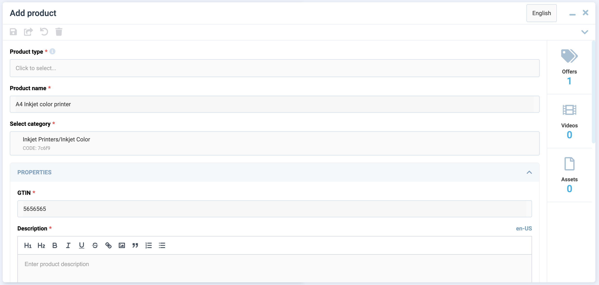
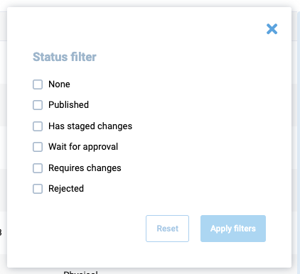

# Overview

This type of view enables the creation of blades containing a tabular list. The view includes the following features:

* Built-in pagination.
* Filters.
* Multiselect.
* Reorderable rows.
* Search field.
* Ability to create a custom mobile view template.
* Ability to create a custom empty list template.
* Ability to create a custom not-found list template.




## Usage sample

```typescript
import { DynamicGridSchema } from "@vc-shell/framework";

export const grid: DynamicGridSchema = {
    settings: {
        url: "/dynamic-module-list",
        id: "DynamicItems",
        titleTemplate: "Dynamic module blade",
        localizationPrefix: "DynamicModule",
        isWorkspace: true,
        composable: "useList",
        component: "DynamicBladeList",
        toolbar: [
        {
            id: "refresh",
            icon: "fas fa-sync-alt",
            title: "Refresh",
            method: "refresh",
        },
        ],
        menuItem: {
            title: 'DYNAMICMODULE.MENU.TITLE',
            icon: "fas fa-file-alt",
            priority: 1,
        }
    },
    content: [
        {
        id: "itemsGrid",
        component: "vc-table",
        mobileTemplate: {
            component: "DynamicItemsMobileGridView",
        },
        multiselect: true,
        columns: [
            {
                id: "imgSrc",
                title: "Pic",
                type: "image",
                alwaysVisible: true,
            },
            {
                id: "name",
                title: "Name",
                alwaysVisible: true,
            },
            {
                id: "createdDate",
                title: "Created date",
                sortable: true,
                type: "date-ago",
            },
        ],
        },
    ],
};
```

## View programming structure

### View declaration

To create a view, create a schema and pass it to the dynamic view. The schema must contain the following properties - `settings` and `content`:

```typescript
interface DynamicGridSchema {
  settings: SettingsGrid;
  content: [ListContentSchema];
}
```

| Property   | Type               | Description          |
| ---------- | ------------------ | -------------------- |
| `settings` | `SettingsGrid`       | The settings of the view. |
| `content`  | `ListContentSchema[]`| The content of the view. |

#### Schema Settings API

`SettingsGrid` is an extension of `SettingsBase` with additional settings for `DynamicBladeList`:

```typescript
interface SettingsGrid extends SettingsBase {
  component: "DynamicBladeList";
}
```

Every newly created view must have settings that describe its behavior and appearance. Depending on the type of view used, the settings may vary slightly. The settings are represented by an object built using the following SettingsBase interface:

```typescript
interface SettingsBase {
    url?: string;
    localizationPrefix: string;
    id: string;
    titleTemplate: string;
    composable: string;
    toolbar: {
        id: string;
        title: string;
        icon: string;
        method: string;
    }[];
    component: "DynamicBladeList";
    permissions?: string | string[];
    pushNotificationType?: string | string[];
    isWorkspace?: boolean;
}
```

| Property | Type | Description |
| --- | --- | --- |
| `url` | `string` | The URL of the view. This option is required if you want to add the view to the navigation menu or want to access it directly by URL. If you do not specify a URL, the view will be available only as a child view of another view. |
| `id` | `string` | The unique ID of the view. This option is required. The ID is used to identify the view in the navigation system and provides scheme overriding capabilities. |
| `localizationPrefix` | `string` | The prefix used for localization keys. This option is required. The prefix is used to provide localized content for the view. For example, if you specify the prefix `MyList`, the localization key for the title of the view will be `MyList.Title`. Under the hood, [vue-i18n](https://kazupon.github.io/vue-i18n/) is used. |
| `titleTemplate` | `string` | The title of the view that is shown in the blade header by default. This option is required. |
| `component` | `"DynamicBladeForm" | "DynamicBladeList"` | The name of the Vue component used by the view. This option is required. It could be one of the following values: <br> - `DynamicBladeList` <br> - `DynamicBladeForm` |
| `composable` | `string` | The name of the composable used by the view. This option is required. |
| `isWorkspace` | `boolean` | Indicates whether the view is a workspace. This option is used to determine which view should be the default view. Default: `false` |
| `toolbar` | `object[]` | An array of objects representing the toolbar buttons. This option is optional. If you do not specify any buttons, the toolbar will not be displayed. Each object in the array must have the following properties: id, title, icon, and method. More info about toolbar creation can be found in the [Toolbar](./toolbar.md) section. |
| `permissions` | `string`, `string[]` | The permissions required to access the view. This option is optional. If you do not specify any permissions, the view will be available to all users. |
| `pushNotificationType` | `string`, `string[]` | The push notification types associated with the view. This option is optional. If you do not specify any push notification types, the view will not receive any push notifications. |

#### Schema Content API

##### ListContentSchema
`ListContentSchema` is an interface that contains settings for the tabular list:

```typescript
interface ListContentSchema {
  id: string;
  component: "vc-table";
  filter?: FilterSchema;
  multiselect?: boolean;
  header?: boolean;
  columns?: (ITableColumns & {
    id: string;
    title: string;
    sortable?: boolean;
    alwaysVisible?: boolean;
    type?: string;
    customTemplate?: GridTemplateOverride;
  })[];
  reorderableRows?: boolean;
  mobileTemplate?: {
    component: string;
  };
  notFoundTemplate?: {
    component: string;
  };
  emptyTemplate?: {
    component: string;
  };
}
```

| Property          | Type                                                                                                 | Description                                           |
| ----------------- | ---------------------------------------------------------------------------------------------------- | ----------------------------------------------------- |
| `id`              | `string`                                                                                               | The unique ID of the view.                            |
| `component`       | `"vc-table"`                                                                                           | The name of the Vue component used by the view.        |
| `filter`          | `FilterSchema`                                                                                        | The filter settings.                                  |
| `multiselect`     | `boolean`                                                                                              | Indicates whether multiselect is enabled.             |
| `header`          | `boolean`                                                                                              | Indicates whether the header of `vc-table` is enabled. When `true` - enables the search bar and provides the possibility to use `Filter`. |
| `columns`         | `(ITableColumns & { id: string; title: string; sortable?: boolean; alwaysVisible?: boolean; type?: string; customTemplate?: GridTemplateOverride; })[]` | The columns settings.                             |
| `reorderableRows` | `boolean`                                                                                              | Indicates whether reorderable rows are enabled.        |
| `mobileTemplate`  | `{ component: string; }`                                                                              | The mobile template settings. The component must be registered globally. |
| `notFoundTemplate`| `{ component: string; }`                                                                              | The not found template settings. The component must be registered globally.|
| `emptyTemplate`   | `{ component: string; }`                                                                              | The empty template settings. The component must be registered globally.|

##### FilterSchema
`FilterSchema` is an interface that contains settings for filters:

```typescript
type FilterSchema = FilterCheckbox | FilterDateInput
```

At the moment, two types of filters are supported: `FilterCheckbox` and `FilterDateInput`. Learn more about them in the instructions below.

##### FilterCheckbox
`FilterCheckbox` is an interface that contains settings for checkbox filters:

```typescript
type FilterCheckbox = {
  columns: {
    title: string;
    controls: {
        field: string;
        component: "vc-checkbox";
        data?: { value: string; displayName: string }[];
    }[];
  }[];
};
```

Since filters represent columns with their own title and controls, they can be multiple. Let's look at the settings for the `FilterCheckbox` control:

| Property       | Type                                             | Description                                                      |
| -------------- | ------------------------------------------------ | ---------------------------------------------------------------- |
| `field`        | `string`                                           | Name of the property that we want to pass for filtering          |
| `component`    | `"vc-checkbox"`                                    | Component used in the schema                                     |
| `data`         | `{ value: string; displayName: string }[]` | Array of objects that represent data for checkbox. `value` - value of the checkbox, `displayName` - text that will be displayed near the checkbox |

Let's consider an example of using the `FilterCheckbox` filter. To do this, create a `filter` object in the `vc-table` component schema:

```typescript
filter: {
        columns: [
          {
            id: "statusFilter",
            title: "Status filter",
            controls: [
              {
                id: "statusCheckbox",
                field: "status",
                component: "vc-checkbox",
                data: [
                  {
                    value: "None",
                    displayName: "None",
                  },
                  { value: "Published", displayName: "Published" },
                  { value: "HasStagedChanges", displayName: "Has staged changes" },
                  { value: "WaitForApproval", displayName: "Wait for approval" },
                  { value: "RequiresChanges", displayName: "Requires changes" },
                  { value: "Rejected", displayName: "Rejected" },
                ],
              },
            ],
          },
        ],
      },
```

As a result, you will get the following result:



When one or more values of the filter are selected, their `value` will be recorded in the `status` field, which will be passed to the `query` when requesting data.

##### FilterDateInput

`FilterDateInput` is an interface that contains settings for date input filters:

```typescript
type FilterDateInput = {
  columns: {
    title: string;
    controls: {
      field: string;
      component: "vc-input";
      label?: string;
    }[];
  }[];
};
```

Since filters represent columns with their own title and controls, they can be multiple. Let's look at the settings for the `FilterDateInput` control:

| Property       | Type             | Description                              |
| -------------- | ---------------- | ---------------------------------------- |
| `field`        | `string`           | Name of the property that we want to pass for filtering |
| `component`    | `"vc-input"`       | Component used in the schema             |
| `label`        | `string`           | Text that will be displayed as input label. |


### Creating a composable for DynamicBladeList

To create a composable for `DynamicBladeList`, use the built-in composable factory function named `useListFactory`. This factory returns a composable method that provides you with all the necessary methods and properties to work with the list.

#### useListFactory API

The `useListFactory` function returns an object with the following properly typed properties:

| Property   | Type                        | Description                                              |
| ---------- | --------------------------- | -------------------------------------------------------- |
| `items`    | `ComputedRef<Items>`         | The readonly list of items loaded after running `load`. |
| `query`    | `Ref<Query>`                  | The query object used to load data.                       |
| `loading`  | `Ref<boolean>`                | Indicates whether the data is loading.                    |
| `pagination` | `ComputedRef<Pagination>`    | The pagination object containing currentPage, totalCount, pageSize, pages. |
| `load`     | `AsyncAction<Query>` | The method used to load data.                        |
| `remove`   | `AsyncAction<CustomQuery>` | The method used to remove data.                    |

This function accepts an object with `load` and `remove` callback methods to implement. The `load` method is used to load data for the list, and the `remove` method is used to remove data from the list.

!!! note
    The `load` and `remove` methods must return a promise.

#### Implementing composable from `useListFactory`

Let's create a file named `useList.ts` in the `composables` folder of your module and add the following code:

```typescript
import { useListFactory, UseList } from "@vc-shell/framework";

const useList = (): UseList => {
    const factory = useListFactory({
        load: async (query) => {
            // return your load method here
        },
        remove: async (query, customQuery) => {
            // return your remove method here
        },
    });

    const { items, load, remove, loading, pagination, query } = factory();

    return {
        items,
        load,
        remove,
        loading,
        pagination,
        query,
    };
}
```

To implement the `load` and `remove` methods, use `useApiClient` composable from `@vc-shell/framework` package. This composable returns a `getApiClient` method, that provides you with an  instance of the API client class, which you can use to make requests to your API.

Let's look at the example of using the `useApiClient` method with `useListFactory` in the `useList` composable:
```typescript
import { useApiClient } from "@vc-shell/framework";
import { SomeClient } from "@your-api-package";

const { getApiClient } = useApiClient(SomeClient);

export const useList = (): UseList => {
    const factory = useListFactory({
        load: async (query) => {
            return (await getApiClient()).someSearchFn(query);
        },
        remove: async (query, customQuery) => {
            return (await getApiClient()).someRemoveFn(query);
        },
    });
}
```

!!!note
    These callback methods have arguments: `query` in `load` and `query, customQuery` in `remove`. These arguments are used to pass the query parameters to your API client. `useListFactory` also returns a `query` property, which contains the query parameters passed to the methods.

With the use of `useListFactory`, you get a ready-to-use composable, which already has all the necessary methods and properties to work with the list. All you need to do is just to implement the `load` and `remove` methods. Also you can add your own logic, methods and properties to the composable, as in other composable functions.

Since the `useListFactory` method is generic, you can provide your own types for your loaded `items` and `query` from your API client. Lets look at an example based on Offers module from `vc-app`:

```typescript
useListFactory<Offer[], ISearchOffersQuery>(
    // ...
)
```

`UseList` interface is also a generic type that accepts your loaded `Items`,  `Query` and your `scope` types:

```typescript
UseList<Offer[], ISearchOffersQuery, OffersListScope>
```

This allows you to get proper typing of your composable and data.

{: width="25"} [Blade Scope](#blade-scope)


#### Access to Blade Component Props and Events

All composables created for dynamic views have incoming parameters by default, which are passed from the dynamic views component:

| Name       | Description                                                   |
|------------|---------------------------------------------------------------|
| `props`    | Contains all blade parameters.                                |
| `emit`     | Includes all blade events that it can emit.                   |
| `mounted`  | Returns `true` if the dynamic views component has been mounted; otherwise, it returns `false`. |

To obtain types, import `DynamicBladeList` as follows:

```typescript
import { Ref } from "vue";
import { DynamicBladeList } from "@vc-shell/framework";

const useList = (args: {
    props: InstanceType<typeof DynamicBladeList>["$props"];
    emit: InstanceType<typeof DynamicBladeList>["$emit"];
    mounted: Ref<boolean>;
}) => {
    // your composable code here
}
```

Thanks to this, you always have access to all incoming blade parameters and can use events `emit` directly from your composable.

#### Blade Scope

Each composable created for dynamic views can have a `scope`, a special variable containing all additional methods, computed values, reactive variables, toolbar overrides that you want to use in your blade.

To use `scope`, return it from your composable:

```typescript
const useList = (args: // ...): UseList => {
    const scope = ref<ListScope>({
        // your scope here
    });

    return {
        // ...,
        scope: computed(() => scope.value),
    }
}
```

Create an interface, for example, `ListScope`, which should extend from the `ListBaseBladeScope` interface to provide type-check for the `scope` and should include all additional methods, computed values, reactive variables, toolbar overrides that you want to use in your blade, as follows:

```typescript
import { ListBaseBladeScope } from "@vc-shell/framework";

interface ListScope extends ListBaseBladeScope {
    // scope types here
}
```

!!! note
    The `ListBaseBladeScope` interface has an `openDetailsBlade` method to implement. This method is used to open the details blade for the selected item.

#### `openDetailsBlade` Method

To open the details blade for a selected item, implement the `openDetailsBlade` method and add it to your `scope` object. With the use of the `openDetailsBlade` method, you can pass additional options to the details blade.

The basic implementation looks like this:

```typescript
const useList = (args: // ...): UseList => {
    const { openBlade, resolveBladeByName } = useBladeNavigation();

    async function openDetailsBlade(data?: Omit<Parameters<typeof openBlade>["0"], "blade">) {
        await openBlade({
            blade: resolveBladeByName("YourDetailsBladeName"),
            options: {
                // any options you want to pass to the details blade
            },
            ...data,
        });
  }

    const scope = ref<ListScope>({
        openDetailsBlade,
    });

    return {
        // ...,
        scope: computed(() => scope.value),
    }
}
```

#### The `toolbarOverrides` object

After you define toolbar object in schema, you can add some custom actions to it or change its visibility or disabled state. To do so, you can use `toolbarOverrides` object in your `scope`:

```typescript
const useList = (args: // ...): UseList => {
    const scope = ref<ListScope>({
        // ...
        toolbarOverrides: {
            // your toolbar overrides here
        },
    });
}
```

{: width="25"} [Toolbar schema creation](../../Essentials/controls/Toolbar.md# #toolbar-schema-creation)

#### Default toolbar buttons

`DynamicBladeList` has a built-in toolbar buttons, which you can use. All this toolbar button objects has methods, visibility and disabled state already implemented, so you just need to add in in your view schema. Also you can override this methods in `toolbarOverrides` object by its names.

This method names are: `openAddBlade`, `refresh`, `removeItems`, `save`

{: width="25"} [Overriding default toolbar methods and properties](../../Essentials/controls/Toolbar.md#binding-properties-and-methods)

#### DynamicBladeList Blade Context

`DynamicBladeList` blade context is an object that contains all methods and properties, returned from composable and settings from view schema.
