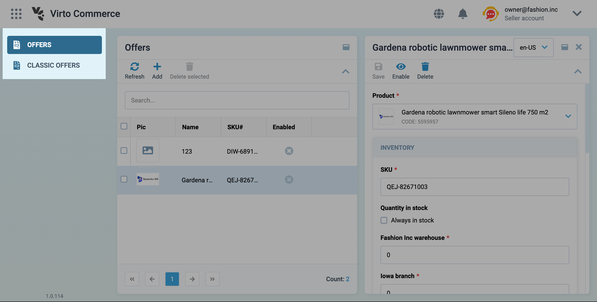
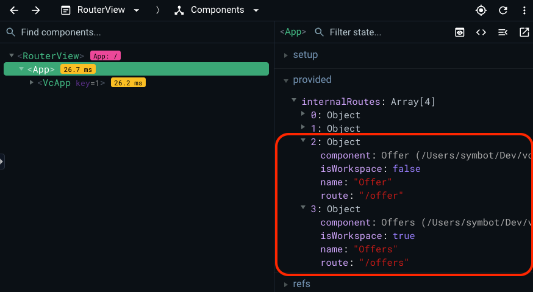

# Navigation

In the VC Shell application, navigation is a fundamental aspect of managing modules and interacting with different blades. This guide explores the various elements of navigation and how to efficiently work with them.

## Overview

Navigation in VC Shell relies on the `Vue Router`, in conjunction with the `useBladeNavigation` composable. The `useBladeNavigation` composable is a custom utility designed to handle navigation between modules, opening and closing blades, and their interactions.

On the other hand, the `Vue Router` is responsible for managing navigation within the application. It responds to clicks in the application menu, facilitates direct linking to pages, and preserves page states after a page refresh.

The initial navigation settings are already configured in the scaffolded application, but let's delve into the finer details.

## Navigation Elements

At the core of the VC Shell application's navigation are `blades`. Each blade represents a distinct page with its own functionality and template. `Blades` are modular and not inherently connected to one another, but they can be combined through special methods.

The `workspace` is composed of blades. New `blades` are added to the right, which can cause the older ones to become hidden, with only two visible at any given time. This design allows you to open and close blades as needed, facilitating work with different sets of data. Blades are highly customizable entities that adhere to application design patterns.


The primary elements of a blade include:

* **Header**: The blade header contains the title of the blade, various actions like the Expand and Collapse Blade buttons, and an area to display additional data, such as blade status.

    

* **Toolbar**: The blade's toolbar is where you can include various actions related to the blade. These actions can range from refreshing data to deleting items.

    

* **Content**: The blade's content section is where all the content specific to that blade resides. This can encompass tables, forms, or any other data that needs to be displayed.

    

* **Top bar**: The blade's top bar is an application component that can host various data and components. It is entirely customizable, but by default, it includes components for language selection, notifications, and user information. It's also responsible for displaying the blade's name in the mobile version.

    

* **Navigation menu**: This element is part of the application's menu system.

    

## Creating a Navigation Menu

The navigation menu is created in the App.vue file and displays links to the modules you've created. It can also contain links to other pages that are not modules, offering full flexibility to cater to your specific needs.

To create a navigation menu, you can utilize the `navigationMenuComposer`, a specialized function. It processes the components provided to it and can directly access any option props set in those components. Additionally, you can create nested menu items using the children key:

```typescript title="App.vue" linenums="1"
const menuItems = reactive(
  navigationMenuComposer([
    {
      title: "Blade",
      icon: "fas fa-file-alt",
      isVisible: true,
      // To use a component without nesting, use the 'component' key
      component: BladeComponent,
      // To nest, use the 'children' key
      children: [
        {
          title: 'Nested 1',
          component: NestedFirst,
        },
        {
          title: 'Nested 2',
          component: NestedSecond,
        },
      ],
    },
  ])
```

## Quick Start for Navigation

To get started with the VC Shell application's navigation system, import the `useBladeNavigation` composable from the `@vc-shell/framework` package:

```typescript linenums="1"
import { useBladeNavigation } from "@vc-shell/framework";
```

`useBladeNavigation` is a custom composition API function designed for working with blade navigation. It works hand in hand with the `VcBladeNavigation` component from `@vc-shell/framework`. This component manages the workspace blade of the module and other blades, which may or may not have their paths defined.

### Blade Components Structure

* Each blade comprises a template with a `VcBlade` component serving as the root. The `VcBlade` component is central to creating a blade:

```html linenums="1"
<VcBlade
    title="My first blade"
    :expanded="expanded"
    :closable="closable"
    width="50%"
    @close="$emit('close:blade')"
    @expand="$emit('expand:blade')"
    @collapse="$emit('collapse:blade')"
>
    <!-- Blade content -->
</VcBlade>
```

* Every blade comes with its default props interface:

```typescript linenums="1"
export interface Props {
    expanded: boolean; // Required prop for VcBlade component
    closable: boolean; // Required prop for VcBlade component
    param?: string; // Additional blade parameter, e.g., for data retrieval
    options?: {}; // Any extra options to pass to the blade
}
```

* Each blade also emits its events based on your requirements:

```typescript linenums="1"
export interface Emits {
    (event: "parent:call", args: IParentCallArgs): void; // Optional
    (event: "close:blade"): void; // Required
    (event: "collapse:blade"): void; // Required
    (event: "expand:blade"): void; // Required
}
```

* If you want your blade to have its path, you can use the defineOptions macro:

```typescript linenums="1"
defineOptions({
    url: "/<blade-url>",
});
```

* To create a blade toolbar, make use of the IBladeToolbar interface:

```typescript linenums="1"
const bladeToolbar = ref<IBladeToolbar>([
    {
        id: "item", // Any unique identifier
        title: "My action", // Title of the toolbar button
        icon: "fas fa-save", // Icon for display
        clickHandler() {
            // Define actions to perform on click
        },
    });
```

* To implement actions upon closing the blade, create a function and expose it. This function should be named onBeforeClose:

```typescript linenums="1"
async function onBeforeClose() {
    return await showConfirmation("Are you sure you want to close the blade?");
}

defineExpose({
    onBeforeClose,
})
```

## Routing

The application's routing can be handled using the `openBlade` method from the `useBladeNavigation` composable:

```typescript linenums="1"
import { useBladeNavigation } from '@vc-shell/framework';

const { openBlade } = useBladeNavigation();
```

To navigate to a module or open a new blade, utilize the `openBlade` method. Pass the blade component you wish to navigate to as an argument.

Additionally, you can provide parameters, options, and two types of callbacks, namely `onOpen` and `onClose`, which execute when the blade is opened or closed, respectively:

```typescript linenums="1"
import { useBladeNavigation } from '@vc-shell/framework';
// Your imported blade component
import Blade from './blade-component.vue'

const { openBlade } = useBladeNavigation();

openBlade({
    blade: markRaw(Blade),
    param: ...,
    options: {
        ...
    },
    onOpen() {
        // Define actions to perform on blade open
    },
    onClose() {
        // Define actions to perform on blade close
    }
})
```

## Adding Module to the Application

Once you've created your `blade` template, it needs to be initialized. In the module's `index.ts` file, register it within the application using the `createAppModule` method. With this setup, you're ready to go:

```typescript linenums="1"
// Your blade pages
import * as pages from "./pages";
import { createAppModule } from "@vc-shell/framework";

export default createAppModule(pages, locales);
```

## Usage Examples

=== "App.vue"

    ```html linenums="1"
    <template>
        <VcApp
            :menu-items="menuItems" // Navigation menu items
            :pages="pages" // Array of all blades with their paths
            :blades-refs="bladesRefs" // Refs to update navigation
            @backlink:click="closeBlade($event)" // Back button click action in mobile view
        >
            <template #bladeNavigation>
            <VcBladeNavigation
                ref="bladeNavigationRefs" // Refs to update navigation
                :blades="blades" // Blades array
                :workspace-options="workspaceOptions" // Workspace options prop
                :workspace-param="workspaceParam" // Workspace param prop
                @on-close="closeBlade($event)" // Event triggered on blade close
                @on-parent-call="(e) => onParentCall(e.id, e.args)" // Event triggered by a blade to the previous blade
                @vue:mounted="resolveLastBlade(pages)" // Event triggered by the VcBladeNavigation 'onMounted' hook to determine the last blade from its path
            ></VcBladeNavigation>
            </template>
        </VcApp>
    </template>
    ```
    ```typescript linenums="1"
    import { watch, ref, reactive } from "vue";
    import { useBladeNavigation, navigationMenuComposer } from "@vc-shell/framework";
    import Blade from "../modules/my-blade";

    const { blades, bladesRefs, parentBladeOptions, parentBladeParam, closeBlade, onParentCall } = useBladeNavigation();
    const bladeNavigationRefs = ref();

    /**
    * Blade navigation refs handler
    */
    watch(
    () => bladeNavigationRefs.value?.bladesRefs,
    (newVal) => {
        bladesRefs.value = newVal;
    },
    { deep: true }
    );

    /**
    * Create navigation menu
    */
    const menuItems = reactive(
    navigationMenuComposer([
        {
        title: "My blade",
        icon: "fas fa-file-alt",
        isVisible: true,
        component: Blade,
        },
    ])
    );
    ```

=== "Vue Router Config"

    ```typescript linenums="1"
    import Blade from "../modules/my-blade";

    const routes: RouteRecordRaw[] = [
    {
        path: "/",
        component: App,
        name: "App",
        meta: {
        root: true,
        }
        children: [],
    },
    {
        path: "/:pathMatch(.*)*",
        component: App,
        beforeEnter: (to) => {
        /**
         * Unknown and error routes resolve method
         */
        const { resolveUnknownRoutes } = `useBladeNavigation`();

        return resolveUnknownRoutes(to);
        },
    },
    ];

    export const router = createRouter({
    history: createWebHashHistory(import.meta.env.APP_BASE_PATH as string),
    routes,
    });
    ```

=== "Blade"

    ```html linenums="1"
    <template>
    <VcBlade
        title="My first blade"
        :expanded="expanded"
        :closable="closable"
        width="50%"
        @close="$emit('close:blade')"
        @expand="$emit('expand:blade')"
        @collapse="$emit('collapse:blade')"
    >
        <!-- Blade content -->
    </VcBlade>
    </template>
    ```
    ```typescript linenums="1"
    <script lang="ts" setup>
    export interface Props {
        expanded?: boolean;
        closable?: boolean;
        param?: string;
    }

    export interface Emits {
        (event: "collapse:blade"): void;
        (event: "expand:blade"): void;
        (event: "close:blade"): void;
    }

    /**
    * Define your path
    */
    defineOptions({
        url: '/my-first-blade'
    })

    withDefaults(defineProps<Props>(), {
        expanded: true,
        closable: true,
    });

    defineEmits<Emits>();
    </script>
    ```

## Navigation Actions

=== "Open Blade"

    To open a new workspace, you can use the `router.push()` method from `Vue Router`. However, a more convenient method is to use the `openBlade` function from the `useBladeNavigation` composable. It offers the advantage of setting initial data when opening the blade. When using imported blade components with `openBlade`, remember to use Vue's `markRaw` method to prevent conversion to a proxy, thereby optimizing performance.

    ```typescript linenums="1"
    openBlade({
        blade: markRaw(MyImportedNewBlade),
        options: {}, // Typed options specific to MyImportedNewBlade, if any
        param: 'my-any-string-param'
        onOpen() {
            // Define actions when the blade is opened
        },
        onClose() {
            // Define actions when the blade is closed
        }
    })
    ```

=== "Close Blade"

    To close a blade, you should emit a `close:blade` event from your blade component. The `VcBlade` component, which is used to construct blades, emits this event when the close button is clicked.

    ```html linenums="1"
    <VcBlade
        @close="$emit('close:blade')"
        ...
    >
        <!-- Blade contents -->
    </VcBlade>
    ```

=== "Execute Methods in the Previous Blade"

    Each blade can emit a `parent:call` event to invoke a method in its parent blade. To execute a method in the parent blade, you must expose it using `defineExpose`.

    ```typescript linenums="1"
    // Parent blade
    function reload() {
    // Implement reloading logic
    }

    defineExpose({
    reload,
    })

    // Child blade
    interface Emits {
    (event: 'parent:call', args: IParentCallArgs): void;
    }

    const emit = defineEmits<Emits>();

    function anyFunction() {
    emit("parent:call", {
        method: "reload", // Exposed method in the parent blade
    });
    }
    ```

## Overview of All Registered Blades in the Application
You can see all `blades` registered in the application with and without paths. To do this, you can use a browser extension called `Vue Devtools`.

!!! note
    For more information about the `Vue Devtools` extension, visit the official website [Vue Devtools](https://devtools.vuejs.org/).

1) To discover the blade's name, open `Vue Devtools` and locate `App` in the components tree. Clicking on it will reveal the component's state:


2) Identify the `provided` option within this state, which contains an array of `internalRoutes`. This array encompasses all registered blades from each module, whether they have their own URL or not:


3) As an example, let's expand two objects of the `internalRoutes` array and see an example of registered blades that belong to the `Offers` module:


