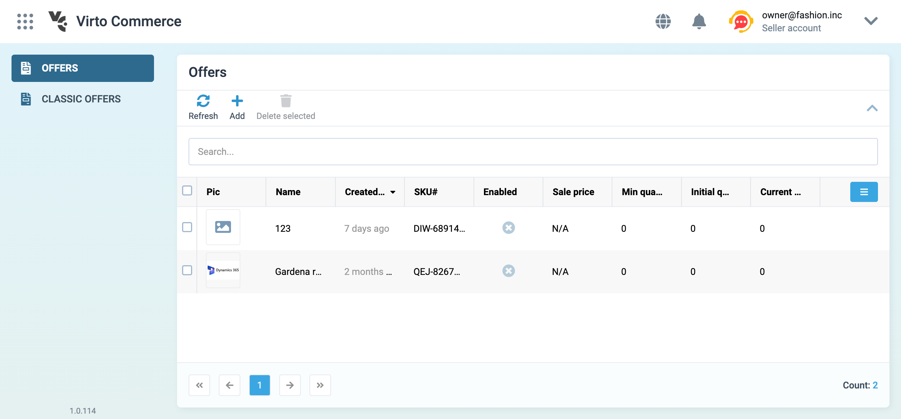

# Creating first VC-Shell application

In this section we will show you how to scaffold a VC Shell application on your local machine. The created project will use Vue 3 and Vite as the build setup.

!!! info "Prerequisites"

    1. You have an up-to-date Node.js version installed.
    1. Your current working directory is the one where you want to create the application.

To create and install custom app:

1. Install and execute create-vc-app scaffolding tool:

    ```bash
    npm init @vc-shell/vc-app@latest
    ```

1. Configure options from the list. If you are unsure about an option, simply choose `No` by hitting <kbd>Enter</kbd>:

    ```bash
    ✔ App name: … <your-app-name>
    ✔ Add Dashboard page? … No / Yes
    ✔ Add Login/Invite/Reset password pages? … No / Yes
    ✔ Add module starter? … No / Yes
    ✔ Module starter name: … <your-first-module-name>

    Scaffolding app in ./<your-app-name>...

    Done.
    ```

1. Once application is created, follow instructions to install dependencies and start the dev server:

    ```bash
    $ cd <your-app-name>
    $ yarn
    $ yarn serve
    ```

You first application is ready to run!



!!! info "Note"

    The example components in the generated application are written using the Vue Composition API and `<script setup>`.


!!! info "Tip"
    The recommended IDE setup is [Visual Studio Code](https://code.visualstudio.com/) + [Volar extension](https://marketplace.visualstudio.com/items?itemName=Vue.volar).

[Read more about the underlying build tool Vite docs](https://vitejs.dev/){ .md-button }

[Read more about Vue Composition API](https://vuejs.org/guide/introduction.html#composition-api){ .md-button }

## Application folder structure

After the application is scaffolded, the folder structure will look as follows:

```css hl_lines="12 13 14 15 16 17 18 19 20"
├─ public                         // Static assets
│  ├─ assets                      // Static images used inside the application.
│  └─ img
│     └─ icons                    // Icons used for favicons, PWA, etc.
├─ src
│  ├─ api_client                  // Generated API clients folder
│  │  └─...
│  ├─ composables                 // Application composables
│  │  └─...
│  ├─ locales                     // Locale files used to provide translated content
│  │  └─ en.json
│  ├─ modules                     // The collection of custom modules
│  │  └─ ...                      // Modules folder
│  │     ├─ components            // The collection of components specific for this module
│  │     │   ├─ notifications     // Dropdown notifications templates
│  │     │   └─ ...
│  │     ├─ composables           // The collection of shared logic written using Composable API pattern.
│  │     ├─ locales               // Locale files used to provide translated content specific for this module
│  │     ├─ pages                 // Set of module pages used within Application router
│  │     └─ index.ts              // Module entry point
│  ├─ pages                       // Set of application pages used within Application router.
│  │  └─...
│  ├─ router                      // SPA routing configuration
│  │  └─...
│  ├─ styles                      // Extras application style files
│  │  └─ index.scss               // Tailwind initialization file
│  └─ types                       // Typescript .d.ts files
```

Let's take a look at the modules directory as it represents the key concept in the application's architecture.

### Modules directory structure

**Module** is a set of composables, locales, components and pages. Each module is responsible for its own functionality and can contain the number of blades you need that serves your needs, which are stored in the pages folder.

**Blade** is a separate page with its own functionality and template. Blades is not connected to each other, but can be used together using special methods.

The **Components folder** contains the collection of components specific to this module. If you want to create a component for your module, the components folder is the best place to do it. A component placed in a module should only be used in it, otherwise it is better to place them in thecomponents folder in the application root folder.

The **Composables folder** contains the collection of shared logic written using Composable API pattern. It may include, for example, logic for loading data from the backend which is used by blade.

The **Locales folder** contains locale files used to provide translated content specific to module. If you need to translate your blades into several languages, you can store all the translations in json format in this folder, which is then processed using **vue-i18n** library.

[Read more about the syntax of localization files](https://kazupon.github.io/vue-i18n/){ .md-button }

The **Pages folder** contains set of blades used within application router. For more information, refer to the [Blades section](../../Platform-Manager/Extensibility-Points/blades-and-navigation.md).

### Creating a new module
To create your own modules within the scaffolded application folder structure:

1. Create a new folder for your module inside the **src/modules** directory. You can give it a descriptive name that reflects its functionality. You can create multiple modules within the **src/modules** directory, each responsible for its own functionality and set of pages.

1. Within your module folder, organize your module-specific code into different directories.

1. In addition to these directories, you can also have an **index.ts** file as the entry point for your module. This file can provide the necessary exports and configurations for your module.


### Initializing a new module in the application

To be able to use the module in the application, it must be initialized.

All modules are created as a Vue plugin. For convenience, module installation is initialized using a special method `createAppModule` that takes `pages`, `locales` and, if necessary, `notificationTemplates` as arguments:

```typescript title="index.ts" linenums="1"
// your blade pages
import * as pages from "./pages";
// its locale files if any
import * as locales from "./locales";
// import createAppModule to initialize your module in application
import { createAppModule } from "@vc-shell/framework";

export default createAppModule(pages, locales);

// Required exports
export * from "./pages";
export * from "./composables";
export * from "./components";
```

Now you are ready to use your module!

## Related links

[Adding new module to the navigation menu](navigation.md)
