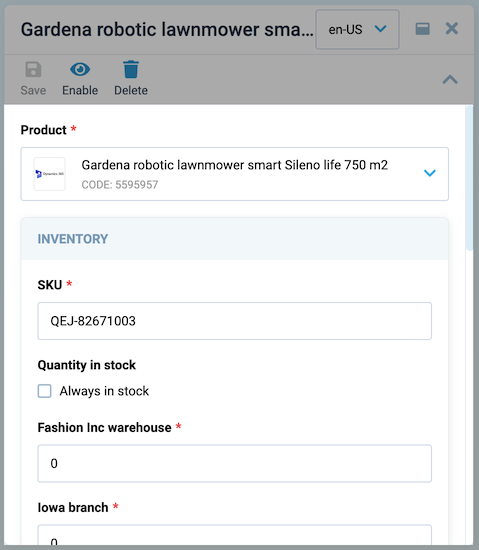

# Navigation

The application has its own routing, which is based on the `vue router` and provided by the ``useBladeNavigation`` composable.
``useBladeNavigation`` is a custom composite responsible for navigating between modules, opening and closing new blades, and their interaction with each other.

The `Vue router` is responsible for navigation within the application, handling clicks in the application menu, and also supporting opening pages via direct links and saving page state after page refresh.

The scaffolded application already has all the initial settings for working with navigation, but let's have a look at the details.

## Navigation elements

The main navigation elements in the application are blades. Each blade is a separate page with its own functionality and template. Blades are not connected to each other, but can be used together by means of special methods.

The working space consists of blades. Each new blade is added to the right, hiding the first ones so that only two are available at a time. You can open and close new blades, and work with different data at the same time. The blade is a fully customizable entity that follows application design patterns.


The main blades elements are:

* **Header**. The blade header contains the title of the blade, various actions such as the Expand and Collapse Blade buttons, and an area where you can place data as you see fit, such as product type or blade status.

    

* **Toolbar**. The blade toolbar is a place where you can place any combination of actions with this blade. It could be actions like refresh, delete, etc.

    

* **Content**. The blade content is a place, where all the content of the blade is located. It can be tables, forms, and any other data that needs to be displayed in it.

    

* **Top bar**. The blade top bar is an application component that can contain various data and components. It is fully customizable, but by default it contains the language selection component, notification component, and user information. It is also responsible for displaying the blade name in the mobile version.

    

* **Navigation menu**.

    


## Creating navigation menu
The navigation menu is created in the **App.vue** file and displays links to the modules you have created. It can also contain links to other pages that are not modules - everything is at your discretion and needs.

To create a navigation menu, there is a special typed method `navigationMenuComposer` that will process the component provided to it. If there are option props set in the components and you want to pass them, they will all be available directly from the `navigationMenuComposer`. It is also possible to create nested menu items using the `children` key.

```typescript title="App.vue" linenums="1"
const menuItems = reactive(
  navigationMenuComposer([
    {
      title: "Blade",
      icon: "fas fa-file-alt",
      isVisible: true,
      // without nested use component key
      component: BladeComponent,
      // or with nested use children key
      children: [
        {
          title: 'Nested 1',
          component: NestedFirst,
        },
        {
          title: 'Nested 2',
          component: NestedSecond,
        },
      ],
    },
  ])
```

## Navigation quick start

To start working with the application's navigation system, import the `useBladeNavigation` composable from @vc-shell/framework.

`useBladeNavigation` is a custom composition API function that allows you to work with blade navigation. It works in conjunction with the `VcBladeNavigation` component included in @vc-shell/framework, which is responsible for displaying the module's workspace blade and the rest of the blades, which may or may not have their own path.

### Blade components structure

* A blade consists of a template with a `VcBlade` component added to it as the root component. `VcBlade` is the main component for creating a blade.

    ```html linenums="1"
    <template>
        <VcBlade
            title="My first blade"
            :expanded="expanded"
            :closable="closable"
            width="50%"
            @close="$emit('close:blade')"
            @expand="$emit('expand:blade')"
            @collapse="$emit('collapse:blade')"
        >
            <!-- blade content -->
        </VcBlade>
    </template>
    ```

* Each blade has its own default props interface:

    ```typescript linenums="1"
    export interface Props {
        expanded: boolean; // To pass into VcBlade component (required)
        closable: boolean; // To pass into VcBlade component (required)
        param?: string; // Blade additional param e.g. to fetch some data
        options?: {}; // Any additional options to pass in blade
    }
    ```

* Each blade has its own events that this blade can emit, depending on your needs:

    ```typescript linenums="1"
    export interface Emits {
        (event: "parent:call", args: IParentCallArgs): void; // optional
        (event: "close:blade"): void; // required
        (event: "collapse:blade"): void; // required
        (event: "expand:blade"): void; // required
    }
    ```

* If you want your blade to have its own path, use `defineOptions` macro:

    ```typescript linenums="1"
    defineOptions({
        url: "/<blade-url>",
    });
    ```

* To create blade toolbar, use `IBladeToolbar` interface:

    ```typescript linenums="1"
    const bladeToolbar = ref<IBladeToolbar>([
        {
            id: "item", // any id
            title: "My action", // title of toolbar button
            icon: "fas fa-save", // icon to display
            clickHandler() {
            // any action on click
            },
        },
    ]);
    ```

* To perform any action when closing the blade, you need to create a function and expose it. The name of this function should be `onBeforeClose`:

    ```typescript linenums="1"
    async function onBeforeClose() {
        return await showConfirmation("Are you sure you want to close the blade?");
    }

    defineExpose({
        onBeforeClose,
    })
    ```

## Routing

Routing in the application is available using the `openBlade` method from `useBladeNavigation` composable.

If you want to navigate to a module or open a new blade, you just need to use the `openBlade` method with the blade argument, where blade is the imported blade component, which you want to navigate to. As arguments, you can take param, options, and two types of callbacks - `onOpen` and `onClose`, which will be executed when opening and closing the blade, respectively.

## Adding module to application

After creating your blade template, you need to initialize it. In the module’s **index.ts** file, register it in the application by using the `createAppModule` method and you are ready to go.

```typescript linenums="1"
// your blade pages
import * as pages from "./pages";
import { createAppModule } from "@vc-shell/framework";

export default createAppModule(pages, locales);
```

### Usage examples

<hr />
=== "App.vue"

    ```html linenums="1"
    <template>
      <VcApp
        :menu-items="menuItems" // navigation menu items
        :pages="pages" // array of all blades with its paths
        :blades-refs="bladesRefs" // refs to update navigation
        @backlink:click="closeBlade($event)" // Back button click action in mobile view
      >
        <template #bladeNavigation>
          <VcBladeNavigation
            ref="bladeNavigationRefs" // refs to update navigation
            :blades="blades" // blades array
            :workspace-options="workspaceOptions" // workspace options prop
            :workspace-param="workspaceParam" // workspace param prop
            @on-close="closeBlade($event)" // event triggered on the blade close
            @on-parent-call="(e) => onParentCall(e.id, e.args)" // event triggered by blade to previous blade
            @vue:mounted="resolveLastBlade(pages)" // event triggered by the VcBladeNavigation 'onMounted' hook to determine the last blade from its path
          ></VcBladeNavigation>
        </template>
      </VcApp>
    </template>
    ```

    ```typescript linenums="1"
    import { watch, ref, reactive } from "vue";
    import { useBladeNavigation, navigationMenuComposer } from "@vc-shell/framework";
    import Blade from "../modules/my-blade";

    const { blades, bladesRefs, parentBladeOptions, parentBladeParam, closeBlade, onParentCall } = useBladeNavigation();
    const bladeNavigationRefs = ref();

    /**
    * Blade navigation refs handler
    */
    watch(
      () => bladeNavigationRefs.value?.bladesRefs,
      (newVal) => {
        bladesRefs.value = newVal;
      },
      { deep: true }
    );

    /**
    * Create navigation menu
    */
    const menuItems = reactive(
      navigationMenuComposer([
        {
          title: "My blade",
          icon: "fas fa-file-alt",
          isVisible: true,
          component: Blade,
        },
      ])
    );
    ```

=== "Vue router config"

    ```typescript linenums="1"
    import Blade from "../modules/my-blade";

    const routes: RouteRecordRaw[] = [
      {
        path: "/",
        component: App,
        name: "App",
        meta: {
          root: true,
        }
        children: [],
      },
      {
        path: "/:pathMatch(.*)*",
        component: App,
        beforeEnter: (to) => {
          /**
          * Unknown and error routes resolve method
          */
          const { resolveUnknownRoutes } = `useBladeNavigation`();

          return resolveUnknownRoutes(to);
        },
      },
    ];

    export const router = createRouter({
      history: createWebHashHistory(import.meta.env.APP_BASE_PATH as string),
      routes,
    });
    ```

=== "Blade"

    ```html linenums="1"
    <template>
      <VcBlade
        title="My first blade"
        :expanded="expanded"
        :closable="closable"
        width="50%"
        @close="$emit('close:blade')"
        @expand="$emit('expand:blade')"
        @collapse="$emit('collapse:blade')"
      >
        <!-- blade content -->
      </VcBlade>
    </template>
    ```
    ```typescript linenums="1"
    <script lang="ts" setup>
    export interface Props {
      expanded?: boolean;
      closable?: boolean;
      param?: string;
    }

    export interface Emits {
      (event: "collapse:blade"): void;
      (event: "expand:blade"): void;
      (event: "close:blade"): void;
    }

    /**
    * define your path
    */
    defineOptions({
      url: '/my-first-blade'
    })

    withDefaults(defineProps<Props>(), {
      expanded: true,
      closable: true,
    });

    defineEmits<Emits>();
    </script>
    ```

## Navigation actions

=== "Open blade"

    If you want to open a new workspace you can use vue-router's `router.push(blade path)`, but it is more convenient to use the `openBlade` method from `useBladeNavigation` composable function, as it allows you to set the initial data when opening the blade.  All imported blade components should be used in `openBlade` with Vue's markRaw method to tell Vue not to be converted to a proxy, avoiding performance hit.

    ```typescript linenums="1"
    openBlade({
      blade: markRaw(MyImportedNewBlade),
      options: {}, // typed MyImportedNewBlade options if any
      param: 'my-any-string-param'
      onOpen() {
        // any action when the blade is opened
      },
      onClose() {
        // any action when the blade closes
      }
    })
    ```

=== "Close blade"

    If you want close the blade, it should emit a `close:blade` event from your blade component. `VcBlade` component, with which the blade is built, emits this event on clicking the close button.

    ```html linenums="1"
    <VcBlade
        @close="$emit('close:blade')"
        ...
      >
        <!-- Blade contents -->
    </VcBlade>
    ```

=== "Execute methods in the previous blade"

    Each blade can emit a `parent:call` event to run method in its parent. Every method you want to execute in parent blade must be exposed by `defineExpose` in it.

    ```typescript linenums="1"
    // Parent blade
    function reload() {
      // reload something
    }

    defineExpose({
      reload,
    })

    // Child blade
    interface Emits {
      (event: 'parent:call', args: IParentCallArgs): void;
    }

    const emit = defineEmits<Emits>();

    function anyFunction() {
      emit("parent:call", {
        method: "reload", // exposed method if Parent blade
      });
    }
    ```
