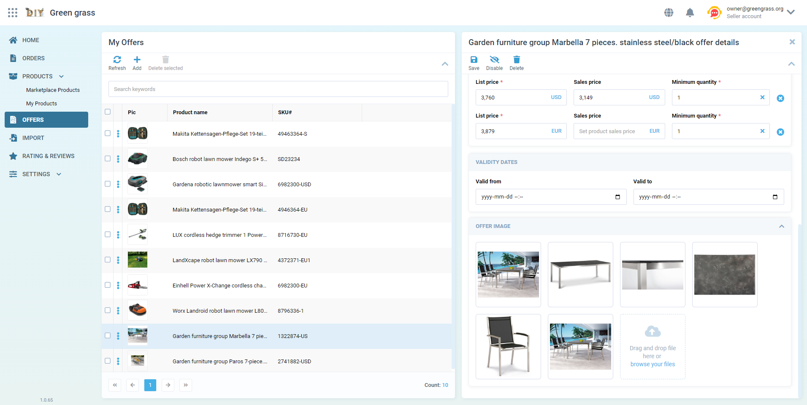

# VirtoShell

[VirtoCommerce Vue3 Frontend](https://github.com/VirtoCommerce/vc-shell) for specialized back-office applications is created to replace the current vc-platform manager concept.

## Main project goals

* Technological shift from AngularJS to Vue3 for platform backoffice UI development.
* Split core components into separate packages with own release cycle.
* Simplify and accelerate the customization of any existing or entirely new specialized (use case oriented) back-office applications using VC's unique design system. It's a collection of reusable components, guided by clear standards, that can be assembled to create a range of applications.

## Tech stack

* **Yarn berry** for managing monorepo and its packages dependencies.
* **Vue 3** as background for our solution.
* **Vite** for easy build and deployment.
* **storybook** for interactive documentation.
