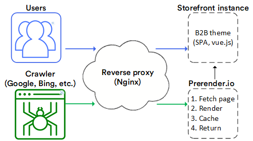
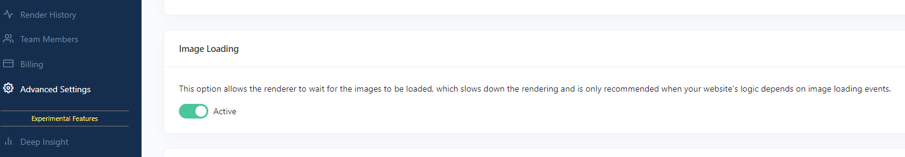
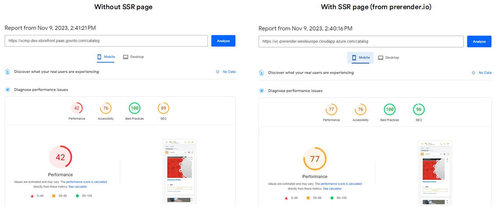

# Enhancing SEO with Prerender.io

The current Virto Commerce theme, vc-theme-b2b-vue, uses the power of Single Page Applications (SPAs) to provide a unique, interactive, and fast user experience. However, while SPAs excel in user experience, they often pose challenges for search engines due to their dynamic nature. This dynamic behavior, which is a strength for user engagement, can become a hurdle in attracting organic traffic.

To overcome these challenges and strike a balance between an engaging user experience and search engine optimization (SEO), [Prerender.io](http://prerender.io/) represents as a valuable solution. Prerender.io generates pre-rendered HTML snapshots for SPAs, significantly improving SEO-friendliness and Web Vitals metrics. This integration doesn't require the adoption of complex Server-Side Rendering (SSR) frameworks like Next or Nuxt, preserving the simplicity of the presentation application. This guide explores how Prerender.io provides a straightforward yet highly effective solution to boost the visibility, performance, and overall experience of Vue.js SPAs.

## Integration with vc-theme-b2b-vue

In this guide, we describe the results of Prerender.io  integration with the vc-theme-b2b-vue. A practical example is our site, [https://vcmp-dev-storefront.paas.govirto.com](https://vcmp-dev-storefront.paas.govirto.com), which is built on vc-theme-b2b-vue and uses the Prerender.io service.

### Configuration Details

The integration involved setting up a reverse proxy using Nginx in front of the VC storefront. Additionally, the vc-theme-b2b-vue and Prerender's cloud service were installed. The Nginx reverse proxy was configured based on the [example](https://docs.prerender.io/docs/nginx-1).

A notable configuration adjustment was made to ensure proper image loading on Server-Side Rendering (SSR) pages, requiring the activation of the image loading option in the [Prerender.io dashboard](http://Prerender.io).

## Performance Evaluation

To measure the impact of Prerender.io on performance, a PageSpeed analysis was conducted for a category listing page. The comparison involved assessing the performance with and without SSR page rendering through Prerender.io.

## Conclusion

The primary advantage of utilizing Prerender.io for custom Virto Commerce frontend solutions, especially those with stringent SEO requirements, lies in its ability to enhance SEO without compromising the purity of the SPA architecture. This eliminates the need for substantial changes or investments in complex SSR frameworks like Nuxt.js.

By avoiding server-side logic, Prerender.io enables a streamlined frontend solution, eliminating concerns related to caching, scaling, server error handling, and logging – elements typically unnecessary for pure SPA applications. Prerender.io offers a simplified and effective solution to enhance search engine visibility and performance without requiring extensive modifications to existing code.

{: width="25"} [SPA JavaScript SEO Challenges and Solutions - Prerender.io](https://prerender.io/blog/spa-javascript-seo-challenges-and-solutions/).