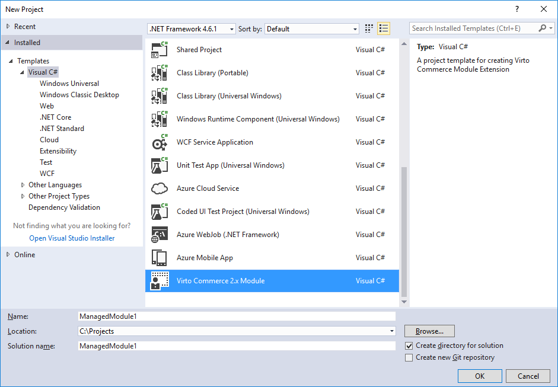
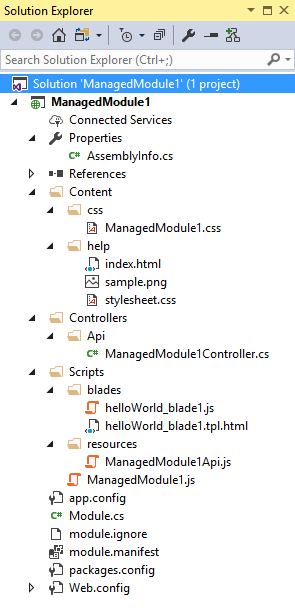
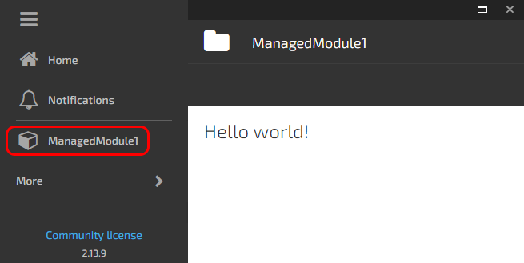
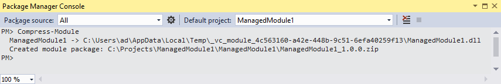
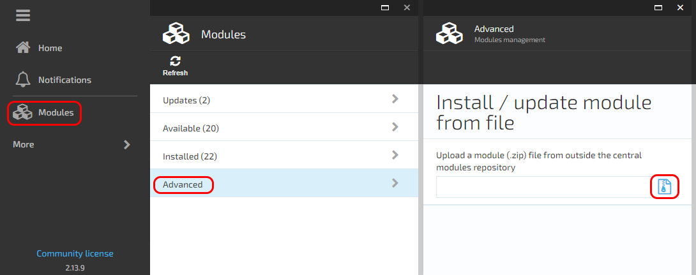
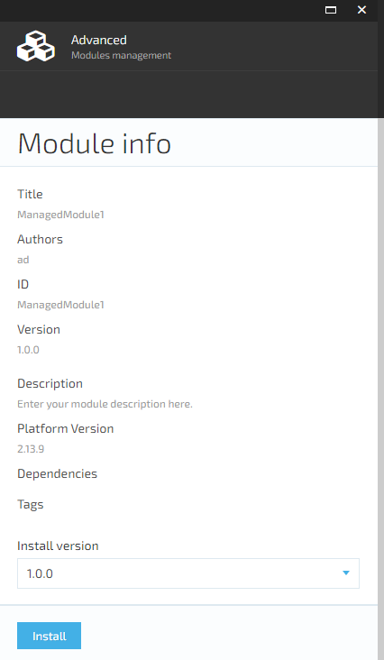

## Create managed module

Let's create a module called **ManagedModule1**. It will open a blade and fill it with data returned from WebAPI data service.

A managed module is a module which has a managed assembly with a class **implementing IModule** interface. This class should be declared in the module manifest.

When the application starts, it iterates two times through all managed modules:

1. Methods **SetupDatabase** and **Initialize** are called for each module.

* In SetupDatabase method a module can create or update tables and fill them with data.
* In Initialize method a module can register its services, repositories and other resources in Unity container.

2. Method **PostInitialize** is called for each module. In this method a module can resolve registered resources using Unity container and use them. The two-step initialization allows modules which are initialized later to override implementation of interfaces registered with modules which are initialized earlier.

Download [Virto Commerce Module template](https://marketplace.visualstudio.com/items?itemName=VirtoCommerce2xModuleProjectTemplate.VirtoCommerce2xModule) from Visual Studio Marketplace, or simply search for "Virto" under online templates.

Create project by using our template as follows:



### Module solution structure

After clicking OK button you will have the following project:



* **module.manifest** Contains various attributes describing the module and its content.
* **module.ignore** Contains a list of files which should be excluded from the resulting module package. This is useful if your module depends on some other module and you don't want files which are already included in that module to be duplicated in your module.
* **Module.cs** Contains a class which is responsible for the server side library initialization.
* Content
  * css
    * **ManagedModule1.css** Contains a style sheet for the Hello World blade.
  * **help** This folder contains files required for a help page which is displayed after generating the project from template. You can safely delete this folder.
* Controllers
  * Api
    * **ManagedModule1Controller.cs** Contains a data service for communicating with JavaScript client.
* Scripts
  * **ManagedModule1.js** Contains an AngularJS module definition.
  * blades
    * **helloWorld_blade1.js** Contains an AngularJS controller for the Hello World blade.
    * **helloWorld_blade1.tpl.html** Contains a markup for the Hello World blade.
  * resources
    * **ManagedModule1Api.js** Contains definitions for the resources (services) available inside AngularJS module.

### Running

If ManagedModule1 folder is not located under Manager's ~/Modules virtual directory, you should create a directory symbolic link to ManagedModule1 folder:

1. Run Command Prompt as an administrator
2. Navigate to the physical location folder of Manager's ~/Modules virtual directory
3. Run the following command: 
```
mklink /d ManagedModule1 <full_path_to_ManagedModule1_project>
```

Compile your solution, restart IIS and open Manager in browser to check how your new module looks like. You should see a new item in the menu, which opens a Hello World blade:



### Creating and installing a module package

1. Open Tools > NuGet Package Manager > Package Manager Console
2. Run the following command: **Compress-Module**



The output will show the location of the created module package (ManagedModule1_1.0.0.zip).

If **Compress-Module** command is not recognized, restart Visual Studio and repeat the command. Restarting may require to allow Visual Studio to load the package generation script which is installed as NuGet package.

3. Open the Virto Commerce Manager where you want to install this module
4. Navigate to Modules > Advanced
5. Upload your ManagedModule1_1.0.0.zip:





6. Click install

7. Restart the Virto Commerce Manager or IIS