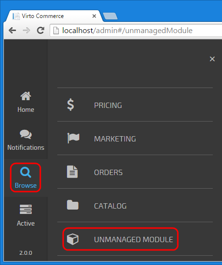

## Create unmanaged(Pure JavaScript) module
	
Let's create a JavaScript module called **Sample Unmanaged Module** which will add a new item to the main menu and open a new blade when this item is clicked.
	
### The required part of each module is the **module.manifest**:

```
<?xml version="1.0" encoding="utf-8" ?>
<module>
  <id>Sample.Unmanaged</id>
  <version>2.0.0</version>
  <platformVersion>2.10</platformVersion>
  <title>Sample Unmanaged Module</title>
  <description>Lorem ipsum dolor sit amet, consectetur adipiscing elit. Aenean vitae sagittis nulla, ac condimentum quam. Maecenas sit amet nibh volutpat, eleifend enim sit amet, cursus erat.</description>
  <authors>
    <author>VirtoCommerce</author>
  </authors>
  <styles>
    <file virtualPath="$/Content/css/UnmanagedModule.css" />
  </styles>
  <scripts>
    <directory virtualPath="$/Scripts" searchPattern="*.js" searchSubdirectories="true" />
  </scripts>
</module>
```

**id**, **version** and **platformVersion** are required elements. This sample module has a single CSS style file and its JavaScript code is placed in the folder called $/Scripts. The $ sign in styles and scripts virtual paths is resolved to the module root folder at runtime by the platform's modularity extension. Title and description are displayed in the installed modules list. That's all what's needed to define a module.

### Module dependencies

One of the js files, UnmanagedModule.js, contains AngularJS module definition:

```
//Call this to register our module to main application
var moduleTemplateName = "platformWebApp.unmanagedModule";
if (AppDependencies != undefined) {
  AppDependencies.push(moduleTemplateName);
}
angular.module(moduleTemplateName, [
  'unmanagedModule.blades.blade1'
])
...
```

It registers itself as a dependency for the main AngularJS module. Then the module definition follows. As you can see, it also depends on the other module, *unmanagedModule.blades.blade1*.

The navigation between modules is based on $stateProvider and states. We register "workspace.unmanagedModuleTemplate" state in the same js file:

```
.config(
  ['$stateProvider',
    function ($stateProvider) {
      $stateProvider.state('workspace.unmanagedModuleTemplate', {
        url: '/unmanagedModule',
        templateUrl: 'Scripts/common/templates/home.tpl.html',
        controller: [
          '$scope', 'platformWebApp.bladeNavigationService', function ($scope, bladeNavigationService) {
             var blade = {
               id: 'blade1',
               // controller name must be unique in Application. Use prefix like 'um-'.
               controller: 'um-blade1Controller',
               template: 'Modules/$(Sample.Unmanaged)/Scripts/blades/blade1.tpl.html',
               isClosingDisabled: true
             };
             bladeNavigationService.showBlade(blade);
           }
         ]
      });
    }
  ]
)
```

This state has such typical parts as **url**, **templateUrl** and **controller**. What's not typical is that state name must begin with "workspace.*". The controller here is used only for displaying a new blade. All **controller names** of **all installed modules** in the **Platform** have to be **unique**.

The controller **um-blade1Controller** (located in **blade1.js**) and template **blade1.tpl.html** are super simple:

```
angular.module('unmanagedModule.blades.blade1', [])
.controller('um-blade1Controller', ['$scope', function ($scope) {
  var blade = $scope.blade;
  $scope.data = "UnmanagedModule content";
  blade.title = "UnmanagedModule title";
  blade.isLoading = false;
}]);
```
```
<div style="width: 400px;">
  <p>{{data}}</p>
</div>
```

### Referencing content files

The links to files inside the module folder should start with **Modules/$(ModuleId)/** where ModuleId is the ID of the module as declared in module.manifest file.

For instance, **Modules/$(Sample.Unmanaged)/Scripts/home/home.tpl.html**

### Adding new items to application's menu

The registration to the main application's menu:

```
.run(
  ['$rootScope', 'platformWebApp.mainMenuService', '$state', function ($rootScope, mainMenuService, $state) {
    //Register module in main menu
    var menuItem = {
      path: 'browse/unmanaged module',
      icon: 'fa fa-cube',
      title: 'Unmanaged Module',
      priority: 110,
      state: function () { $state.go('workspace.unmanagedModuleTemplate'); },
      permission: 'UnmanagedModulePermission'
    };
    mainMenuService.addMenuItem(menuItem);
  }]);
```

Mind the **priority** property as it defines the menu position relative to the other menu options; **smaller number means higher priority** and such menu item is displayed first.

That's it. Run VirtoCommerce Manager application to check how your new module looks like. It should have its own menu entry in the main menu:

