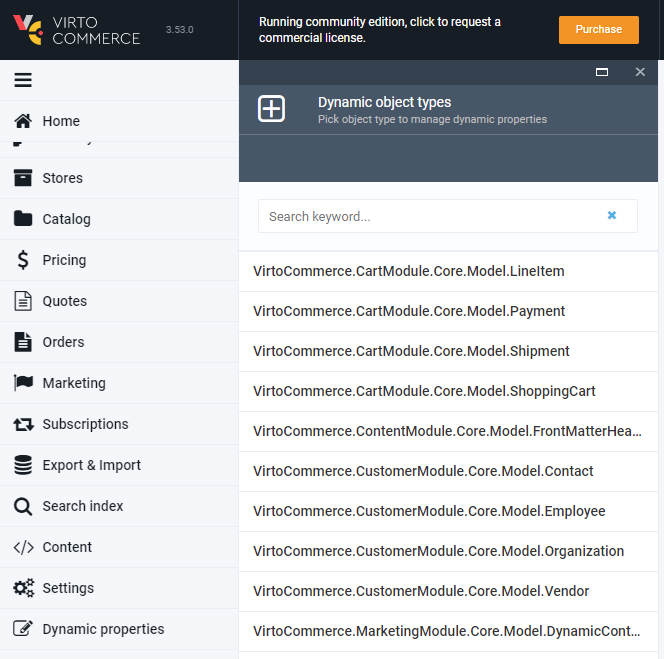
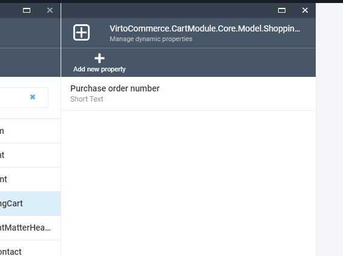
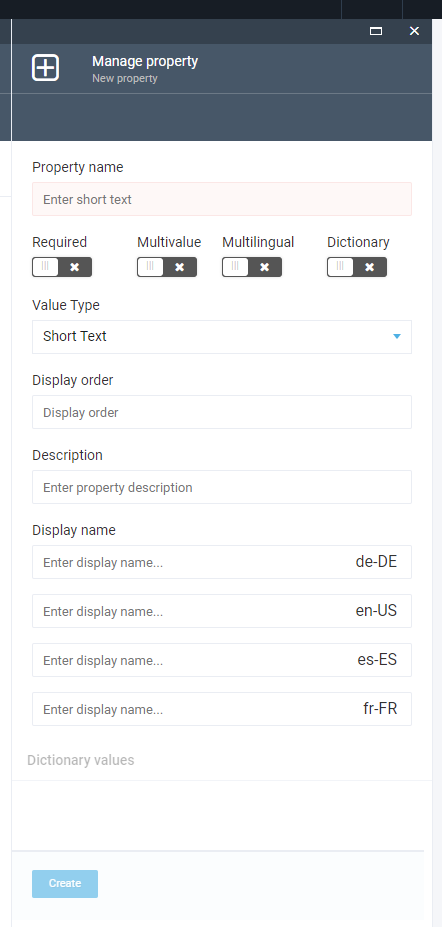
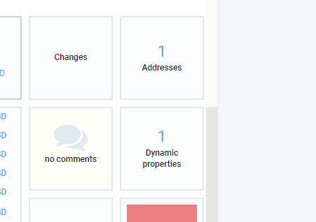
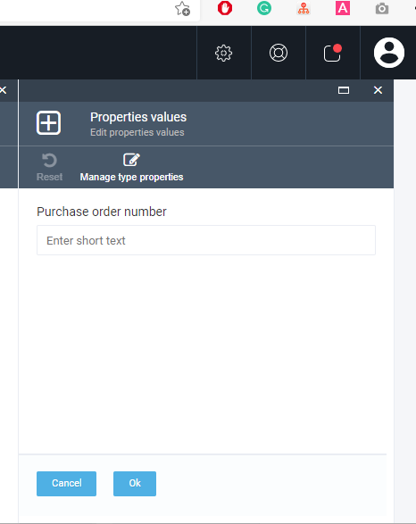

VirtoCommerce Platform enables adding new properties to entities at runtime. 

## Adding New Dynamic Property for Existing Type from UI

In the left toolbar menu, click *More > Dynamic Properties* and select one of the available objects:

Select the required object:

Click the *Create* button:

Enter the new property name, select value type and other options.

You can also define the property name for each of the registered languages:

+ **Required:** Does not allow any empty property values when editing object values.
+ **Multivalue:** Allows to enter more than one value for the property when editing object values.
+ **Multilingual:** Allows to define different values for each registered language when editing object values.
+ **Dictionary:** Allows to select one of the predefined values when editing object values. The value type for dictionaries can be short text only. You can add dictionary items after creating the property.

## Editing Object Values

Open the object details and click the *Dynamic Properties* widget:

In the new blade, you will see the list of available properties with input controls for entering values:

