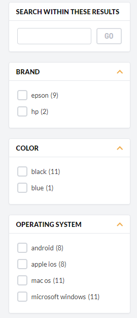
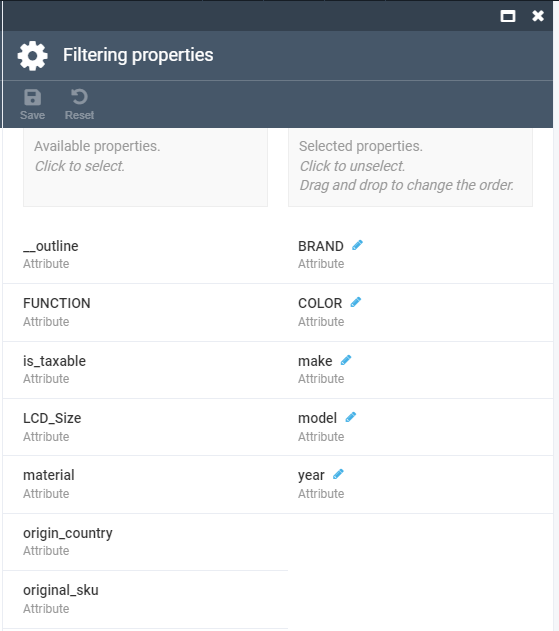

# Faceted Search Overview and Configuration

Faceted search (sometimes also called faceted navigation) allows users to navigate through a website by applying filters for categories, attributes, price ranges, and so on. The main idea behind faceted search is to present the attributes of the documents of the previous search result as filters, which can be used by the user to narrow down search results, along with calculating statistical counts to aid.

For example, let's assume we need to query for all blue shirts. The search engine has a facet configured 
on the category category level, and another one on the color attribute level. This way, the search query 
will be executed using these two facets. The search result will return the entries that are aggregated 
both in the category facet with the shirt category ID and in the color facet with the value *blue*.

## Muti-select Faceting Search

This policy allows you to select multiple values of the same facet (e.g using a checkbox).

You can read more on how muti-select faceting search works in [this article ](https://blog.griddynamics.com/multi-select-faceting-for-nested-documents-in-solr) telling you how to implement multi-select faceting for nested documents in Solr. You may also want to check out [Elastic search post filter](https://www.elastic.co/guide/en/elasticsearch/reference/7.6/search-request-body.html#request-body-search-post-filter).

The muti-select faceting search policy is enabled by default and you do not need any extra parameters or setting to activate it.

## Faceted Search Configuration

This section is based on example of catalog entities, where the properties available for faceted search are configured at the **Store** level in Platform Manager.

1.  Open **Stores**, select an appropriate store, click the **Aggregation Properties** widget, and pick catalog properties eligible for filtering in this store:

There are two facet types (aggregation types) that are supported for configuration:

-   Attribute facet: Displays and enables using all or selected values of the selected property for facet filters, e.g `color: Red(1), Blue(22)`, etc.
    
-   Range facet: Enables aggregating facet counts across ranges of values. This type is applicable to the date, time, datetime, number, and money type fields.
